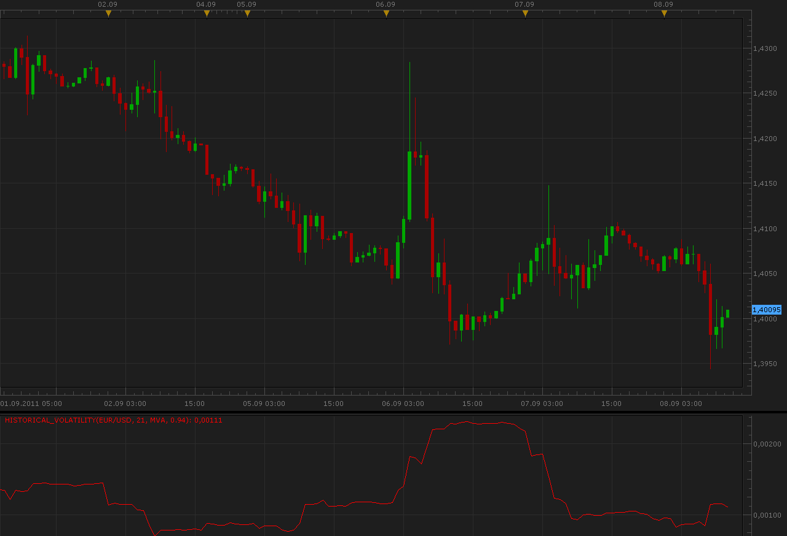

# Historical Volatility indicator

> Source: https://fxcodebase.com/code/viewtopic.php?f=17&t=6397  
> Forum: 17 · Topic 6397 · 9 post(s)

---

## Historical Volatility indicator

**Alexander.Gettinger** · Thu Sep 08, 2011 10:09 am

The indicator shows the value of volatility (see [wiki](https://en.wikipedia.org/wiki/Volatility_(finance)) for details).
Possible to calculate several methods: MVA, EMA and extremum volatility.

 

Download:

 [Historical_Volatility.lua](files/14690/Historical_Volatility.lua)

The indicator was revised and updated

---

## Re: Historical Volatility indicator

**zmender** · Sat Mar 03, 2012 12:18 am

A further development of above indicator:
The ratio of a short / long term HV, based on SMA.

---

## Re: Historical Volatility indicator

**Alexander.Gettinger** · Mon Mar 05, 2012 2:46 pm

> **zmender wrote:**
> A further development of above indicator:
> The ratio of a short / long term HV, based on SMA.

See this oscillator.

Formula:
HV_Ratio=HV(Period1, Method1, decline1)/HV(Period2, Method2, decline2).

Download:

 [HV_Ratio.lua](files/27629/HV_Ratio.lua)

For this oscillator must be installed Historical Volatility indicator.

---

## Re: Historical Volatility indicator

**Jeffreyvnlk** · Mon May 06, 2013 4:01 pm

> **Alexander.Gettinger wrote:**
>
>
> > **zmender wrote:**
> > A further development of above indicator:
> > The ratio of a short / long term HV, based on SMA.
>
>
>
> See this oscillator.
>
> Formula:
> HV_Ratio=HV(Period1, Method1, decline1)/HV(Period2, Method2, decline2).
>
> Download:
>
>
> HV_Ratio.lua
>
>
>
> For this oscillator must be installed Historical Volatility indicator.

I thought I could not find this gem in this forum.Thanks, this should be in the popular item list

---

## Re: Historical Volatility indicator

**Jeffreyvnlk** · Mon May 06, 2013 4:03 pm

[viewtopic.php?f=17&t=21021&p=36945&hilit=volatility#p36945](https://fxcodebase.com/code/viewtopic.php?f=17&t=21021&p=36945&hilit=volatility#p36945)

Is is the same kind of historical volatility we talk about here ?

---

## Re: Historical Volatility indicator

**Jeffreyvnlk** · Thu May 09, 2013 11:24 am

> **Alexander.Gettinger wrote:**
>
>
> > **zmender wrote:**
> > A further development of above indicator:
> > The ratio of a short / long term HV, based on SMA.
>
>
>
> See this oscillator.
>
> Formula:
> HV_Ratio=HV(Period1, Method1, decline1)/HV(Period2, Method2, decline2).
>
> Download:
>
>
> HV_Ratio.lua
>
>
>
> For this oscillator must be installed Historical Volatility indicator.

Could you add an horizontal line please. For example, when under <50 meaning market in a narrow range

---

## Re: Historical Volatility indicator

**Apprentice** · Sat May 11, 2013 2:21 am

Your request is added to the development list.

---

## Re: Historical Volatility indicator

**Jeffreyvnlk** · Thu Jul 11, 2013 7:20 pm

> **Apprentice wrote:**
> Your request is added to the development list.

Also a version of HS bars please.Thank you

---

## Re: Historical Volatility indicator

**Apprentice** · Thu Jun 01, 2017 10:20 am

Indicator was revised and updated.
