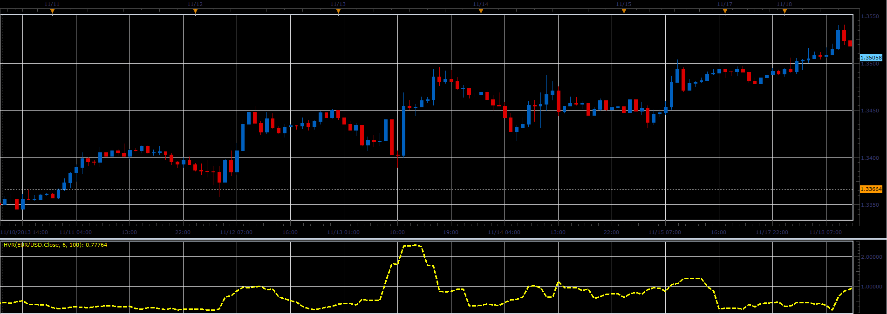
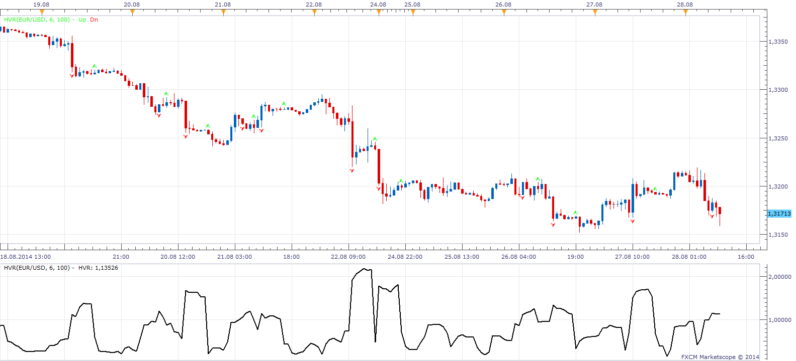

# Historical Volatility Ratio oscillator

> Source: https://fxcodebase.com/code/viewtopic.php?f=17&t=59981  
> Forum: 17 · Topic 59981 · 12 post(s)

---

## Historical Volatility Ratio oscillator

**Alexander.Gettinger** · Tue Nov 26, 2013 3:21 pm

Formulas:
HVR = StdDev1/StdDev2, where
StdDev1 - standard deviation with Period1,
StdDev2 - standard deviation with Period2.

 

Download:

 [HVR.lua](files/91134/HVR.lua)

The indicator was revised and updated

---

## Re: Historical Volatility Ratio oscillator

**Alexander.Gettinger** · Tue Nov 26, 2013 3:23 pm

MQL4 version of Historical Volatility Ratio oscillator: [viewtopic.php?f=38&t=59982](https://fxcodebase.com/code/viewtopic.php?f=38&t=59982).

---

## Re: Historical Volatility Ratio oscillator

**Jeffreyvnlk** · Tue Aug 26, 2014 3:47 am

> **Alexander.Gettinger wrote:**
> Formulas:
> HVR = StdDev1/StdDev2, where
> StdDev1 - standard deviation with Period1,
> StdDev2 - standard deviation with Period2.
>
>
>
> HVR.PNG
>
>
>
> Download:
>
>
> HVR.lua

Coud you give a percentage plse ?
Btw appreciated if you can give a version overlaying on chart with 2 numbers of 2 days earlier (not counting today price)
Thanks

---

## Re: Historical Volatility Ratio oscillator

**Apprentice** · Tue Aug 26, 2014 10:59 am

Can you define what the percentage is.

---

## Re: Historical Volatility Ratio oscillator

**Jeffreyvnlk** · Tue Aug 26, 2014 3:03 pm

> **Apprentice wrote:**
> Can you define what the percentage is.

Sorry I messed up with the percentage of other indicator.

Just an arrow on the bar which HRV under a threshold , for example under 50

---

## Re: Historical Volatility Ratio oscillator

**Apprentice** · Thu Aug 28, 2014 8:48 am

Try this version.
This version will introduce an arrow on HRV / threshold cross.
Unfortunately will only work on Bar source.

 [HVR.lua](files/95610/HVR.lua)

---

## Re: Historical Volatility Ratio oscillator

**Jeffreyvnlk** · Fri Aug 29, 2014 4:04 pm

> **Apprentice wrote:**
>
>
> HVR.png
>
>
> Try this version.
> This version will introduce an arrow on HRV / threshold cross.
> Unfortunately will only work on Bar source.
>
>
> HVR.lua

Thank you it is great but I can not set threshold level smaller than 1. Appreciated if you could fix it

---

## Re: Historical Volatility Ratio oscillator

**Apprentice** · Sat Aug 30, 2014 4:01 am

Please Re-Download.

---

## Re: Historical Volatility Ratio oscillator

**Jeffreyvnlk** · Mon Sep 01, 2014 7:23 pm

> **Apprentice wrote:**
> Please Re-Download.

Excellent, thanks

---

## Re: Historical Volatility Ratio oscillator

**Jeffreyvnlk** · Sat Sep 27, 2014 2:13 pm

> **Apprentice wrote:**
>
>
> HVR.png
>
>
> Try this version.
> This version will introduce an arrow on HRV / threshold cross.
> Unfortunately will only work on Bar source.
>
>
> HVR.lua

May I report the problem. The arrow not appeared when the indicator jump up or down so big so the threshold level ignored. For example, if I set the threshold is 0.5. When HVR jump from 0.3 to 0.7 from yesterday to today, it means 0.5 threshold not registered at all so no arrow for this crossing

---

## Re: Historical Volatility Ratio oscillator

**Jeffreyvnlk** · Sat Sep 27, 2014 2:15 pm

The error made when I using 2 HVR indicators at the same time. So better I just use 1 only. Sorry, just ignore that post.Thank for reading

---

## Re: Historical Volatility Ratio oscillator

**Apprentice** · Thu Jun 29, 2017 6:22 am

The indicator was revised and updated.
