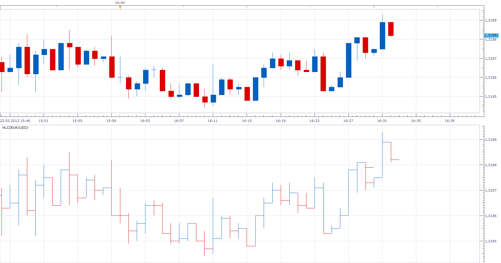

# HLC Bar

> Source: https://fxcodebase.com/code/viewtopic.php?f=17&t=15046  
> Forum: 17 · Topic 15046 · 11 post(s)

---

## HLC Bar

**Apprentice** · Thu Mar 22, 2012 3:31 pm

As requested.
I wrote HLC Bar.
As you can see, lacking the O / Open component.
This is the best I can do for now.

 [HLC.lua](files/28496/HLC.lua)

MT4/MQ4 version
[viewtopic.php?f=38&t=68600](https://fxcodebase.com/code/viewtopic.php?f=38&t=68600)

---

## Re: HLC Bar

**Bouzouki** · Wed Oct 22, 2014 3:00 pm

First off THANK YOU so much for this indicator it is great!
Is there anyway you can add the option to increase the thickness of the bars?

Heads Up to others looking for a HLC Indi this one is the best!!!

---

## Re: HLC Bar

**Apprentice** · Wed Oct 22, 2014 3:29 pm

Style Option Added.

---

## Re: HLC Bar

**Bouzouki** · Wed Oct 22, 2014 3:54 pm

Tip for Traders that want a HLC bar as main chart especially with the new Bar thickness option.

1)When adding indicator click the tab for location and uncheck the "Show indicator/Oscillator box"

2)Set your chart mode to bars

3)Next Right click chart and go to options
 Click Bar Mode Options on the left in the Options window
 Set the color of the bars to the same as your background chart color

4)Now go to properties and adjust the bar thickness to suit your eye

Another nice feature about this Indicator is when your on a daily chart the close of Friday IS NOT shown.(I mean the end of the line is the close but there is no bartick to the right)
For me this is good because I can quickly see end of the week easily on daily charts

---

## Re: HLC Bar

**fromthewest** · Wed Jan 07, 2015 8:34 am

Hi, how much to have you code in an adjustable closing bar length? I'd like a not touching the next bar. Really nice otherwise!

---

## Re: HLC Bar

**fromthewest** · Wed Jan 07, 2015 8:53 am

I'm not sure if my other message went through. Looking to get this indicator coded with the ability to adjust the length of the close bar, or at least have them long like they are but not touching the next bar. Thanks

---

## Re: HLC Bar

**Apprentice** · Sun Jan 11, 2015 5:14 am

Please Re-Download.

---

## Re: HLC Bar

**Apprentice** · Thu Aug 03, 2017 6:04 am

The indicator was revised and updated.

---

## Re: HLC Bar

**logicgate** · Sun Jun 23, 2019 2:23 pm

Dear friend Apprentice, can you code a MT4 version of this indicator? But to be displayed on the main price chart, not on a sub window. Then we can hide price and have the HLC indicator as the main price display.

---

## Re: HLC Bar

**Apprentice** · Mon Jun 24, 2019 12:03 pm

Your request is added to the development list under Id Number 4744

---

## Re: HLC Bar

**Apprentice** · Tue Jun 25, 2019 4:37 am

MT4/MQ4 version
[viewtopic.php?f=38&t=68600](https://fxcodebase.com/code/viewtopic.php?f=38&t=68600)
