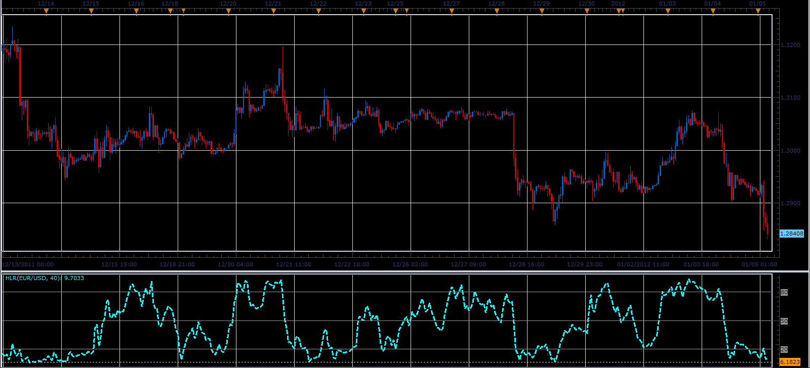

# HLR oscillator

> Source: https://fxcodebase.com/code/viewtopic.php?f=17&t=11039  
> Forum: 17 · Topic 11039 · 2 post(s)

---

## HLR oscillator

**Alexander.Gettinger** · Thu Jan 05, 2012 4:24 pm

This indicator is a ported MQL5 indicator from [http://www.mql5.com/ru/code/791](http://www.mql5.com/ru/code/791) (in Russian)

Formula:
HLR[i]=100*(MidPrice-Min)/(Max-Min), where
MidPrice - median price,
Max and Min - maximum and minimum prices at range from (i-Period) to (i).

 

Download:

 [HLR.lua](files/22544/HLR.lua)

The indicator was revised and updated

---

## Re: HLR oscillator

**Apprentice** · Mon Mar 20, 2017 8:01 am

Indicator was revised and updated.
