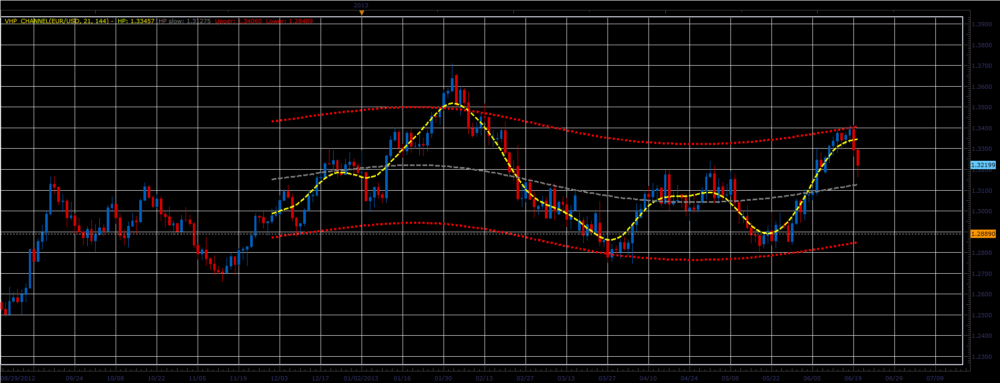

# Hodrick-Prescott Channel

> Source: https://fxcodebase.com/code/viewtopic.php?f=17&t=41584  
> Forum: 17 · Topic 41584 · 6 post(s)

---

## Hodrick-Prescott Channel

**Alexander.Gettinger** · Thu Jun 20, 2013 3:23 pm

This indicator is a ported MQL5 indicator from [http://www.mql5.com/en/code/191](http://www.mql5.com/en/code/191).

 

Download:

 [VHP_Channel.lua](files/67867/VHP_Channel.lua)

 [Tick_VHP_Channel.lua](files/67867/Tick_VHP_Channel.lua)

---

## Re: Hodrick-Prescott Channel

**Alexander.Gettinger** · Thu Jun 20, 2013 3:25 pm

MQL4 version of indicator: [viewtopic.php?f=38&t=41585](https://fxcodebase.com/code/viewtopic.php?f=38&t=41585)

---

## Re: Hodrick-Prescott Channel

**nikpapado** · Sun Dec 08, 2013 9:08 am

Hodrick-Prescott Window indicator
The question is the VHP_CHANNEL,( 21, 144) is :
The The Hodrick-Prescott **filte**r or
, the Hodrick-Prescott **Window**

Because in [http://www.neuroshell.com/manuals/ais1/ ... filter.htm](http://www.neuroshell.com/manuals/ais1/index.html?hodrickprescottfilter.htm)

Exists the following discussion
1.	**The** Hodrick-Prescott filter**CANNOT****be used** in trading strategies or neural nets used in trading strategies. This indicator was designed to be viewed as a trend curve through the entire set of data. It is not appropriate for use in a trading strategy because new data bars can cause the trend line to change the trend through past data. This in turn can cause the NeuroShell Trader signals to change in the past. Use this indicator ONLY for viewing in a static chart, but do NOT insert it in a trading strategy or a neural net used for trading. Use Hodrick-Prescott Window indicator instead.
2.	Unlike Hodrick-Prescott Filter, **the** Hodrick-Prescott **Window i**ndicator **can be used** in trading strategies or neural nets used in trading strategies. New data bars DO NOT cause the trend line to change the trend through past data.
Please in case the VHP IS NOT THE SECOND one'' THE WINDOW"" , can you give us the Hodrick-Prescott Window indicator as it looks very very intersting and promising.

Thank you and congratulations for the big Job you do.

---

## Re: Hodrick-Prescott Channel

**Patrick Sweet** · Mon Dec 09, 2013 12:24 pm

Hi NIkpapado,

Than HPF Channel repaints.

Try this.
[viewtopic.php?f=27&t=40105&p=66605&hilit=hpf+static#p66605](https://fxcodebase.com/code/viewtopic.php?f=27&t=40105&p=66605&hilit=hpf+static#p66605)
it is a member developed HPFstatic that sounds like the HPFWIndow. Read the forum on it. BUt is pretty good.
It apparently is 2 bars behind. but on small timeframes you could run a strategy that simply uses that bar (current -2) as the trigger....as movement (on shorter timeframes) may be acceptable in that the majority of % the movement does not reverse in 2 bars but rather continues. Longer frames is another question.
Patrick

---

## Re: Hodrick-Prescott Channel

**nikpapado** · Wed Dec 11, 2013 2:10 am

Thank You Patric , I will do .

---

## Re: Hodrick-Prescott Channel

**Apprentice** · Sun Jul 30, 2017 7:06 am

The indicator was revised and updated.
