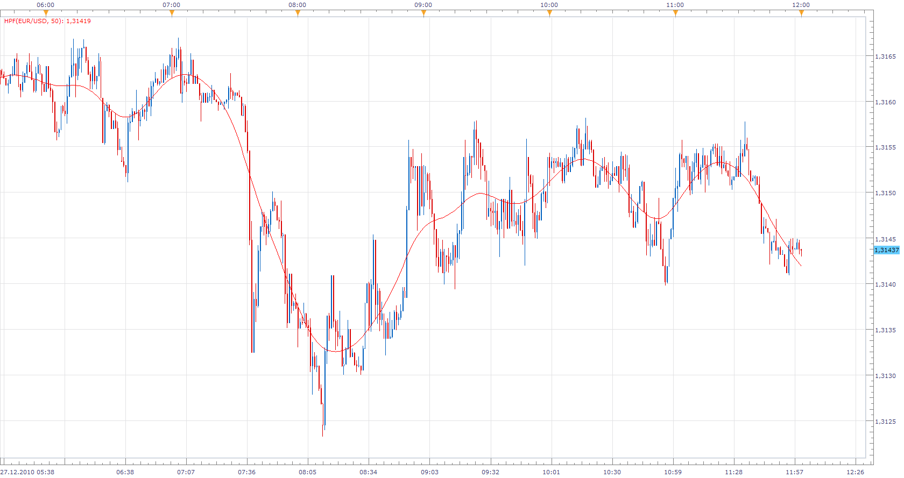
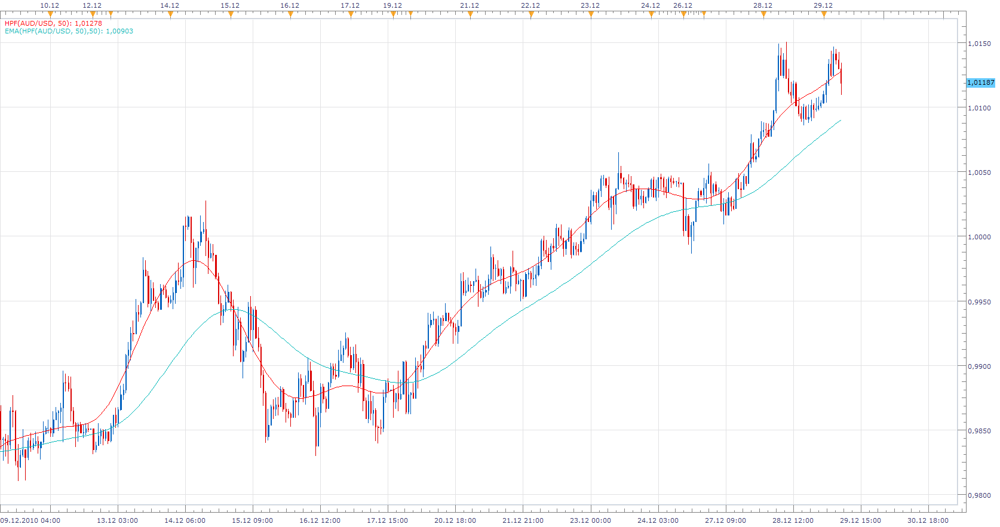
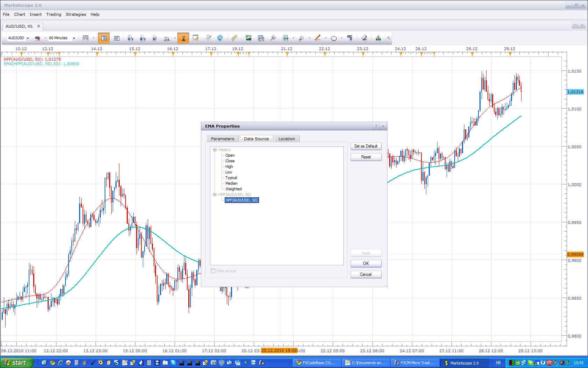

# Hodrick-Prescott Filter

> Source: https://fxcodebase.com/code/viewtopic.php?f=17&t=3024  
> Forum: 17 · Topic 3024 · 39 post(s)

---

## Hodrick-Prescott Filter

**Apprentice** · Mon Dec 27, 2010 12:00 pm

The Hodrick-Prescott filter is a mathematical tool used in macroeconomics, especially in real business cycle theory to separate the cyclical component of a time series from raw data.

 It is used to obtain a smoothed non-linear representation of a time series, it is more sensitive to long-term than to short-term fluctuations.

 [HPF.lua](files/7014/HPF.lua)

The indicator was revised and updated

---

## Re: Hodrick-Prescott Filter

**Apprentice** · Mon Dec 27, 2010 3:41 pm

When used in combination with a 50 period EMA of HPS gives good Entry / Exit signals.

---

## Re: Hodrick-Prescott Filter

**Blackcat2** · Tue Dec 28, 2010 5:43 pm

Looks good I'm currently testing it...

BTW, what do you means by "50 period EMA of HPS"? Do you mean when this indicator combined with 50 EMA or is there another indicator called HPS?

Thanks

---

## Re: Hodrick-Prescott Filter

**Apprentice** · Wed Dec 29, 2010 7:48 am

Instead you are using closing price, to calculate the EMA.
Use the EMA based on the HPF data stream.

This is only a recommendation.

Basically there are no big differences.
But since this was designed to determine long-term cycles,
EMA has a little too much noise.

 

Here you can see how to choose an alternative data source for EMA.

If 50 EMA have too much Lag for you use lower value,
for example 10 or even 5 period EMA.

The classic EMA with this period gives a lot of false signals,
EMA of HPF with period 5 almost never given false ones.

---

## Re: Hodrick-Prescott Filter

**Blackcat2** · Wed Dec 29, 2010 7:36 pm

Thanks Apprentice...

Much appreciated

---

## Re: Hodrick-Prescott Filter

**laners303** · Thu Jan 13, 2011 11:46 pm

Hey Apprentice,

if the HPF was an option in the MA ADVISOR strategy, and you could adjust the EMA as you suggested it would be an unreal strategy

Laners303

---

## Re: Hodrick-Prescott Filter

**ALEX678** · Sat Jan 15, 2011 5:20 am

This HPF 50 with EMA 50 is the great indicators, ther is a signal with this two indicators combined?

---

## Re: Hodrick-Prescott Filter

**Apprentice** · Sat Jan 15, 2011 6:06 am

The answer to both post, HPF is primarily an analytical tool, not for trader,
 I will see whether this is justified.

---

## Re: Hodrick-Prescott Filter

**craige** · Sun Jan 16, 2011 3:51 am

HELLO GUYS

I found HPF is a great indicator in the long term which it is able to predict the trend

two questions

1. which time frame is suitable for HPF in order to use its advantage in the long term, M15、H1、H4、D1?
2. is the HPF indicator a lagging indicator? or how long it lags when used in different time frame?

thanks for your reply

---

## Re: Hodrick-Prescott Filter

**laners303** · Sun Jan 16, 2011 11:05 pm

Hey Craige,

I set it up just as Apprentice said with the 50 HPF and the 50 EMA. On the hourly time frame since the 3 of june last year it collected 9978 pips excluding spreads and slippage etc. In that 6 month period there was 37 trades and only three of them were losers, but thats without stoplosse's. there is a small bit of lag but when u get the signal the move is in motion so there is no major pullback's.Thats what I have found the best so far,

all the best man,
Laners303

---

## Re: Hodrick-Prescott Filter

**craige** · Mon Jan 17, 2011 6:30 am

HELLO Laners

thanks for your information, your information is very important to me, which give me a strong support for this indicator.

the reason why I ask this indicator whether is a lagging indicator or not is that I found sometimes when the HPF cross EMA, with the price changing, the HPF may pullback from the EMA.

but now, I will forget it, I will have a try with your information

thanks a lot Laners

Craige

---

## Re: Hodrick-Prescott Filter

**craige** · Mon Jan 17, 2011 6:37 am

HELLO Laners

one more question

when you got the singal, you put the order buy or sell, the question is that in which situation you exit from the market?

thanks a lot

---

## Re: Hodrick-Prescott Filter

**knightflyer** · Wed Jan 19, 2011 8:32 pm

+1 for the HPF in the MA Advisor strategy, although it may need to wait a bar or two after the cross to confirm. Keep up the good work.

---

## Re: Hodrick-Prescott Filter

**Zodiac** · Wed Jan 19, 2011 9:38 pm

this is very cool.

I've tried to wire up a strategy that uses this. I wonder if you could help.

I get this error when the strategy calls the updateLast method.

[string "HPMCrossTestVersion.lua"]:87: [string "HPF.lua"]:121: attempt to index field 'open' (a nil value)

Code: [Select all](https://fxcodebase.com/code/)
`80: function ExtUpdate(id, source, period)
81:    if id == 1 and price == nil then
82:        price = ExtSubscribe(2, nil, instance.parameters.TF, true, "close");
83:        hpfLine = core.indicators:create("HPF", price, instance.parameters.HPF);
84:        emaLine = core.indicators:create("EMA", price, instance.parameters.EMA);
85:        first = math.max(hpfLine.DATA:first(), emaLine.DATA:first()) + 1;
86:    elseif id == 2 then
87:        hpfLine:update(core.UpdateLast); --error is here
88:        emaLine:update(core.UpdateLast);`
HPF.lua:

Code: [Select all](https://fxcodebase.com/code/)
`121:  a[i]=(source.open[i]-hh3*hh5-h3*h4)/z;`

---

## Re: Hodrick-Prescott Filter

**Apprentice** · Thu Jan 20, 2011 5:38 am

It appears that you have sent Tick Data to Indicator.
The indicator use Data Bar.

If this does not help, post the whole code.

---

## Re: Hodrick-Prescott Filter

**Zodiac** · Thu Jan 20, 2011 6:39 pm

thank you. i actually was able to figure it out after getting a better understanding of the streams. all the code you've posted has been very helpful.

I wonder if you could take a look at the strategy.

There's two things. The orders lag way behind and at different intervals. I saw someone in the post say this too. I wonder if you think this is because of how it repaints?

Also, some crosses don't open an order. I don't think it's because of repainting but I can't tell because I'm still learning lua and indicore.

Code: [Select all](https://fxcodebase.com/code/)
`function Init()
    strategy:name("HPF Cross Strategy");
    strategy:description("Hodrick-Prescott Filter Cross with HPF's EMA. Based on HPF indicator by Apprentace.");

strategy.parameters:addGroup("HPF Cross Parameters");
strategy.parameters:addInteger("HPF", "HPF Period", "", 50, 1, 200);
strategy.parameters:addInteger("EMA", "EMA Periods", "", 50, 1, 200);

strategy.parameters:addGroup("Price");
strategy.parameters:addString("PT", "Price Type", "", "Bid");
strategy.parameters:addStringAlternative("PT", "Bid", "", "Bid");
strategy.parameters:addStringAlternative("PT", "Ask", "", "Ask");
strategy.parameters:addString("TF", "Time Frame", "", "m1");
strategy.parameters:setFlag("TF", core.FLAG_PERIODS);

strategy.parameters:addGroup("Signals");
strategy.parameters:addBoolean("ShowAlert", "Show Alert", "", true);
strategy.parameters:addBoolean("PlaySound", "Play Sound", "", false);
strategy.parameters:addFile("SoundFile", "Sound File", "", "");
strategy.parameters:setFlag("SoundFile", core.FLAG_SOUND);

strategy.parameters:addGroup("Trading");
strategy.parameters:addBoolean("CanTrade", "Allow Trading", "", false);
strategy.parameters:addString("Account", "Account to trade", "", "");
strategy.parameters:setFlag("Account", core.FLAG_ACCOUNT);
strategy.parameters:addInteger("LotSize", "Lots to trade", "", 1, 1, 100);
strategy.parameters:addInteger("Stop", "Stop pips", "Use 0 for no stops", 0, 1, 100);
strategy.parameters:addInteger("Limit", "Limit pips", "User 0 for limits", 0, 1, 100);
end

local SoundFile;
local CanTrade;
local Account;
local Stop;
local Limit;
local CanClose;
local CanStop;
local OfferID;

function Prepare()
local HPF, EMA;
HPF = instance.parameters.HPF;
EMA = instance.parameters.EMA;
assert(HPF >= EMA, "The HPF periods must be equal or longer than the EMA.");
local ShowAlert;
ShowAlert = instance.parameters.ShowAlert;

if instance.parameters.PlaySound then
    SoundFile = instance.parameters.SoundFile;
else
    SoundFie = nil;
end
assert(not(PlaySound) or (PlaySound and SoundFile ~= ""), "Sound file must be specified");

if CanTrade then
    Account = instance.parameters.Account;
    Stop = math.floor(instance.parameters.Stop + 0.5);
    Limit = math.floor(instance.parameters.Limit + 0.5);
    local instrument = instance.bid:instrument();

    OfferID = core.host:findTable("Offers"):find("Instrument", instrument).OfferID;
    CanStop = core.host:execute("getTradiingProperty", "canCreateStopLimit", instrument, Account);
    CanClose = core.host:execute("getTradingProperty", "canCreateMarketClose", instrument, Account);
    Amount = instance.parameters.LotSize * core.host:execute("getTradingProperty", "baseUnitSize", instrument, Account);
end

local name = profile:id() .. "(" .. instance.bid:name() .. "," .. instance.parameters.TF .. "," .. HPF .. "," .. "HPF" .. ")";
instance:name(name);
ExtSetupSignal(name, ShowAlert);
ExtSubscribe(1, nill, "t1", true, "tick");
end

----
local price = nil;
local hpfLine;
local emaLine;
local first;

function ExtUpdate(id, source, period)
    if id == 1 and price == nil then
        price = ExtSubscribe(2, nil, instance.parameters.TF, true, "bar");
        hpfLine = core.indicators:create("HPF", price, instance.parameters.HPF);
        emaLine = core.indicators:create("EMA", hpfLine.DATA, instance.parameters.EMA);
        first = math.max(hpfLine.DATA:first(), emaLine.DATA:first()) + 1;
    elseif id == 2 then
        hpfLine:update(core.UpdateLast);
        emaLine:update(core.UpdateLast);
            if period >= first then
                if core.crossesOver(hpfLine.DATA, emaLine.DATA, period) then
                    ExtSignal(instance.ask, instance.ask:size() - 1, "BUY", SoundFile, nil);
                        if CanTrade then
                            if not(close(true)) then
                                open(false);
                            end
                        end
                elseif core.crossesUnder(hpfLine.DATA, emaLine.DATA, period) then
                    ExtSignal(instance.bid, instance.bid:size() - 1, "SELL", SoundFile, nil);
                        if CanTrade then
                            if not(close(false)) then
                                open(true);
                            end
                        end
                end
            end
    end
end

function open(sell)
    valuemap= core.valuemap();
    valuemap.Command = "CreateOrder";
    valuemap.OrderType = "OM";
    valuemap.OfferID = OfferID;
    valuemap.AcctID = Account;
    valuemap.Quantity = Amount;

    local side, limit, stop;
    if sell then
        side = "S";
        stop = instance.ask[instance.ask:size() - 1] + Stop * instance.ask:pipSize();
        limit = instance.bid[instance.ask:size() - 1] - Limit * instance.bid:pipSize();
    else
        side = "B";
        stop = instance.bid[instance.ask:size() - 1] - Stop * instance.ask:pipSize();
        limit = instance.ask[instance.ask:size() - 1] + Limit * instance.bid:pipSize();
    end

    valuemap.BuySell = side;

    if Stop > 0 and CanStop then
        valuemap.RateStop = stop;
    end

    if Limit > 0 and CanStop then
        valuemap.RateLimit = limit;
    end

    local success, msg;
    success, msg = terminal:execute(200, valuemap);
    assert(success, msg);
end

function close(sell)
    local enum, side, valuemap, side, closed;

    if sell then
        side = "S";
    else
        side = "B";
    end
    closed = false;

    enum = core.host:findTable("trades"):enumerator();

    while true do
    row = enum:next();
        if row == nil then
            break;
        end

        if row.AccountID == Account and row.OfferID == OfferID and row.BS == side then
            if CanClose then
                -- non-NFA accounts
                valuemap = core.valuemap();
                valuemap.Command = "CreateOrder";
                valuemap.OrderType = "CM";
                valuemap.AcctID = Account;
                valuemap.Quantity = row.Lot;
                valuemap.TradeID = row.TradeID;

                    if row.BS == "B" then
                        valuemap.BuySell = "S";
                    else
                        valuemap.BushSell = "B";
                    end

                local success, msg;
                success, msg = terminal:execute(200, valuemap);
                assert(success, msg);
            else
                -- NFA account
                valuemap = core.valuemap();
                valuemap.OrderType = "OM";
                valuemap.Command = "CreateOrder";
                valuemap.OfferID = OfferID;
                valuemap.AcctID = Account;
                valuemap.Quantity = row.Lot;

                    if row.BS == "B" then
                        valuemap.BuySell = "S";
                    else
                        valuemap.BuySell = "B";
                    end
                local success, msg;
                success, msg = terminal:execute(200, valuemap);
                assert(success, msg);
            end
        closed = true;
        end
    end
    return closed;
end

dofile(core.app_path() .. "\\strategies\\standard\\include\\helper.lua");`

---

## Re: Hodrick-Prescott Filter

**macogi37** · Sun Jan 23, 2011 6:04 am

Hello everyone,
I tried to put EMA and HPF togheter at 50, and I must say that is a good match, but I tried to select HPF in all my MA strategies (MA Crossover Strategy - Ma Advisor - MA Strategy), I found all the Moving Averages but the only missing is this.
Is there a way to make it avalaible for these Strategies?

Thanks a lot

P.S.
I tried also the code posted before, but it didn't work!
Please help us...

---

## Re: Hodrick-Prescott Filter

**craige** · Mon Jan 31, 2011 11:44 pm

any progress achieved?

---

## Re: Hodrick-Prescott Filter

**Fortunelost** · Fri Feb 04, 2011 9:48 am

The HPF Indicator appears to be an excellent Indicator under my limited test on the Daily and 1H charts. Yes, there is a slight delay but this is insurance that you catch the up or down trend with limited drawdowns .
As I watch many currency pairs at once on three screens, could you kindly program the HPF trendline to change colour when Up or Down. This visual 'alarm" will assist to catch the correct currency pair for a trade or exit.
Keep up the good work,

---

## Re: Hodrick-Prescott Filter

**virgilio** · Fri Feb 04, 2011 10:11 am

Can anyone tell me what the Hodrick-Prescott Filter calculations is?
Thank you.

---

## Re: Hodrick-Prescott Filter

**Apprentice** · Wed Mar 30, 2011 4:56 am

HPF Update.

In addition to improving performance,
Some algorithms are changed, or corrected.

Fully compatible with the old version was held.

---

## Re: Hodrick-Prescott Filter

**davetherave110179** · Wed Mar 30, 2011 9:25 am

Apprentice,

Thank you so much for this!

I will keep my eyes peeled for the stratagy.

God bless,

davetherave110179

---

## Re: Hodrick-Prescott Filter

**sentmenat4** · Sat Apr 02, 2011 3:31 pm

Good night from Spain, Apprentice,

I can confirm that this indicator does not repaint as another's in a thread about this site??

Thanks for your time

---

## Re: Hodrick-Prescott Filter

**davetherave110179** · Mon Apr 04, 2011 1:20 pm

Apprentice,

I realise I have been taking up too much of fxcodebase time with the HPF request. The HPF is an indicator that cannot be stratagised because of the way it calculates itself. Both you, Sunshine and Nikolay (and my mate Luke) have tried to tell me otherwise. I have been stubborn and somewhat ignorant in not listening to you guys. I have, therefore conceded defeat. The HPF is one stratagy that will not be tamed.

Please delete my request, I apologise for any inconvienence (and head-aches) incurred.

davetherave110179

---

## Re: Hodrick-Prescott Filter

**Apprentice** · Tue Apr 05, 2011 2:05 am

I will not delete, just delayed until something like this would not be possible.
I have the most to blame for this problem.
The development team will find a solution.
To make indicators like this work in the future.

---

## Re: Hodrick-Prescott Filter

**alpha_bravo** · Tue Apr 05, 2011 6:24 am

Its possible, just define a crossover with another filter and delay the entry order for x bars until a set of conditions has been met- there has to be some kind of coefficient that determines under what conditions the filter could repaint, and to what degree- i.e. after time t with slope y, the filter wont repaint itself(to the extent of a new crossover at t-1) because… perhaps a certain area threshold between filters a and b has been met for example, or they have diverged a distance that cant possibly be retraced in time t(if you couldn’t find the coefficients with math, this could be based on some statistical analysis of how the filter has performed over years of data)...But this kind of thing goes well beyond the scope of a simple request. There is perhaps weeks of pointless work involved here, and in the end, nothing changes.

In the end, risk is risk; its only a filter, don’t be fooled by it. By its nature, it is taking its information from current prices and applying them to the past, if you change any of this, then its no longer the HPF…it just becomes another filter, that also cant predict the future, it just paints a pretty and hypnotizing picture of the past.

---

## Re: Hodrick-Prescott Filter (Static)

**Scrat_Power** · Sun Sep 09, 2012 10:30 am

Hi,

Here the static version of the HPF indicator.
As HPF is fully dynamic, it's hard to imagine the past of this indicator.
Now, you can.
As you will see, the result is quite different from the perfect draw of the dynamic one.

Scrat.

 [HPF_Static.lua](files/39971/HPF_Static.lua)

---

## Re: Hodrick-Prescott Filter

**petrus.marx** · Thu Nov 01, 2012 3:38 am

There could be something to this if I look at this chart, been checking it out for the last day or so, and going back in the past. Seem like the only problem is finding a good exit point. Entry is after the cross of the two lines, maybe give it two candles or so.

---

## Re: Hodrick-Prescott Filter

**juju1024** · Sun Nov 18, 2012 6:28 am

Hi all,

Can you create a strategy for this indicator when HPF (customizable with same parameter) cross EMA or MVA also configurable ?

thanks very much

Cordialy

---

## Re: Hodrick-Prescott Filter

**Apprentice** · Sun Nov 18, 2012 8:41 am

This is possible.
one remark, the Hodrick-Prescott filter is not the best indicator for historical testing.
Because entry, exit crosses constantly move around.
As you know this indicator repaints.

---

## Re: Hodrick-Prescott Filter

**juju1024** · Sun Nov 18, 2012 11:05 am

Yes i know, what is the best indicator for historical indicator testing (no repaint)?

---

## Re: Hodrick-Prescott Filter

**Apprentice** · Mon Nov 19, 2012 3:45 am

I do not use indicators / strategies in my trading.
Fundamentals, risk control, position sizing, sentiment are more important in my book.

---

## Re: Hodrick-Prescott Filter

**juju1024** · Mon Nov 19, 2012 2:59 pm

Okay, can you create this request, the repaint is not a problem it is short

---

## Re: Hodrick-Prescott Filter

**Apprentice** · Tue Nov 20, 2012 3:21 am

I have planned this, but I have not found the time.

---

## Re: Hodrick-Prescott Filter

**dtb71fxcm** · Fri Mar 08, 2013 7:39 pm

I'd like to bump this along... Apprentice - any ETA on when you could create this strategy?

Thanks!

---

## Re: Hodrick-Prescott Filter

**Coondawg71** · Sat May 25, 2013 7:02 am

Can we please have this HPF Channel indicator converted to Luna.

Thanks

Sjc

[http://www.mql5.com/en/code/191](http://www.mql5.com/en/code/191)

---

## Re: Hodrick-Prescott Filter

**Apprentice** · Sun Jun 02, 2013 11:58 am

Your request is added to the development list.

---

## Re: Hodrick-Prescott Filter

**mulligan** · Mon Apr 06, 2015 2:55 pm

I read the suggestion by Apprentice to use HPF as the data source on moving averages. Brilliant!
 I set up several different combinations of time frames with the Averages indicator and watched in real time to make sure it wasn't just a pretty repainting illusion. It seems to work quite well. Since there is already an Averages strategy existing, is it feasible to change the data base to HPF? If so, I would request the option to change the HP filter period and max bars to calculate as with the indicator. Would also request strategy uses end of turn if it doesn't already.

Thanks very much

---

## Re: Hodrick-Prescott Filter

**Apprentice** · Wed Jun 14, 2017 7:32 am

The indicator was revised and updated.
