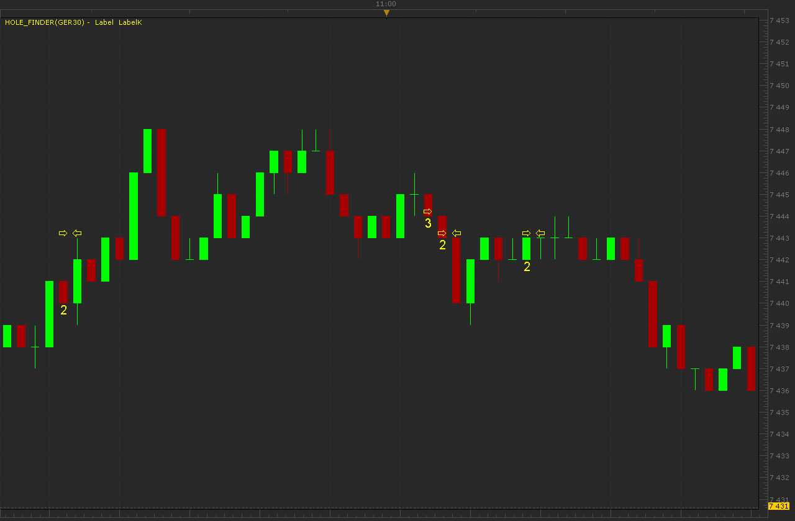

# Hole finder

> Source: https://fxcodebase.com/code/viewtopic.php?f=17&t=5006  
> Forum: 17 · Topic 5006 · 2 post(s)

---

## Hole finder

**Alexander.Gettinger** · Tue Jul 05, 2011 1:57 am

Indicator shows holes in the chart data. Number label corresponds number of missed candles.

 

Download:

 [Hole_Finder.lua](files/12338/Hole_Finder.lua)

The indicator was revised and updated

---

## Re: Hole finder

**Apprentice** · Sun Mar 12, 2017 6:10 pm

Indicator was revised and updated.
