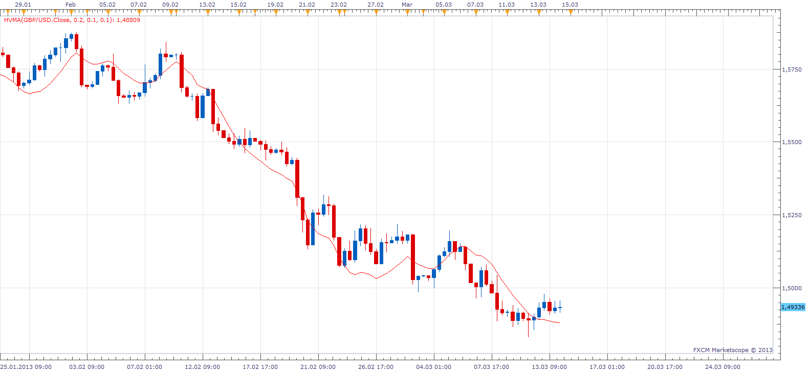
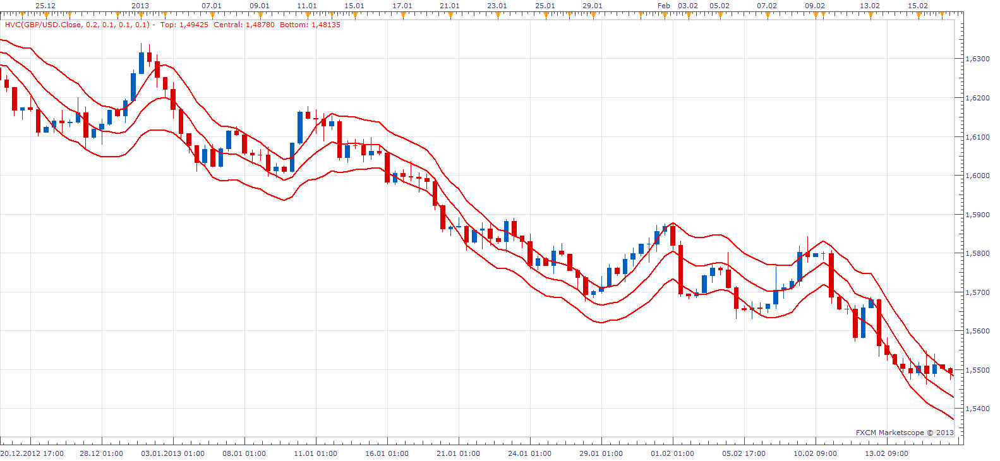

# Holt-Winter Moving Averege

> Source: https://fxcodebase.com/code/viewtopic.php?f=17&t=33313  
> Forum: 17 · Topic 33313 · 4 post(s)

---

## Holt-Winter Moving Averege

**Apprentice** · Thu Mar 14, 2013 6:06 am

 [HVMA.lua](files/56551/HVMA.lua)

The indicator was revised and updated

---

## Holt-Winter Channel

**Apprentice** · Thu Mar 14, 2013 6:13 am

As Presented by Ichu Cheng in August 1988 article, Holt-Winter Channel: taking the formula one step beyond of Stock & Commodities magazine.

 [HVC.lua](files/56553/HVC.lua)

---

## Re: Holt-Winter Moving Averege

**Alexander.Gettinger** · Fri Jun 06, 2014 3:59 pm

MQL4 version of Holt-Winter Moving Average and Holt-Winter Channel: [viewtopic.php?f=38&t=60802](https://fxcodebase.com/code/viewtopic.php?f=38&t=60802).

---

## Re: Holt-Winter Moving Averege

**Apprentice** · Mon Jun 19, 2017 7:55 am

The indicator was revised and updated.
