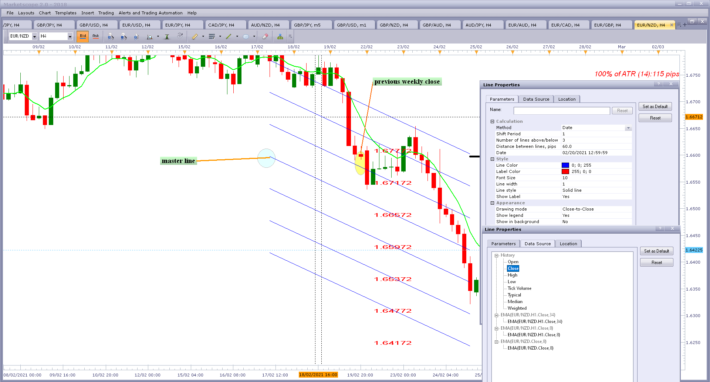
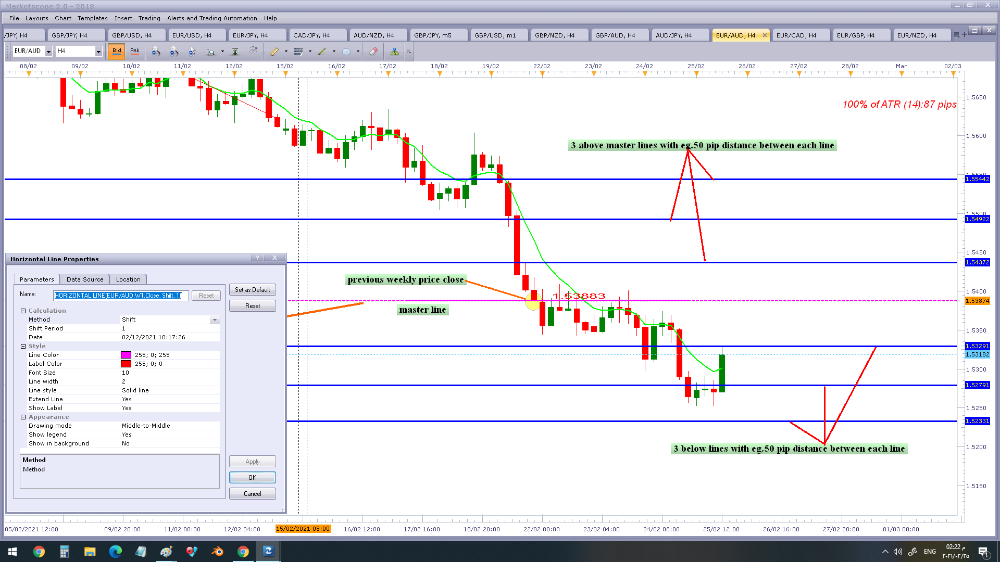

# Horizontal Line

> Source: https://fxcodebase.com/code/viewtopic.php?f=17&t=70510  
> Forum: 17 · Topic 70510 · 14 post(s)

---

## Horizontal Line

**Apprentice** · Mon Oct 05, 2020 12:37 pm

Based on line.
[viewtopic.php?f=27&t=70504](https://fxcodebase.com/code/viewtopic.php?f=27&t=70504)

 [Horizontal Line.lua](files/138077/Horizontal%20Line.lua)

---

## Re: Horizontal Line

**gustavonoves** · Wed Oct 07, 2020 4:34 pm

Hi Apprentice. Thank you por developing the indicator. Could the line please finish in the current price instead of just being horizontal. I mean it should have an ascending or descending slope. Attached is an image with an example. Thank you

---

## Re: Horizontal Line

**Apprentice** · Thu Oct 08, 2020 2:18 am

Your request is added to the development list.
Development reference 2160.

---

## Re: Horizontal Line

**Apprentice** · Fri Oct 09, 2020 6:59 am

[Line.lua](files/138184/Line.lua)

Try this version.

---

## Re: Horizontal Line

**00808060** · Tue Feb 23, 2021 1:25 pm

good day Apprentice, kindly could you please make some update for Horizontal Line.lua
i want to be be able to draw an umber of horizontal line above and below the master line like SweetSpots indicator.

exactly i want master line draw on close of weekly candle
then i want to blot 3 or more Horizontal Line above and below of master line with specefic numper of pip .
please note that the line should be staple and haven't shift from start to end of week

[img]

Capture.PNG

[/img]

 [32123](files/140906/Capture.PNG)

 

best regards

---

## Re: Horizontal Line

**Apprentice** · Wed Feb 24, 2021 3:55 am

Your request is added to the development list.
Development reference 227.

---

## Re: Horizontal Line

**Apprentice** · Wed Feb 24, 2021 11:32 am

[Multi Line.lua](files/140922/Multi%20Line.lua)

Try this version.

---

## Re: Horizontal Line

**00808060** · Thu Feb 25, 2021 7:23 am

thank you too much dear Apprentice for your great works, i appreciate it.

but the there are some note abot this vesion of indicator:

1- the master line should be drawing depending on the previous weekly close.... in this version the data source not works fine.

2- all lines have some slope and its not horizontal. ( it must be horizontal).

3- all lines and and prices label shift and change its not stable. (it is should be stable and constant with out any shift or slope from start to end of week.... because its logical, established depending on previous weekly price close (master line, and another lines above and below master line have specific pip distance .

simple I want the combination of tow indicators (horizontal line Which drawn a stable line from previous weekly price close ) & ( draw an umber of above and below horizontal line with specific distance of pip)

kindly please see the attached image.

best regards

 

eg.

 

---

## Re: Horizontal Line

**Apprentice** · Fri Feb 26, 2021 4:22 am

Your request is added to the development list.
Development reference 231.

---

## Re: Horizontal Line

**Apprentice** · Wed Mar 03, 2021 1:12 pm

The idea is to draw horizontal lines above and below the previous week's close?

---

## Re: Horizontal Line

**00808060** · Wed Mar 03, 2021 3:48 pm

> **Apprentice wrote:**
> The idea is to draw horizontal lines above and below the previous week's close?

yes brother the main idea to draw horizontal lines above and below the previous week's close with specific number of pip>
and the horizontal lines must be constant with out any shift or sloe (from previous week's close to end of the new week..... its simply idea.

best regards

---

## Re: Horizontal Line

**Apprentice** · Thu Mar 04, 2021 12:15 pm

Your request is added to the development list.
Development reference 249.

---

## Re: Horizontal Line

**Apprentice** · Mon Mar 08, 2021 7:31 am

[Multi Line.lua](files/141097/Multi%20Line.lua)

Try this version.

---

## Re: Horizontal Line

**00808060** · Mon Mar 08, 2021 12:47 pm

thank you too much brother the indicator work 100%............ congratulations great work.

 

