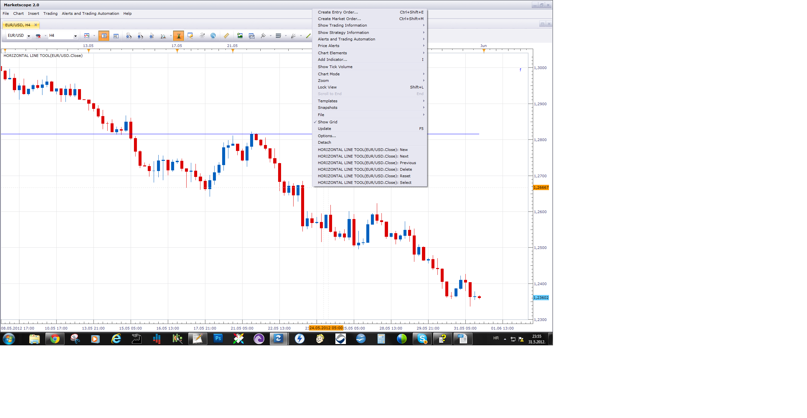

# Horizontal line tool

> Source: https://fxcodebase.com/code/viewtopic.php?f=17&t=19572  
> Forum: 17 · Topic 19572 · 4 post(s)

---

## Horizontal line tool

**Apprentice** · Thu May 31, 2012 3:53 am

This tool allows you to define, unlimited number of horizontal lines.
Use,
New - to define a new line
Next & Previous - for positioning
Reset - to delete all lines.
Delete - to delete single line
Due to an unknown bug, currently works only for close price.

 [Horizontal line tool.lua](files/34608/Horizontal%20line%20tool.lua)

The indicator was revised and updated

---

## Re: Horizontal line tool

**matson** · Thu May 31, 2012 8:07 am

hello
Can you kindly tell me how to use this tool?
thanks a lot
France

---

## Re: Horizontal line tool

**Apprentice** · Thu May 31, 2012 4:52 pm

This is a simple tool.
Enables the definition of horizontal lines, with one click.
This is a development version.
Supports only the close price, as a reference.

Use Manu to define lines.

 

---

## Re: Horizontal line tool

**Apprentice** · Tue Apr 04, 2017 4:10 am

Indicator was revised and updated.
