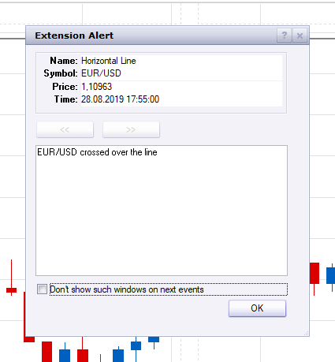

# Horizontal Line with alerts

> Source: https://fxcodebase.com/code/viewtopic.php?f=17&t=68793  
> Forum: 17 · Topic 68793 · 6 post(s)

---

## Horizontal Line with alerts

**Apprentice** · Thu Aug 15, 2019 7:09 am

Based on request.
[viewtopic.php?f=27&t=68779](https://fxcodebase.com/code/viewtopic.php?f=27&t=68779)

 [Horizontal Line with alerts.lua](files/127915/Horizontal%20Line%20with%20alerts.lua)

MT4/MQ4 version.
[viewtopic.php?f=38&t=69043](https://fxcodebase.com/code/viewtopic.php?f=38&t=69043)

---

## Re: Horizontal Line with alerts

**HappyFox8** · Thu Aug 22, 2019 3:00 am

Hi Apprentice,
I've downloaded this indicator & have it on my charts, but it doesn't make a sound.

---

## Re: Horizontal Line with alerts

**Apprentice** · Wed Aug 28, 2019 11:02 am

I don't have any issues with it.

 

---

## Re: Horizontal Line with alerts

**chai88888** · Mon Sep 09, 2019 5:46 am

hi there can you add end of turn option

thanks

---

## Re: Horizontal Line with alerts

**Apprentice** · Tue Sep 10, 2019 7:54 am

Your request is added to the development list.
Development reference 56.

---

## Re: Horizontal Line with alerts

**Apprentice** · Wed Sep 11, 2019 6:09 am

Try it now.
