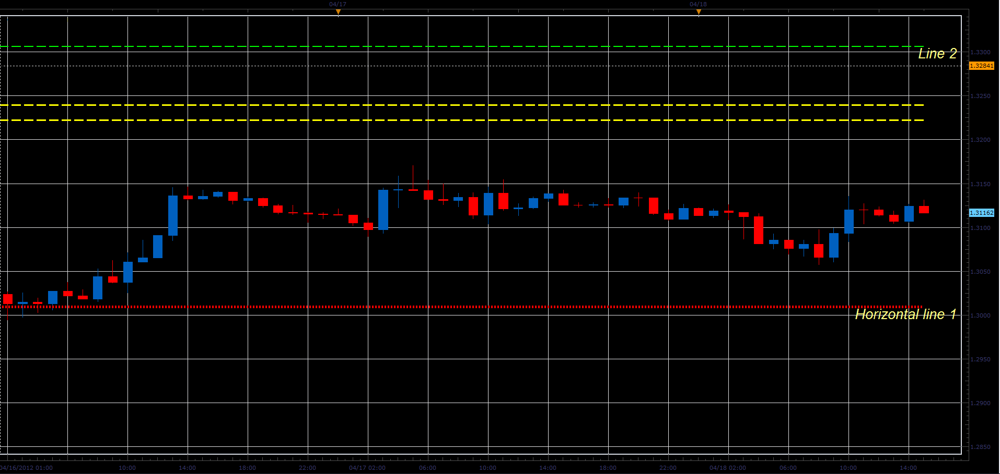
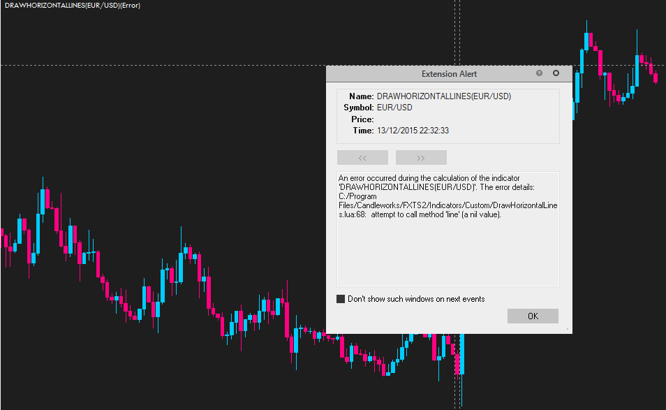
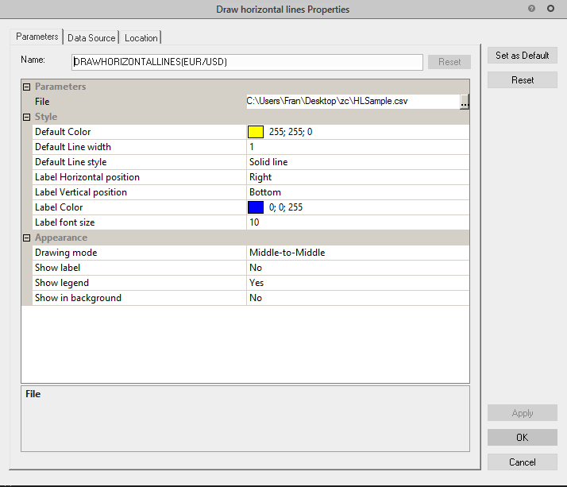
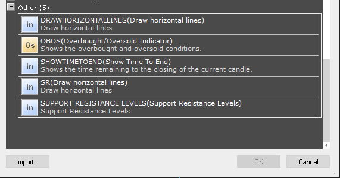
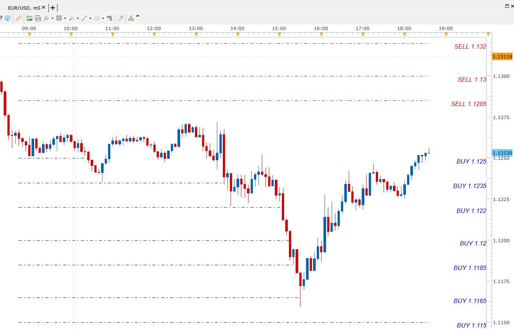

# Horizontal lines from file

> Source: https://fxcodebase.com/code/viewtopic.php?f=17&t=16319  
> Forum: 17 · Topic 16319 · 24 post(s)

---

## Horizontal lines from file

**Alexander.Gettinger** · Wed Apr 18, 2012 3:02 pm

The indicator draws a horizontal lines in accordance with the data from the file.

Strings of input file must have such format:
[Price] [R] [G] [B] [Style] [Size] [Name], where
Price - price of line,
R, G, B are a components of line color,
Style, Size - style and size of line (style may be SOLID, DOT, DASH or DASHDOT),
Name - name of line.

You may not specify color, style, width and name of lines. In this case, will be used by the default settings.

 

Download:

 [DrawHorizontalLines.lua](files/30407/DrawHorizontalLines.lua)

Sample of input file:

 [HLSample.csv](files/30407/HLSample.csv)

---

## Re: Horizontal lines from file

**Rachid** · Thu Jun 28, 2012 12:43 pm

Hi,

Is it possible to draw the lines from date to date (different dates for each line)? for example:

1 - first line from 01/01/2012 9:30 to 02/03/2012 16:30
2- Second line from 07/01/2012 9:30 to 05/04/2012 12:00
...so on

the dates should be in the file too.

Thank you

---

## Re: Horizontal lines from file

**Apprentice** · Fri Jun 29, 2012 3:56 am

Your request is added to the development list.

---

## Re: Horizontal lines from file

**Alexander.Gettinger** · Mon Jul 02, 2012 2:48 pm

The indicator with start and end dates of line.

Strings of input file must have such format:
[Price] [StartDate] [EndDate] [R] [G] [B] [Style] [Size] [Name], where
Price - price of line,
StartDate, EndDate - start and end dates of line with format MM/DD/YYYY HH:MM,
R, G, B are a components of line color,
Style, Size - style and size of line (style may be SOLID, DOT, DASH or DASHDOT),
Name - name of line.

Download:

 [DrawHorizontalLines2.lua](files/36405/DrawHorizontalLines2.lua)

---

## Re: Horizontal lines from file

**Rachid** · Wed Jul 04, 2012 2:40 pm

Work perfectly, thanks

---

## Re: Horizontal lines from file

**SuperTrader** · Wed Aug 15, 2012 11:46 am

This is a **very** useful indicator! Can we please have a little modification on its first version (the original LUA file, without the dates on the lines): Suppose there are 60 prices for drawing horizontal lines in a text file: If a **price** appears 2 or more times in that list, can we please have the output line on the chart drawn **twice as thick** ? (width 2, so it stands out from the other lines on the chart). And if a price appears 3 times in our text file, have the output line on the chart drawn thrice as thick (width 3). But if it's easier for you, let's just have width=2 for all lines that their prices appear "2 or more times" in our file (if the code finds a duplicate price, then makes the line thicker). That would be **really** great ! Thank you very much in advance guys !

---

## Re: Horizontal lines from file

**Apprentice** · Thu Aug 16, 2012 11:45 am

Your request is added to the development list.

---

## Re: Horizontal lines from file

**SuperTrader** · Thu Aug 16, 2012 2:01 pm

Thank you Apprentice. The reason for asking this modification, is that traders often visit several research sites on the internet (i.e. Daily FX, etc) and read many articles in there, technical or fundamental ones, where they may come across some **interesting price levels** written in the articles or shown on the charts of those sites, that may want to store somewhere for their future reference and trading (i.e. I'm doing this every day for the last couple of years).

Also in the beginning of each trading day I'm looking at my own blank charts (for several fx pairs and different timeframes) and take notes of the levels I find interesting for a number of reasons (historically, S+R, etc).

This text file is **a great place to store** many such price levels (several dozens often), as the indicator can later draw them on charts and visually help traders on their trading! Now, if the same price level is reported on two or more sites (or let's say "sources" in general), it makes this level more "important" and it should stand out in some way from the other lines when finally drawn !!

---

## Re: Horizontal lines from file

**Alexander.Gettinger** · Thu Sep 06, 2012 3:13 pm

> **SuperTrader wrote:**
> This is a **very** useful indicator! Can we please have a little modification on its first version (the original LUA file, without the dates on the lines): Suppose there are 60 prices for drawing horizontal lines in a text file: If a **price** appears 2 or more times in that list, can we please have the output line on the chart drawn **twice as thick** ? (width 2, so it stands out from the other lines on the chart). And if a price appears 3 times in our text file, have the output line on the chart drawn thrice as thick (width 3). But if it's easier for you, let's just have width=2 for all lines that their prices appear "2 or more times" in our file (if the code finds a duplicate price, then makes the line thicker). That would be **really** great ! Thank you very much in advance guys !

Please, see this indicator:

 [DrawHorizontalLines3.lua](files/39794/DrawHorizontalLines3.lua)

---

## Re: Horizontal lines from file

**SuperTrader** · Wed Sep 12, 2012 5:05 am

thank you **very much** Alexander, works great !

---

## Re: Horizontal lines from file

**tgassmann** · Thu Mar 20, 2014 10:41 pm

Hello,

I like this indicator a lot. I was wondering if there is a way to reload the file when ever it changes. Or reload when a chart becomes active.

Thanks
tgassmann

---

## Re: Horizontal lines from file

**Apprentice** · Sat Mar 22, 2014 3:08 am

Any changes will be registered.

---

## Re: Horizontal lines from file

**pakoromeu** · Mon Dec 14, 2015 12:27 am

Hi I need some help. I updated my platform to 01.14.101415 version and this indicator show me this error

 

I try with the example file HLSample but same error appears

 

This are my others indicators, I don't know if I need one else. SR.lua indicator show same error

 

Thanks in advance

---

## Re: Horizontal lines from file

**Victor.Tereschenko** · Mon Dec 14, 2015 5:58 am

> **pakoromeu wrote:**
> Hi I need some help. I updated my platform to 01.14.101415 version and this indicator show me this error...

This indicator uses function which doesn't supported in current version of Indicore 3 (file:lines()). Support of this function will be added in the next release.

---

## Re: Horizontal lines from file

**artiti** · Mon Jan 25, 2016 11:10 am

Hi all,

After reading that : fxcodebase.com/code/viewtopic.php?f=28&t=2178&hilit=spread&start=60

I modified the .lua file.

It's working out for me but please don't ask me any upgrades. I don't know lua but I'm a copy'n'paste expert

---

## Re: Horizontal lines from file

**pakoromeu** · Thu Jan 28, 2016 8:00 pm

Thank you Work fine for me. I needed the indicator

---

## Re: Horizontal lines from file

**wirehear** · Fri Jan 29, 2016 3:33 pm

Could I please get help on how to fill out the CSV sheet? The layout is:

[Price] [R] [G] [B] [Style] [Size] [Name], where
Price - price of line,

What is the difference between the first "[Price]" and the "Price - price of line"?

I am trying to draw horizontal solid lines at 00 levels and dashed lines at 50 levels. How would I do that in the CSV file?

Thanks in advance.

---

## Re: Horizontal lines from file

**mihaitintea** · Wed Feb 10, 2016 2:44 pm

Hi

Since I also wanted for a sooo long time to draw horizontal lines at the levels where there was Internet gossip that orders were clustered (read: where ForexLive says there are , I inspired myself from this website - much respect and hat off to all developers here ! - and I created my version for this indicator. The main differences from versions 1,2 and 3 already published in this topic are:

a) the input data for the orders is in a file named "fxorders.txt" stored in a subfolder under Candleworks installation directory tree (e.g., "C:\Program Files (x86)\Candleworks\FXTS2\persistent\fxorders.txt"). Feel free to modify this indicator to have the input file provided via a File parameter.

b) the format of the input file is csv and the structure is:
instrument, order type, start date, price
where:
instrument = name of the instrument as returned by source:name() (e.g., EUR/USD)
order type = SELL or BUY
start date = format MM/DD/YYYY HH:MM, in GMT timezone
price = the price of that order

c) the indicator draws horizontal lines from the starting point=the moment when the orders were published on the Internet, to the ending point=either the moment when the price hit that order, or up to the current moment if the price didn't hit the order yet. This is the main reason I developed this version, I am too lazy to manually draw and delete lines in Marketscope. Of course, the next challenge would be to update that fxorders.txt file live from Internet.

d) the orders older than X days are not drawn any more (see the input parameters of the indicator)

e) To use this version of the horizontal lines indicator with the latest official release of Trading Station (i.e., 01.14.112415), you must hack the Indicore I/O libraries which have to do with the "io" object, that is, apply the indicore-hotfix-TS01.14.112415-020916.zip file mentioned by Mr. Alexey Pechurin on Tue Jan 26, 2016 3:13 pm at the following forum post:
[http://fxcodebase.com/code/viewtopic.ph ... l&start=70](https://fxcodebase.com/code/viewtopic.php?f=28&t=2178&hilit=io.lines+nil&start=70)
That workaround was awesome, by the way.

f) You can put in the fxorders.txt file market orders or option expiries. The thing with these option expiries is that they usually expire (hence their name) at some regular hours daily (e.g., 10am EST), but you could bet that even after that hour there may be some orders clustered at the levels where the options were.

Attached: a sample fxorders.txt file which I've successfully tested, and the screenshot of the results.

 [fxorders.txt](files/104770/fxorders.txt)

 

*the screenshot of the results*

Feel free to modify this version at your will. Enjoy !

---

## Re: Horizontal lines from file

**mihaitintea** · Wed Feb 10, 2016 2:48 pm

Hi

Forgot to attach the indicator itself (related to the post with the fxorders.txt input file)

Sorry. I attached it just now.

Best regards
Mihai

---

## Re: Horizontal lines from file

**mihaitintea** · Fri Feb 12, 2016 8:47 am

Hi

OK now I got the final version of my version of the horizontal lines drawing indicator. This last version has more versatile and it works like this:
- create a text file <your_Program_Files>\Candleworks\FXTS2\persistent\fxorders.txt as in the following example:
# There are 4 fields on each line, separated with comma (,)
# the format of the date is MM/DD/YYYY HH:mm
# the list of prices must be separated with a slash (/) or with a space
# the second field must be BUY, SELL or OPT (for option expiries)
# comments are prefixed with "#"
# orders feb10
EUR/USD,SELL,02/10/2016 08:45,1.1285/1.1300/1.1320/1.1350/1.1375/1.1380/1.1400
EUR/USD,BUY,02/10/2016 08:45,1.1250/1.1235/1.1220/1.1200/1.1185/1.1165
# options Feb.12
EUR/USD,OPT,02/12/2016 10:55,1.1000 1.1100 1.1140 1.1200 1.1225

- import the indicator (remove the previous version of it, if necessary)

 [horizlinesorders.lua](files/104792/horizlinesorders.lua)

- Choose the parameters for the indicator as shown in their description on screen.

Hope this version is more helpful.

Regards
Mihai

---

## Re: Horizontal lines from file

**Cactus** · Sat Jun 04, 2016 4:17 pm

> **artiti wrote:**
> Hi all,
>
> After reading that : fxcodebase.com/code/viewtopic.php?f=28&t=2178&hilit=spread&start=60
>
> I modified the .lua file.
>
> It's working out for me but please don't ask me any upgrades. I don't know lua but I'm a copy'n'paste expert

This works. Sometimes it gives an error to do with "handle" I don't remember exactly, it crashes and lines disappear... Maybe due to multiple instances of it? Can anyone update this very useful indicator? Is there a limit on how many lines it can draw?

---

## Re: Horizontal lines from file

**Victor.Tereschenko** · Thu Jun 09, 2016 8:07 am

> **Cactus wrote:**
>
>
> > **artiti wrote:**
> > Hi all,
> >
> > After reading that : fxcodebase.com/code/viewtopic.php?f=28&t=2178&hilit=spread&start=60
> >
> > I modified the .lua file.
> >
> > It's working out for me but please don't ask me any upgrades. I don't know lua but I'm a copy'n'paste expert
>
>
>
> This works. Sometimes it gives an error to do with "handle" I don't remember exactly, it crashes and lines disappear... Maybe due to multiple instances of it? Can anyone update this very useful indicator? Is there a limit on how many lines it can draw?

It happens when the indicator can't read the file. When this error occurs make sure the indicator parameter points to the existing file.

---

## Re: Horizontal lines from file

**Apprentice** · Sun Sep 17, 2017 7:06 am

The indicator was revised and updated.

---

## Re: Horizontal lines from file

**Apprentice** · Sun Sep 23, 2018 6:58 am

The Indicator was revised and updated.
