# How to Download and Install Custom Indicator

> Source: https://fxcodebase.com/code/viewtopic.php?f=17&t=17  
> Forum: 17 · Topic 17 · 30 post(s)

---

## How to Download and Install Custom Indicator

**admin** · Tue Oct 20, 2009 12:21 pm

**The latest version of the article can be found in FXCodebase wiki:
[http://fxcodebase.com/wiki/index.php/Cu ... arketscope](https://fxcodebase.com/wiki/index.php/Custom_Indicators:_How_To_Install_in_Marketscope)**

**Step 1. Download Indicator**

**Variant 1**

In case the indicator is attached to the post, right click on the name of the attached file and then choose "Save Target As" in the context menu.

 

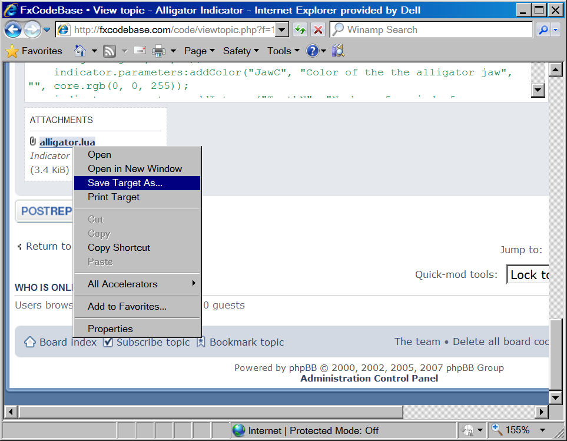

The "Save As" dialog appears. Choose any folder, for example c:\ to save the indicator. The name of the indicator file (alligator.lua in our example) will appear in the dialog automatically.

 

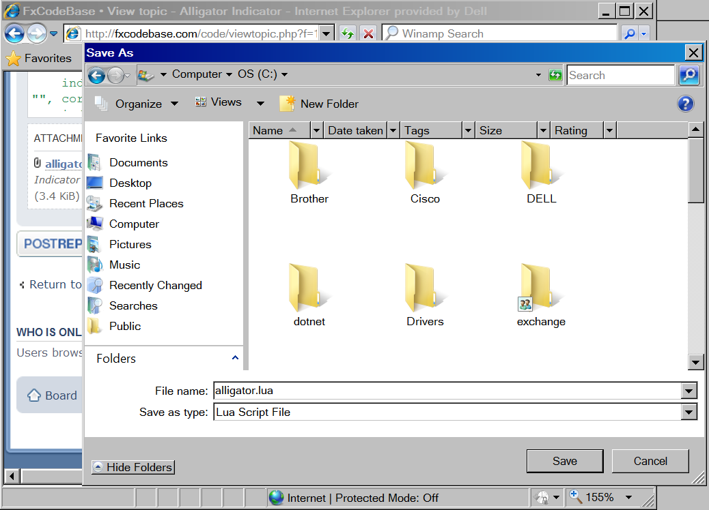

Click the "Save" button. That's all, the indicator is saved. You can go to the [next step](https://fxcodebase.com/code/viewtopic.php?f=17&t=17&p=18#p18).

**Variant 2**

In case the indicator author published only the code of the indicator, you have to copy-paste it to your computer.

Click on the "SELECT ALL" options of the indicator code.

 

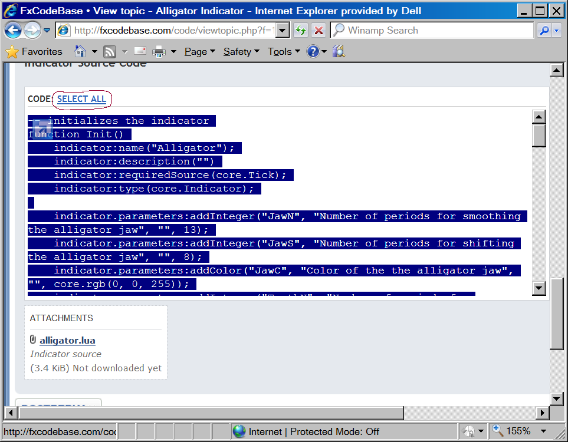

Then right-click on the selected text and choose "Copy"

 

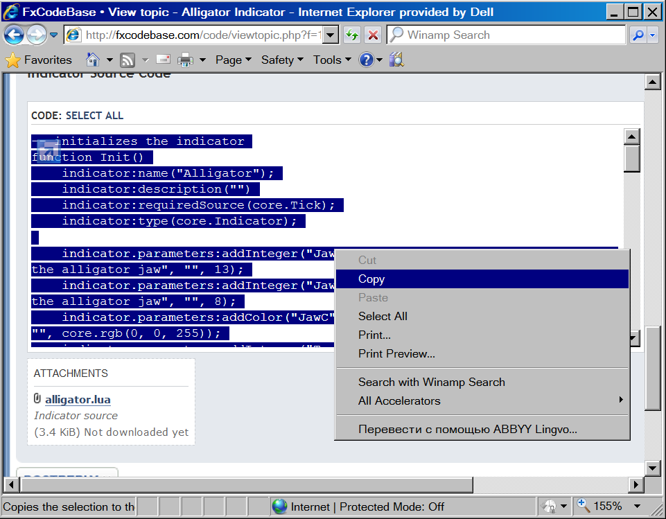

Click on the Windows' Start Menu and Choose "Run". The Run dialog appears. Type "notepad" in "Open" field and press OK.

 

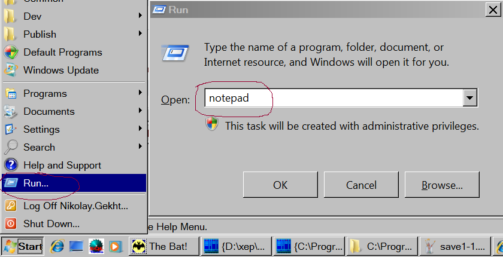

Notepad application appears. Go to the "Edit" menu and choose "Paste".

 

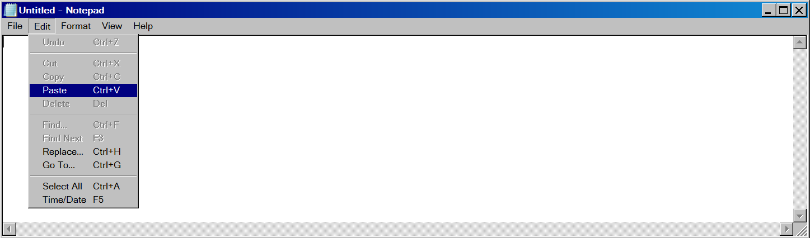

The indicator source code will be inserted into the notepad application. Go to the "File" menu and choose "Save As". The "Save As" dialog appears. Choose any folder, for example c:\ to save the indicator. Type the name of the indicator in the "File Name" field. The extension (the part of the name after the last dot character (.)) must always be **lua**.

 

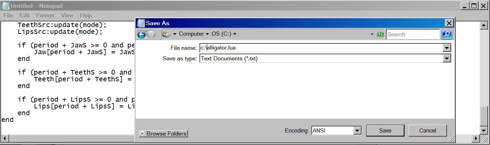

And, finally, click "Save" to save the indicator on your computer.

---

## Re: How to Download and Install Custom Indicator

**admin** · Tue Oct 20, 2009 12:35 pm

**Step 2. Install Indicator in Trading Station application**

1) Open Marketscope application. Choose the "Alerts and Trading Automation" menu and then choose "Import Extension".

 

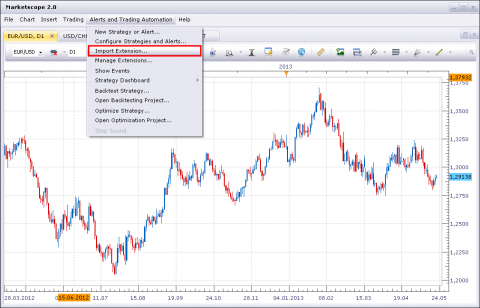

The "Open" dialog box appears. Choose the file you have saved on the previous step.

 [9212](files/18/setup-2.PNG)

The "Install Extension" dialog box appears. Click "Install".

 

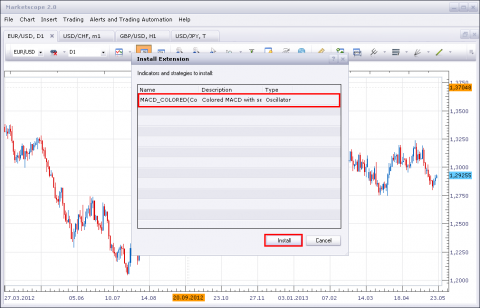

Click "Ok". The indicator is loaded and appears in the custom indicators list.

The "Extension has been installed" message box appears. No errors must be shown. Click "OK".

 [9214](files/18/setup-4.PNG)

Restart the Trading Station application. That's all, the new indicator is in the list of indicators which appears when you choose "Add Indicator" command on the chart.

---

## Re: How to Download and Install Custom Indicator

**pipsahoy** · Mon Apr 12, 2010 6:23 am

I have tried to Install some of the custom indicators and get an error when I attempt to load the indicators using the "load" command under "manage custom indicators." This message appears in the comments section: "Error in the file 'C:\Downloads\Forex\lua indicators\RubCCI.lua':[string "RubCCI.lau"]:5:attempt to index global 'indicator' (a nil value)."

I get a similar error with other indicators. Please advise as to the solution.

---

## Re: How to Download and Install Custom Indicator

**pipsahoy** · Mon Apr 12, 2010 12:22 pm

Thanks, Nikolay.Gekht That was my problem. Everything works great now!

---

## Re: How to Download and Install Custom Indicator

**kevinb1914** · Wed Apr 14, 2010 8:02 pm

When I choose "Add Indicator" command on the chart and try to load 'ZONETRADE', the Bill Williams Zone Trade indicator that I just added from this forum, a dialog box opens and under 'Parameters' and the cursor is on the 'name' section.

What am I supposed to type in? This does not happen with the pre-loaded indicators nor with the other indicators that I downloaded from this forum because the 'name' is automatically filled in.

Why does this happen with ZONETRADE and how can I fix it?

---

## Re: How to Download and Install Custom Indicator

**big777** · Thu Jul 22, 2010 1:24 pm

A huge thank you for the excellent work here.
I am ignorant of programming however, and have a question that demonstrates this.

I'm able to put your very brilliant indicators and oscillators into my *.lua folder, but do not know how to copy and paste in new Metatrader code (*.MQ4) code as *.lua and have it load into Marketscope with the Manage Custom Indicator method. I get a "failed to load... error message when I try to load per the usual method. Is there a tutorial on how to use Metatrader code in Marketscope ? If that even can be done?

Thanx,

big777

---

## Re: How to Download and Install Custom Indicator

**baongockt29** · Thu Aug 12, 2010 6:06 am

Hello
I can not create the Simple Moving Average - SMA into the chart.
I need your help to do that.
But, there is not SMA in the Cateloge Add Indicator of my FXCN Trading Station.
Can you help me, please?

---

## Re: How to Download and Install Custom Indicator

**Apprentice** · Thu Aug 12, 2010 6:23 am

Confusion is perhaps because of the name we use,
 you can find it as a Moving Average Indicator (MVA).

If this does not help.

Picture is worth a thousand words.

**The process of adding indicators on the chart.**

1.Click the right mouse button opens a menu where you can find the Add Indicator button.

 

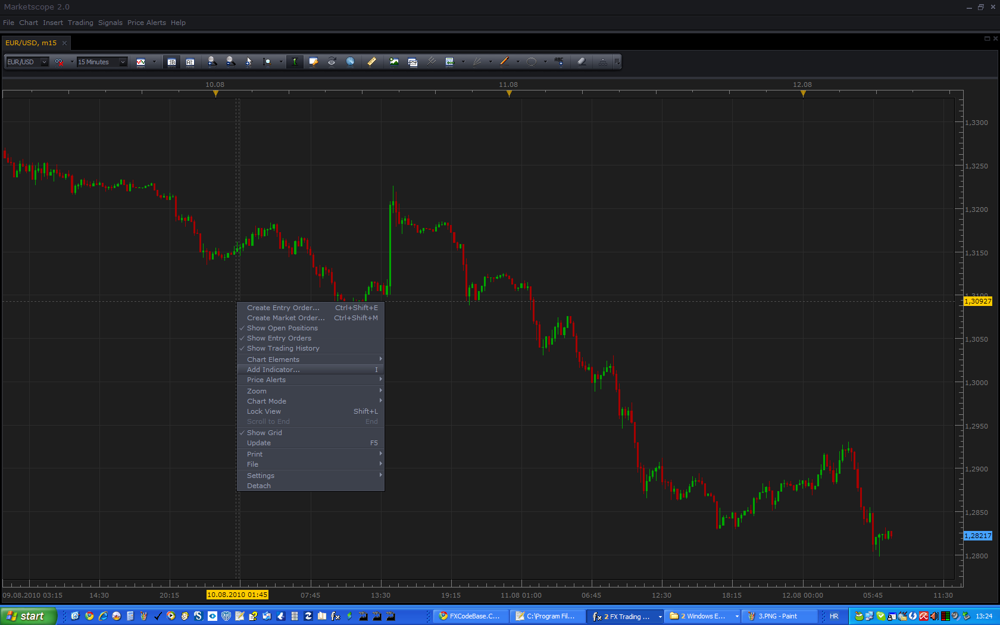

2.Find and expand Moving Averages Group.

 

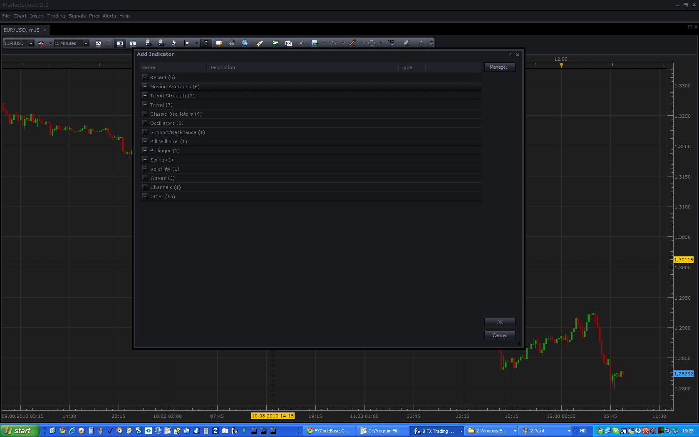

3.Double-click on the MVA indicator to add it to the Chart.

 

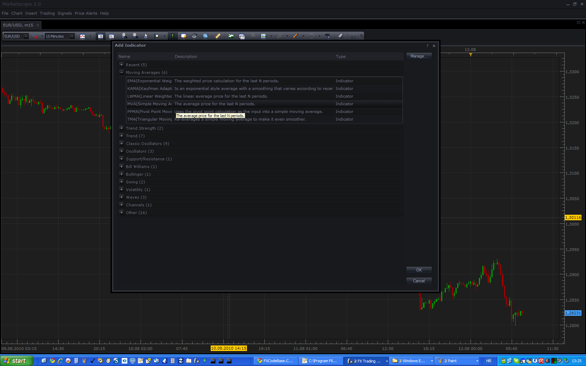

---

## Re: How to Download and Install Custom Indicator

**baongockt29** · Thu Aug 12, 2010 6:33 am

Hello Apprentice
Thank you verry much.
Have a good day

---

## Re: How to Download and Install Custom Indicator

**Poupouille** · Fri Feb 04, 2011 8:29 am

Hello, i search the "Price Channel Indicator", where can i find it ? Ty

---

## Re: How to Download and Install Custom Indicator

**Apprentice** · Fri Feb 04, 2011 3:15 pm

I looked at the definition, and you're right.
It appears that this indicator does not exist.
Send a request to the appropriate Indicator and Signal Requests Forum.
[viewforum.php?f=27](https://fxcodebase.com/code/viewforum.php?f=27)

---

## Re: How to Download and Install Custom Indicator

**Poupouille** · Sat Feb 05, 2011 4:04 am

T y

---

## Re: How to Download and Install Custom Indicator

**gelan2000** · Tue Mar 15, 2011 2:13 am

hi
i can not use this lua extension on MT4

can any one help me

---

## Re: How to Download and Install Custom Indicator

**Apprentice** · Tue Mar 15, 2011 5:03 am

This is normal and expected.
MT4 scripts, and other addons for other platforms can not be used to Marketscope Charting package.
Also, Marketscope Addons can not be used on other platforms.

They are not compatible.

Any such indication should be translated into Lua scripting language.

This is possible, in most cases, through this forum.
Just leave your Translation request in the appropriate Forum topic.

---

## Re: How to Download and Install Custom Indicator

**JPNWV7** · Wed Sep 21, 2011 6:05 pm

I"ve tried this with several indicators on this board & I get a Error.

What am I doing wrong?

Thanks

---

## Re: How to Download and Install Custom Indicator

**sunshine** · Thu Sep 22, 2011 12:27 am

Could you please tell which error do you get? It would be great if you post a screenshot.

---

## Re: How to Download and Install Custom Indicator

**JPNWV7** · Thu Sep 22, 2011 4:41 am

Not sure if I can post a snap shot, but it just says error. It happens whenever I open up Manage Custom Strategies, Click Download & try to download the saved file from my computer.

I'll work on posting a picture

---

## Re: How to Download and Install Custom Indicator

**sunshine** · Mon Oct 03, 2011 12:46 am

> **JPNWV7 wrote:**
> Not sure if I can post a snap shot, but it just says error. It happens whenever I open up Manage Custom Strategies, Click Download & try to download the saved file from my computer.
>
> I'll work on posting a picture

The issue has been resolved: to install indicators, the Manage Custom **Indicators** dialog (the Chart menu -> Manage Custom Indicators) should be used instead of Manage Custom **Strategies**.

---

## Re: How to Download and Install Custom Indicator

**amorgos89** · Tue Nov 22, 2011 4:27 pm

How to install a custom signal in the new version marketcope ?

---

## Re: How to Download and Install Custom Indicator

**sunshine** · Wed Nov 23, 2011 6:38 am

The instruction has been updated for new November Marketscope version
Please see [viewtopic.php?f=17&t=17&p=18#p18](https://fxcodebase.com/code/viewtopic.php?f=17&t=17&p=18#p18)
In short, go to the Alerts and Trading Automation menu -> choose Import Indicators -> Click Load -> Select indicator -> Click OK.

---

## Re: How to Download and Install Custom Indicator

**liyu83** · Thu Feb 09, 2012 5:20 am

I found some indicators and signals very useful. I want to know because this is LUA file. How can convert to file which suit MT4 platform.

---

## Re: How to Download and Install Custom Indicator

**Steven Smith** · Thu Jan 17, 2013 3:53 am

I have tried to Install some of the custom indicators and get an error
when I attempt to load the indicators using the "load" command under "manage custom indicators.

---

## Re: How to Download and Install Custom Indicator

**Apprentice** · Thu Jan 17, 2013 8:18 am

Could you specify which error message is given.
Post Screenshot maybe.

---

## Re: How to Download and Install Custom Indicator

**alaaroshdy** · Wed Jan 23, 2013 7:41 am

hi there, i have downloaded the "Strong vs Weak" indicator, and the trade station sees it, but when i try to attach it to a chart, it gives me the following error:
[string"Strong vs.Weak.bin"]:155:cannot recognize the host command
and the name area is empty!!! what should i do???

---

## Re: How to Download and Install Custom Indicator

**Apprentice** · Wed Jan 23, 2013 8:29 am

Alaaroshdy as i Wrote, "Strong vs Weak" is written for the current beta version of TS.
Beta Version can be found here.
[viewtopic.php?f=30&t=20383](https://fxcodebase.com/code/viewtopic.php?f=30&t=20383)

---

## Re: How to Download and Install Custom Indicator

**opportunity4all** · Thu Jul 11, 2013 3:20 pm

Can I download an MT4 file into the trade station file like I would normally due with a lua file?

---

## Re: How to Download and Install Custom Indicator

**Valeria** · Mon Jul 15, 2013 5:14 am

Hi opportunity4all,

Trading station works only with lua files.

---

## Re: How to Download and Install Custom Indicator

**Apprentice** · Tue Sep 17, 2013 3:28 am

Fortunately for you, we provide conversion service, which is free for you.

---

## Re: How to Download and Install Custom Indicator

**Jude3333** · Wed Jul 24, 2019 4:19 pm

Hello. Can the indicators with .LUA be used potentially in MT4 and how? If you already posted on this, please provide the link. Thank you

---

## Re: How to Download and Install Custom Indicator

**Avignon** · Thu Jul 25, 2019 5:24 am

Hello,

TS2 => lua

MT4 => mq4

To convert => [viewforum.php?f=27](http://www.fxcodebase.com/code/viewforum.php?f=27) or [viewforum.php?f=32](http://www.fxcodebase.com/code/viewforum.php?f=32)
