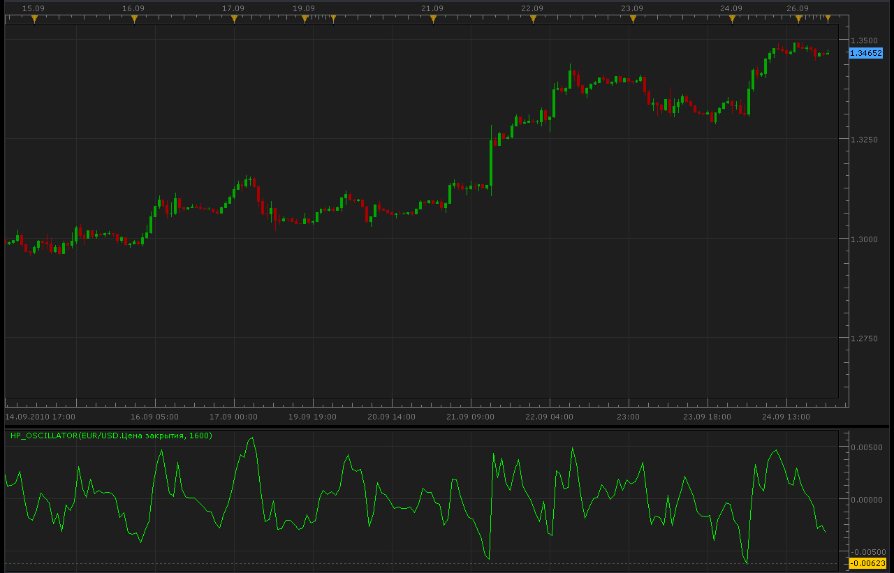

# HP oscillator

> Source: https://fxcodebase.com/code/viewtopic.php?f=17&t=2273  
> Forum: 17 · Topic 2273 · 4 post(s)

---

## HP oscillator

**Alexander.Gettinger** · Sun Sep 26, 2010 11:39 pm

[viewtopic.php?f=27&t=2201](https://fxcodebase.com/code/viewtopic.php?f=27&t=2201)

 

The indicator was revised and updated

---

## Re: HP oscillator

**hydetom** · Mon Sep 27, 2010 2:13 am

Thank you for the indicator. However it doesn't work for me. It doesn't show anything (e.g. axis, hp curve)

So if you have time to fix it, it would be great.

Thank you

---

## Re: HP oscillator

**Alexander.Gettinger** · Mon Sep 27, 2010 9:49 pm

Indicator needs for a large data, more than 1000 bars.

---

## Re: HP oscillator

**Apprentice** · Mon Jan 23, 2017 5:57 am

Indicator was revised and updated.
