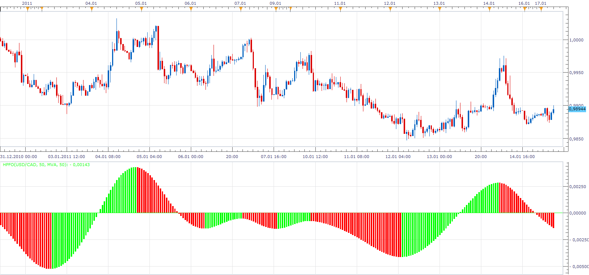
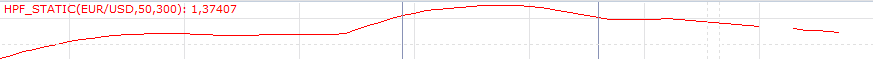

# HPF Oscillator

> Source: https://fxcodebase.com/code/viewtopic.php?f=17&t=3190  
> Forum: 17 · Topic 3190 · 15 post(s)

---

## HPF Oscillator

**Apprentice** · Mon Jan 17, 2011 6:50 am

The formulais simple...
HPF - Moving Average of HPF

 

To work you need to install Averages Indicator as well as HPF Filter

 [HPFO.lua](files/7515/HPFO.lua)

 [HPFO with alert.lua](files/7515/HPFO%20with%20alert.lua)

Averages Indicator
[viewtopic.php?f=17&t=3145&p=7376&hilit=averages#p7376](https://fxcodebase.com/code/viewtopic.php?f=17&t=3145&p=7376&hilit=averages#p7376)
HPF Filter
[viewtopic.php?f=17&t=3024](https://fxcodebase.com/code/viewtopic.php?f=17&t=3024)

The indicator was revised and updated

---

## Re: HPF Oscillator

**craige** · Mon Jan 17, 2011 11:22 am

HEY Apprentice

great works, It 's very useful when used conbined with HPF together with EMA

thanks a lot

---

## Re: HPF Oscillator

**Blackcat2** · Tue Jan 18, 2011 5:56 am

On hindsight it looks good but in real time, the signal repaint and change color, even after 2-3 bars...

---

## Re: HPF Oscillator

**craige** · Tue Jan 18, 2011 9:07 am

Hello Blackcat2

you are right, Apprentice, however, is going to fix the Oscillator, looking for the method whether could auto update this Oscillator or not

we are waiting

---

## Re: HPF Oscillator

**virgilio** · Mon Feb 07, 2011 10:08 am

Is it possible to create a strategy based on the HPFO?
Thank you.

---

## Re: HPF Oscillator

**Apprentice** · Wed Mar 23, 2011 3:23 pm

Update.
Now, The indicator is recalculated after each period.
Once again, the HPF repaints after each period.

---

## Re: HPF Oscillator

**jeisenm** · Thu Mar 24, 2011 11:07 am

why does my hpfo indicator not look like the picture? i get the 1st 20-30 bars, then the rest is just a straight line. i do have averages and hpf installed. tading station is 01.10.010311.

 [hpfo.pdf](files/9027/hpfo.pdf)

---

## Re: HPF Oscillator

**Apprentice** · Thu Mar 24, 2011 3:42 pm

I have Fix This one.
Thank you for reporting it.

Further optimization is required.
In the current version.
Indicator need a lot of time for calculation.

---

## Re: HPF Oscillator

**Nikolay.Gekht** · Thu Mar 24, 2011 10:12 pm

BTW, I finished the initial review of HPF. It looks not so bad. I promise I'll optimize it in a new few days.

---

## Re: HPF Oscillator

**StefPasc** · Tue Dec 10, 2013 5:51 am

Dear Apprentice

can you PLEASE create a **HPFO version** based not on HPF but on HPF_Static ?
Here is the link for the HPF_Static
[http://fxcodebase.com/code/viewtopic.php?f=17&t=3024&p=39971&hilit=hpf+static#p39971](https://fxcodebase.com/code/viewtopic.php?f=17&t=3024&p=39971&hilit=hpf+static#p39971)
please use the HPF_Static index you wrote and works very well
Not the HPF_Static Old index (that was written by Scrat)
Thank you very much in advance

PS

Please let me remind you that the HPF_Static when started for the first time , ends 2 bars before current bar. After new price bars are formed then the HPF_Static draws perfectly. So there is always a small 2 bars gap but this does not affect the index in the future bars !!
you can see the pic below
Thank you again

 

---

## Re: HPF Oscillator

**StefPasc** · Mon Jan 13, 2014 8:16 am

Apprentice hi,

any news on previous post request ?
thank you in advance

---

## Re: HPF Oscillator

**Apprentice** · Wed Jun 14, 2017 7:24 am

The indicator was revised and updated.

---

## Re: HPF Oscillator

**mulligan** · Thu May 02, 2019 7:59 am

Could we please get an alert with the standard features that notifies at color change from up to down and zero line cross. Repainting is understood. Thanks very much.

---

## Re: HPF Oscillator

**Apprentice** · Fri May 03, 2019 7:16 am

Your request is added to the development list under Id Number 4632

---

## Re: HPF Oscillator

**Apprentice** · Tue May 07, 2019 7:23 am

HPFO with alert.lua added.
