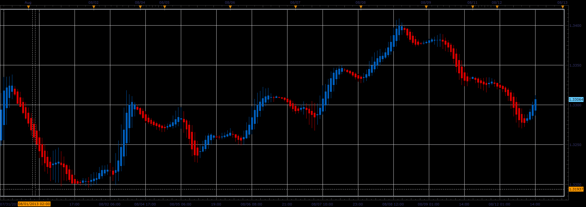

# Hull candles

> Source: https://fxcodebase.com/code/viewtopic.php?f=17&t=59048  
> Forum: 17 · Topic 59048 · 6 post(s)

---

## Hull candles

**Alexander.Gettinger** · Tue Aug 13, 2013 8:28 am

This indicator is a ported MQL5 indicator from [http://www.mql5.com/en/code/1784](http://www.mql5.com/en/code/1784).

Formulas:
High[i] = Max(X_H, Open[i-1], Close[i-1]),
Low[i] = Min(X_L, Open[i-1], Close[i-1]),
Open[i] = (Open[i-1]+Close[i-1])/2,
Close[i] = (X_O+X_H+X_L+X_C)/4, where
X_O = 2*MA(Open, Period/2)-MA(Open, Period),
X_H = 2*MA(High, Period/2)-MA(High, Period),
X_L = 2*MA(Low, Period/2)-MA(Low, Period),
X_C = 2*MA(Close, Period/2)-MA(Close, Period).

 

Download:

 [Hull_Candles.lua](files/88462/Hull_Candles.lua)

 [Hull_Candles with Alert.lua](files/88462/Hull_Candles%20with%20Alert.lua)

For this indicator must be installed Averages indicator ([viewtopic.php?f=17&t=2430](https://fxcodebase.com/code/viewtopic.php?f=17&t=2430)).

---

## Re: Hull candles

**Apprentice** · Sun Jun 04, 2017 5:43 am

The indicator was revised and updated.

---

## Re: Hull candles

**Recursive Trendline** · Wed Aug 16, 2017 10:19 am

Hi Apprentice,

Need a hull candle alert similar to Heikin Ashi Alert here:
[viewtopic.php?f=17&t=18230&hilit=heikin+ashi+alert](https://fxcodebase.com/code/viewtopic.php?f=17&t=18230&hilit=heikin+ashi+alert)

Up and Down arrows on live/end of turn.

Regards,
Recursive

---

## Re: Hull candles

**Apprentice** · Thu Aug 17, 2017 5:33 am

Hull_Candles with Alert.lua added.

---

## Re: Hull candles

**Recursive Trendline** · Thu Aug 17, 2017 9:23 am

Thanks a lot Apprentice

---

## Re: Hull candles

**Apprentice** · Wed Sep 12, 2018 6:06 am

The indicator was revised and updated.
