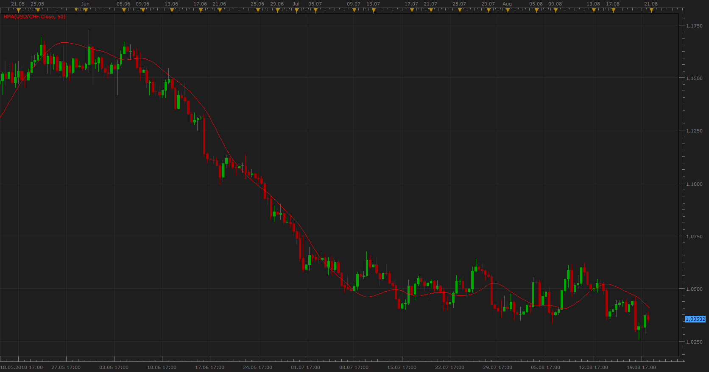

# Hull Moving Average (HMA)

> Source: https://fxcodebase.com/code/viewtopic.php?f=17&t=1659  
> Forum: 17 · Topic 1659 · 9 post(s)

---

## Hull Moving Average (HMA)

**Apprentice** · Tue Aug 03, 2010 1:30 pm

The Hull Moving Average (HMA) developed by Alan Hull, is an extremely fast and smooth moving average.

 HMA trying to eliminate lag time and keep smoothing at the same time.

HMA=LWMA ([2 x LWMA (Price, Period/2) - LWMA (Price, Period)], SQRT (Period))

 [HMA.lua](files/3300/HMA.lua)

 [HMA with Alert.lua](files/3300/HMA%20with%20Alert.lua)

---

## Re: Hull Moving Average (HMA)

**maddup3e** · Thu May 26, 2011 6:48 am

I know this is an old topic, but is there a way to add color changes for the HMA line going up vs. going down?

Thank you.

---

## Re: Hull Moving Average (HMA)

**maddup3e** · Thu May 26, 2011 9:55 am

That is perfect. Thank you, Apprentice

---

## Re: Hull Moving Average (HMA)

**fxwithme** · Wed Aug 24, 2011 2:20 pm

Is it possible for you to make HMA similar to WMA, where I can not only change colors but also the thickness and type (dotted, etc.) of the HMA? Thanks.

---

## Re: Hull Moving Average (HMA)

**Apprentice** · Wed Aug 24, 2011 3:10 pm

Top Most Post, Style Option Added.

---

## Re: Hull Moving Average (HMA)

**Apprentice** · Mon Sep 29, 2014 1:27 am

Major algorithm update.

---

## Re: Hull Moving Average (HMA)

**Apprentice** · Fri Jun 23, 2017 6:45 am

The indicator was revised and updated.

---

## Re: Hull Moving Average (HMA)

**TazmasterT** · Tue Sep 03, 2019 11:39 am

I know this is an old topic now but is there anyway to add an alert when the MA changes colour?

Many thanks
TMT

---

## Re: Hull Moving Average (HMA)

**Apprentice** · Thu Sep 05, 2019 7:06 am

HMA with Alert.lua added.
