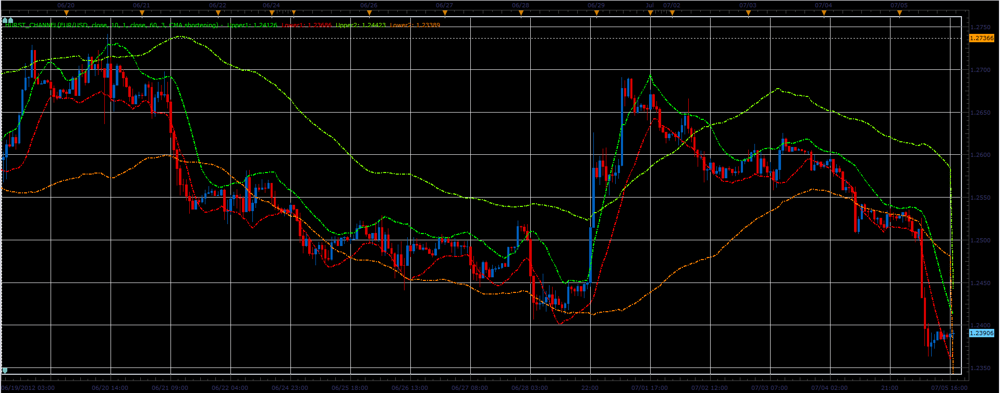

# Hurst Channel Indicator

> Source: https://fxcodebase.com/code/viewtopic.php?f=17&t=20881  
> Forum: 17 · Topic 20881 · 2 post(s)

---

## Hurst Channel Indicator

**Alexander.Gettinger** · Thu Jul 05, 2012 5:15 pm

The indicator is written in accordance with the request: [viewtopic.php?f=27&t=20589&p=36030#p36030](https://fxcodebase.com/code/viewtopic.php?f=27&t=20589&p=36030#p36030)

 

Download:

 [Hurst_Channel.lua](files/36570/Hurst_Channel.lua)

The indicator was revised and updated

---

## Re: Hurst Channel Indicator

**Apprentice** · Tue Apr 04, 2017 6:20 am

Indicator was revised and updated.
