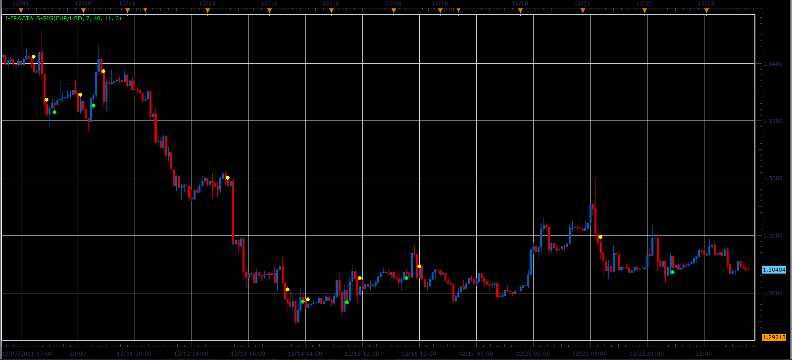

# i-Fractals-sig indicator

> Source: https://fxcodebase.com/code/viewtopic.php?f=17&t=10396  
> Forum: 17 · Topic 10396 · 3 post(s)

---

## i-Fractals-sig indicator

**Alexander.Gettinger** · Sun Dec 25, 2011 1:47 pm

This indicator is a ported MQL5 indicator from [http://www.mql5.com/ru/code/770](http://www.mql5.com/ru/code/770) (in Russian).

Formulas.
Indicator shows UP fractal if at least one of three conditions:
1. Low[-3]-Low[-2]>sd and Low[-4]-Low[-2]>sd and Low[-1]-Low[-2]>sd and Close[-1]-Open[-1]>bd,
2. Low[-4]-Low[-2]>sd and Low[-5]-Low[-2]>sd and Low[-1]-Low[-2]>sd and Close[-1]-Open[-1]>bd and Abs(Low[-3]-Low[-2])<sdd,
3. Low[-3]-Low[-2]>sd and Low[-4]-Low[-2]>sd and Abs(Low[-1]-Low[-2])<sdd and Close[-1]-Open[-1]>bdd and Open[-2]-Close[-2]>bdd.

Indicator shows DN fractal if at least one of three conditions:
1. High[-2]-High[-3]>sd and High[-2]-High[-4]>sd and High[-2]-High[-1]>sd and Open[-1]-Close[-1]>bd,
2. High[-2]-High[-4]>sd and High[-2]-High[-5]>sd and High[-2]-High[-1]>sd and Open[-1]-Close[-1]>bd and Abs(High[-3]-High[-2])<sdd,
3. High[-2]-High[-3]>sd and High[-2]-High[-4]>sd and Abs(High[-2]-High[-1])<sdd and Open[-1]-Close[-1]>bdd abd Close[-2]-Open[-2]>bdd.

bd - last bar body length,
bdd - body lenght for double top/buttom bars,
sd - shadow difference for fractal bars,
sdd - shadow difference for double tops/buttoms bars.

 

Download:

 [i-Fractals-sig.lua](files/21604/i-Fractals-sig.lua)

---

## Re: i-Fractals-sig indicator

**Alexander.Gettinger** · Mon Dec 26, 2011 7:00 am

Strategy based on i-Fractals-sig indicator: [viewtopic.php?f=31&t=10448](https://fxcodebase.com/code/viewtopic.php?f=31&t=10448)

---

## Re: i-Fractals-sig indicator

**Apprentice** · Tue Mar 13, 2018 11:20 am

The Indicator was revised and updated.
