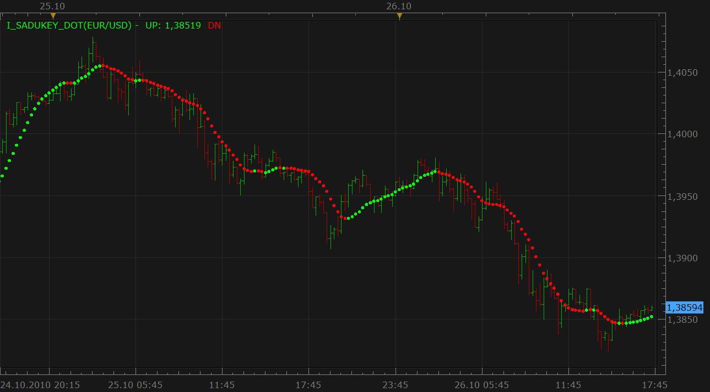
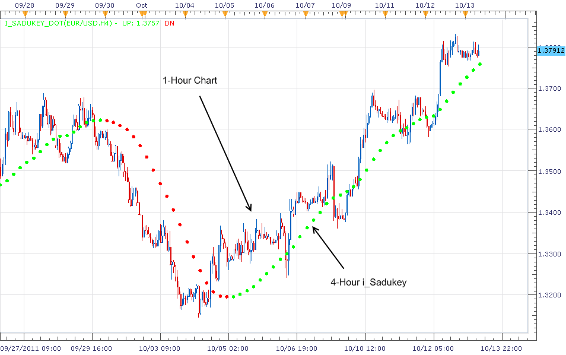
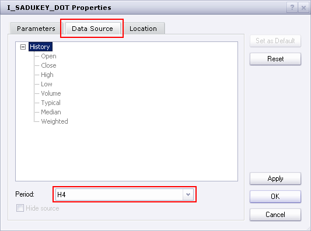

# i_Sadukey (new version)

> Source: https://fxcodebase.com/code/viewtopic.php?f=17&t=2525  
> Forum: 17 · Topic 2525 · 42 post(s)

---

## i_Sadukey (new version)

**Nikolay.Gekht** · Tue Oct 26, 2010 4:42 pm

Based on [http://isadukey.blogspot.hr/](http://isadukey.blogspot.hr/)

The indicator is based on frequency filter and can be used as a trend-detector.

This version has the following advantages:

1) The display style is changed from lines to dots, so now the indicator does not "hide" 1-bar switches between red and green as it was in the previous version.

2) The indicator now works correctly on "alive" data, not on historical data only.

 

Download:

 [i_Sadukey_dot.lua](files/5583/i_Sadukey_dot.lua)

 [Single Stream i_Sadukey_dot.lua](files/5583/Single%20Stream%20i_Sadukey_dot.lua)

 

 [i_Sadukey Overlay.lua](files/5583/i_Sadukey%20Overlay.lua)

MT4/MQ4 version.
[viewtopic.php?f=38&t=70116](https://fxcodebase.com/code/viewtopic.php?f=38&t=70116)

---

## Re: i_Sadukey (new version)

**bluepip** · Sun Mar 06, 2011 9:42 am

Is it possible to develop a strategy based on this signal?

Thanks
bluepip

---

## Re: i_Sadukey (new version)

**Apprentice** · Sun Mar 06, 2011 3:33 pm

Your request has been added in the developmental cue.

---

## Re: i_Sadukey (new version)

**carlhans** · Wed Mar 09, 2011 5:34 am

I have experience that in MT4, some indicator repaint....this Sadukey looks promising...almost too prefect...can anybody confirm, it doesnt repaint? So when the dot is plotted on the close of the candle = its definitive, no change afterwards?

---

## Re: i_Sadukey (new version)

**Nikolay.Gekht** · Thu Mar 10, 2011 9:34 am

> **carlhans wrote:**
> I have experience that in MT4, some indicator repaint....this Sadukey looks promising...almost too prefect...can anybody confirm, it doesnt repaint? So when the dot is plotted on the close of the candle = its definitive, no change afterwards?

I reviewed the code and can say that it does not repaint already closed candles, only the fresh one.

---

## Re: i_Sadukey (new version)

**compulsive** · Mon Mar 14, 2011 5:56 am

At times,(most of the times it will NOT repaint the bar) BUT occasionally, It DOES repaint the bar. You will need to refresh or switch from ASK to BID and back. (It does it on my charts)

---

## Re: i_Sadukey (new version)

**carlhans** · Sat Mar 19, 2011 5:01 pm

> **Nikolay.Gekht wrote:**
>
>
> > **carlhans wrote:**
> > I have experience that in MT4, some indicator repaint....this Sadukey looks promising...almost too prefect...can anybody confirm, it doesnt repaint? So when the dot is plotted on the close of the candle = its definitive, no change afterwards?
>
>
> I reviewed the code and can say that it does not repaint already closed candles, only the fresh one.

Thanks a lot Nikolay!
Have a good one,
carl

---

## Re: i_Sadukey (new version)

**motoko123** · Tue Oct 11, 2011 3:37 pm

Hello,

nice indicator, can you please share the algorythm of this indicator so that I can understand what it is doing?

Thank you, good work,

motoko

---

## Re: i_Sadukey (new version)

**Apprentice** · Tue Oct 11, 2011 4:42 pm

The formula is quite complicated.
After you download the indicator on your računalao,
open the file with any text editor.
The formula used by algooritam, should be clear then.

First, Define Variables Price1 and Price 2

Code: [Select all](https://fxcodebase.com/code/)
`Price1[period]=((source.open[period]+source.close[period]+source.high[period]+source.low[period])/4.+source.close[period])/2.;
        Price2[period]=((source.open[period]+source.close[period]+source.high[period]+source.low[period])/4.+source.open[period])/2.;`

Second, Define Variables Price1 and Price 2

Code: [Select all](https://fxcodebase.com/code/)
`local B1= 0.11859648*Price1[period]
                  +0.11781324*Price1[period-1]
                  +0.11548308*Price1[period-2]
                  +0.11166411*Price1[period-3]
                  +0.10645106*Price1[period-4]
                  +0.09997253*Price1[period-5]
                  +0.09238688*Price1[period-6]
                  +0.08387751*Price1[period-7]
                  +0.07464713*Price1[period-8]
                  +0.06491178*Price1[period-9]
                  +0.05489443*Price1[period-10]
                  +0.04481833*Price1[period-11]
                  +0.03490071*Price1[period-12]
                  +0.02534672*Price1[period-13]
                  +0.01634375*Price1[period-14]
                  +0.00805678*Price1[period-15]
                  +0.00062421*Price1[period-16]
                  -0.00584512*Price1[period-17]
                  -0.01127391*Price1[period-18]
                  -0.01561738*Price1[period-19]
                  -0.01886307*Price1[period-20]
                  -0.02102974*Price1[period-21]
                  -0.02216516*Price1[period-22]
                  -0.02234315*Price1[period-23]
                  -0.02165992*Price1[period-24]
                  -0.02022973*Price1[period-25]
                  -0.01818026*Price1[period-26]
                  -0.01564777*Price1[period-27]
                  -0.01277219*Price1[period-28]
                  -0.00969230*Price1[period-29]
                  -0.00654127*Price1[period-30]
                  -0.00344276*Price1[period-31]
                  -0.00050728*Price1[period-32]
                  +0.00217042*Price1[period-33]
                  +0.00451354*Price1[period-34]
                  +0.00646441*Price1[period-35]
                  +0.00798513*Price1[period-36]
                  +0.00905725*Price1[period-37]
                  +0.00968091*Price1[period-38]
                  +0.00987326*Price1[period-39]
                  +0.00966639*Price1[period-40]
                  +0.00910488*Price1[period-41]
                  +0.00824306*Price1[period-42]
                  +0.00714199*Price1[period-43]
                  +0.00586655*Price1[period-44]
                  +0.00448255*Price1[period-45]
                  +0.00305396*Price1[period-46]
                  +0.00164061*Price1[period-47]
                  +0.00029596*Price1[period-48]
                  -0.00093445*Price1[period-49]
                  -0.00201426*Price1[period-50]
                  -0.00291701*Price1[period-51]
                  -0.00362661*Price1[period-52]
                  -0.00413703*Price1[period-53]
                  -0.00445206*Price1[period-54]
                  -0.00458437*Price1[period-55]
                  -0.00455457*Price1[period-56]
                  -0.00439006*Price1[period-57]
                  -0.00412379*Price1[period-58]
                  -0.00379323*Price1[period-59]
                  -0.00343966*Price1[period-60]
                  -0.00310850*Price1[period-61]
                  -0.00285188*Price1[period-62]
                  -0.00273508*Price1[period-63]
                  -0.00274361*Price1[period-64]
                  +0.01018757*Price1[period-65];

       local B2= 0.11859648*Price2[period]
                  +0.11781324*Price2[period-1]
                  +0.11548308*Price2[period-2]
                  +0.11166411*Price2[period-3]
                  +0.10645106*Price2[period-4]
                  +0.09997253*Price2[period-5]
                  +0.09238688*Price2[period-6]
                  +0.08387751*Price2[period-7]
                  +0.07464713*Price2[period-8]
                  +0.06491178*Price2[period-9]
                  +0.05489443*Price2[period-10]
                  +0.04481833*Price2[period-11]
                  +0.03490071*Price2[period-12]
                  +0.02534672*Price2[period-13]
                  +0.01634375*Price2[period-14]
                  +0.00805678*Price2[period-15]
                  +0.00062421*Price2[period-16]
                  -0.00584512*Price2[period-17]
                  -0.01127391*Price2[period-18]
                  -0.01561738*Price2[period-19]
                  -0.01886307*Price2[period-20]
                  -0.02102974*Price2[period-21]
                  -0.02216516*Price2[period-22]
                  -0.02234315*Price2[period-23]
                  -0.02165992*Price2[period-24]
                  -0.02022973*Price2[period-25]
                  -0.01818026*Price2[period-26]
                  -0.01564777*Price2[period-27]
                  -0.01277219*Price2[period-28]
                  -0.00969230*Price2[period-29]
                  -0.00654127*Price2[period-30]
                  -0.00344276*Price2[period-31]
                  -0.00050728*Price2[period-32]
                  +0.00217042*Price2[period-33]
                  +0.00451354*Price2[period-34]
                  +0.00646441*Price2[period-35]
                  +0.00798513*Price2[period-36]
                  +0.00905725*Price2[period-37]
                  +0.00968091*Price2[period-38]
                  +0.00987326*Price2[period-39]
                  +0.00966639*Price2[period-40]
                  +0.00910488*Price2[period-41]
                  +0.00824306*Price2[period-42]
                  +0.00714199*Price2[period-43]
                  +0.00586655*Price2[period-44]
                  +0.00448255*Price2[period-45]
                  +0.00305396*Price2[period-46]
                  +0.00164061*Price2[period-47]
                  +0.00029596*Price2[period-48]
                  -0.00093445*Price2[period-49]
                  -0.00201426*Price2[period-50]
                  -0.00291701*Price2[period-51]
                  -0.00362661*Price2[period-52]
                  -0.00413703*Price2[period-53]
                  -0.00445206*Price2[period-54]
                  -0.00458437*Price2[period-55]
                  -0.00455457*Price2[period-56]
                  -0.00439006*Price2[period-57]
                  -0.00412379*Price2[period-58]
                  -0.00379323*Price2[period-59]
                  -0.00343966*Price2[period-60]
                  -0.00310850*Price2[period-61]
                  -0.00285188*Price2[period-62]
                  -0.00273508*Price2[period-63]
                  -0.00274361*Price2[period-64]
                  +0.01018757*Price2[period-65];`
The final results depends on the comparison of B1 and B2

Code: [Select all](https://fxcodebase.com/code/)
`if B1 > B2 then
            bufferUp[period] = B1;         
        else
            bufferDn[period] = B2;
         
        end`

---

## Re: i_Sadukey (new version)

**biggiesmalls** · Wed Oct 12, 2011 6:54 am

Is there anyway we can get a Multiple Time Frame version of this indicator? For example, if I wanted to use the 1-hour chart for entry, I would want this indicator looking at a 4-hour chart or the daily chart but plotting the points on the 1-hour chart. That way I don't have to waste time jumping back and forth between time frames.

---

## Re: i_Sadukey (new version)

**Apprentice** · Wed Oct 12, 2011 5:10 pm

Your request is added to the developmental cue.

---

## Re: i_Sadukey (new version)

**sunshine** · Thu Oct 13, 2011 3:10 am

> **biggiesmalls wrote:**
> Is there anyway we can get a Multiple Time Frame version of this indicator? For example, if I wanted to use the 1-hour chart for entry, I would want this indicator looking at a 4-hour chart or the daily chart but plotting the points on the 1-hour chart. That way I don't have to waste time jumping back and forth between time frames.

It is possible in the new version of Marketscope which comes to productions pretty soon. For now the beta version is available here: [viewtopic.php?f=30&t=6490](https://fxcodebase.com/code/viewtopic.php?f=30&t=6490)

 

You can choose the time frame in the Indicator Properties dialog box -> Data Source tab:

 

---

## Re: i_Sadukey (new version)

**biggiesmalls** · Thu Oct 13, 2011 5:21 am

Awesome! Thank you very much.

---

## Re: i_Sadukey (new version)

**faithrider** · Wed Nov 30, 2011 5:07 am

This is a very helpful indicator. Would it be possible to have the i_Sadukey colors overlay the price bars. Green for an uptrend and red for a downtrend. Thank you for your awesome work.

---

## Re: i_Sadukey (new version)

**Apprentice** · Thu Dec 01, 2011 9:33 am

Your request is added to the developmental cue.

---

## Re: i_Sadukey (new version)

**Apprentice** · Wed Mar 14, 2012 3:11 pm

Overlay Added to Topmost post.

---

## Re: i_Sadukey (new version)

**briansummy** · Fri Mar 23, 2012 11:20 pm

This seems to be similar to the nonlagdot. I notice firsthand on a minute chart repainting for NLD. Is this similar to the calculation and are we certain there is no repainting? I will have to demo this indicator.

---

## Re: i_Sadukey (new version)

**Apprentice** · Sun Mar 25, 2012 4:20 am

Last Candles affects the final value with less than 12%.
The closing price (close) with about 4 percent.

---

## Re: i_Sadukey (new version)

**briansummy** · Tue Mar 27, 2012 6:54 pm

Apprentice,

If allowed, are you able to translate this strategy into LUA using the Isadukey?

[http://www.forexfactory.com/showthread.php?t=215512](http://www.forexfactory.com/showthread.php?t=215512)

If possible with all the money management and bells and whistles? LOL

You rock!

---

## Re: i_Sadukey (new version)

**Apprentice** · Wed Mar 28, 2012 6:35 am

Unfortunately not. The strategy is encoded.
Can you give me a description.
What are the indicators used, which are the entry exit conditions.

---

## Re: i_Sadukey (new version)

**briansummy** · Wed Mar 28, 2012 6:40 pm

Long signal: Color UP rectangle of i_Sadukey indicator. Short signal: Color DN rectangle of i_Sadukey indicator. Exits: Opposite colour of i_Sadukey indicator.

StopLossAtrMultiplier: If greater than zero, the stop loss is ATR based and the ATR is multiplied by this number.

TakeProfitAtrMultiplier1: If greater than zero, the first take profit is ATR based. ATR is multiplied by this number.

BreakEvenAtrMultiplier: If greater than zero the breakeven is ATR based and the ATR is multiplied by this number.

LockAtrMultiplier: If greater than zero, the lock level is ATR based and the ATR is multiplied by this
number.

TrailingStopAtrMultiplier: If greater than zero, the trailing stop is ATR based and the ATR is multiplied by this number.

Trading hours restrictions, and all those types of options.

They have lot management which is pretty cool. It adjusts with the % of margin selected.

I think what could tremendously improve this strategy is introduction of the Tick SAR agreement condition and not trading against it to help with false signals. Thoughts?

---

## Re: i_Sadukey (new version)

**Apprentice** · Sat Mar 31, 2012 3:44 am

Your request is added to the development list.

---

## Re: i_Sadukey (new version)

**Hailkayy** · Mon Sep 10, 2012 6:37 pm

Hi,

i wonder if you could make basic strategy of sadukey.
Maybe in addings you can let us have 2 or 3 limits. Like Limit1 x% at xpips.
Same for Limit2 and Limit3.

---

## Re: i_Sadukey (new version)

**Apprentice** · Tue Sep 11, 2012 3:52 am

Your request is added to the development list.

---

## Re: i_Sadukey (new version)

**Coondawg71** · Thu Sep 13, 2012 7:50 pm

Can I please request a MTF MCP Sadukey heatmap.

Thanks!

sjc

---

## Re: i_Sadukey (new version)

**Apprentice** · Fri Sep 14, 2012 3:39 am

Your request is added to the development list.

---

## Re: i_Sadukey (new version)

**Apprentice** · Fri Sep 14, 2012 4:55 am

Requested can be found here.
[viewtopic.php?f=17&t=23404](https://fxcodebase.com/code/viewtopic.php?f=17&t=23404)

---

## Re: i_Sadukey (new version)

**Fafountrader** · Wed Sep 14, 2016 5:37 am

hi,

I can not find the strategy of this indicator.
Basic strategy (opposite colour of i_Sadukey indicator)

Thank of the link.

---

## Re: i_Sadukey (new version)

**Apprentice** · Thu Sep 15, 2016 3:43 am

Strategy is available here.
[viewtopic.php?f=31&t=63870](https://fxcodebase.com/code/viewtopic.php?f=31&t=63870)

---

## Re: i_Sadukey (new version)

**Fafountrader** · Thu Sep 15, 2016 12:13 pm

thanks, apprendice

---

## Re: i_Sadukey (new version)

**Apprentice** · Tue Sep 18, 2018 6:52 am

The indicator was revised and updated.

---

## Re: i_Sadukey (new version)

**hedging** · Sun Apr 12, 2020 7:44 am

Hi Apprentice,

Does sadukey repaints?

Thanks,

---

## Re: i_Sadukey (new version)

**Apprentice** · Sun Apr 12, 2020 9:35 am

i_Sadukey does not repaint.

---

## Re: i_Sadukey (new version)

**hedging** · Wed May 06, 2020 2:56 am

Thanks Apprentice

---

## Re: i_Sadukey (new version)

**lowcoloured** · Thu May 14, 2020 9:34 am

Can we have single stream sadukey dot please? Just like single stream sar on fxcodebase?
Much needed. Want to apply indicators on sadukey. That's why single stream.

Thanks

---

## Re: i_Sadukey (new version)

**Apprentice** · Fri May 15, 2020 7:20 am

Your request is added to the development list.
Development reference 1297.

---

## Re: i_Sadukey (new version)

**Apprentice** · Thu May 21, 2020 7:56 am

Single Stream i_Sadukey_dot.lua added.

---

## Re: i_Sadukey (new version)

**g201702890** · Sat May 23, 2020 7:50 pm

Dears,

is there a copy of this file for MT4?

Regards

---

## Re: i_Sadukey (new version)

**Apprentice** · Mon May 25, 2020 5:33 am

Your request is added to the development list.
Development reference 1341.

---

## Re: i_Sadukey (new version)

**7200100470** · Thu May 28, 2020 5:35 pm

> **bluepip wrote:**
> Is it possible to develop a strategy based on this signal?
>
> Thanks
> bluepip

Is there a strategy using this indicator, as a .lua one?

Thanks

---

## Re: i_Sadukey (new version)

**Apprentice** · Fri May 29, 2020 4:23 am

[viewtopic.php?f=31&t=63870](https://fxcodebase.com/code/viewtopic.php?f=31&t=63870)
[viewtopic.php?f=31&t=69816](https://fxcodebase.com/code/viewtopic.php?f=31&t=69816)
Try these versions.

---

## Re: i_Sadukey (new version)

**Apprentice** · Thu Jul 02, 2020 5:29 am

Task 1341
Originally it was MT4
[viewtopic.php?f=38&t=70116](https://fxcodebase.com/code/viewtopic.php?f=38&t=70116)
