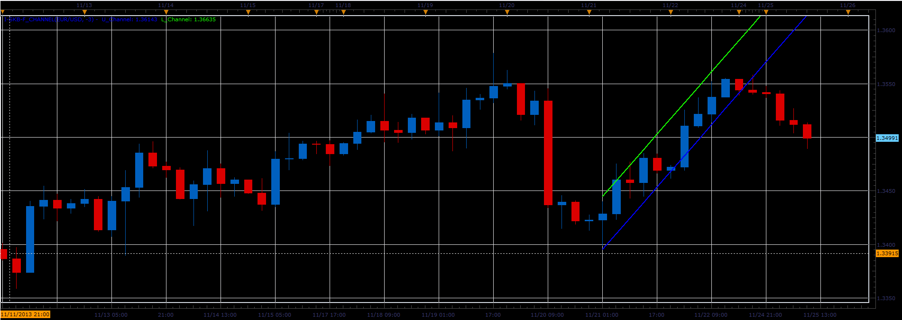

# i-SKB-F indicator

> Source: https://fxcodebase.com/code/viewtopic.php?f=17&t=59993  
> Forum: 17 · Topic 59993 · 2 post(s)

---

## i-SKB-F indicator

**Alexander.Gettinger** · Tue Nov 26, 2013 4:46 pm

This indicator is a ported MQL5 indicator from [http://www.mql5.com/en/code/1903](http://www.mql5.com/en/code/1903).

 

Download:

 [i-SKB-F_channel.lua](files/91150/i-SKB-F_channel.lua)

The indicator was revised and updated

---

## Re: i-SKB-F indicator

**Apprentice** · Sat Jun 17, 2017 4:28 am

The indicator was revised and updated.
