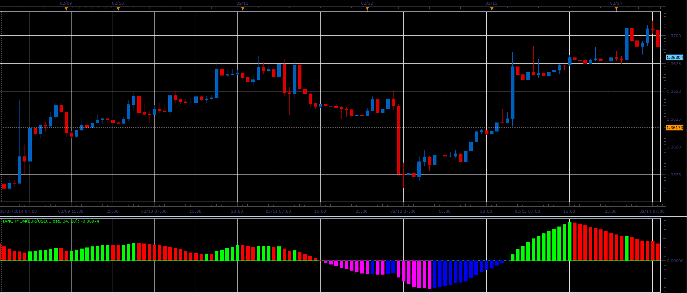

# iAnchMom oscillator

> Source: https://fxcodebase.com/code/viewtopic.php?f=17&t=60364  
> Forum: 17 · Topic 60364 · 2 post(s)

---

## iAnchMom oscillator

**Alexander.Gettinger** · Thu Feb 27, 2014 10:48 am

This indicator is a ported MQL5 indicator from [http://www.mql5.com/ru/code/2045](http://www.mql5.com/ru/code/2045) (in Russian).

Formula:
iAnchMom = 100*(EMA(Price) - MVA(Price)-1).

 

Download:

 [iAnchMom.lua](files/92925/iAnchMom.lua)

The indicator was revised and updated

---

## Re: iAnchMom oscillator

**Apprentice** · Fri Jun 02, 2017 6:47 am

Indicator was revised and updated.
