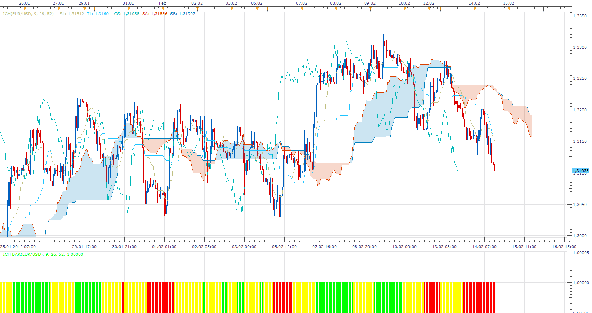

# ICH Bar

> Source: https://fxcodebase.com/code/viewtopic.php?f=17&t=13375  
> Forum: 17 · Topic 13375 · 11 post(s)

---

## ICH Bar

**Apprentice** · Tue Feb 14, 2012 2:16 pm

Green
Tenkan sen > Kijun sen > Senkou span B

Red
Tenkan sen < Kijun sen < Senkou span B

Yellow - Nutral

 [ICH Bar.lua](files/25996/ICH%20Bar.lua)

The indicator was revised and updated

---

## Re: ICH Bar

**kaya_171** · Tue Feb 14, 2012 5:43 pm

Thanks you very much Apprentice

A little question : how to change the scale of the indicator to have it bigger ?

---

## Re: ICH Bar

**nazaar** · Thu Oct 11, 2012 8:09 am

Another Brilliant indicator !! Thank you.

How can I remove the excess space in the indicator, it is taking up valuable screen space,

Could you add another option for the Chinkou Span?

Chinkou > span B
Chinkou < span B

Thanks

---

## Re: ICH Bar

**Apprentice** · Thu Oct 11, 2012 2:02 pm

Your request is added to the development list.

---

## Re: ICH Bar

**nazaar** · Fri Oct 12, 2012 4:31 pm

Hi!

The Ich Bar tool is very good. At present it has 3 colours:
Green -Tenkan sen > Kijun sen > Senkou span B
Red - Tenkan sen < Kijun sen < Senkou span B
Yellow - Neutral.

Could we add 2 additional colours involving the chinkou span line. As we all know, the chinkou span line is present price plotted 26 periods back. So, the additional calculation would be:

Blue - Chinkou span > span b value 26 periods back + present tenkan > present kijun > present span B

Orange - Chinkou span < span b value 26 periods back + present tenkan < present kijun < present span B

Thank you.

---

## Re: ICH Bar

**Apprentice** · Sun Oct 14, 2012 6:27 am

Your request is added to the development list.

---

## Re: ICH Bar

**nazaar** · Thu Oct 18, 2012 9:50 pm

> **Apprentice wrote:**
> Green
> Tenkan sen > Kijun sen > Senkou span B
> Red
> Tenkan sen < Kijun sen < Senkou span B
> Yellow - Nutral

Hello Apprentice,

please could you add another option to this amazing tool?

Pink
Price > (closed price) tenkan > kijun > Span B

Black
Price (closed price) < tenkan < kijun < Span B

Thanks very much.

---

## Re: ICH Bar

**Alexander.Gettinger** · Tue Nov 27, 2012 3:49 pm

Please, see this indicator:

 [ICH Bar2.lua](files/46949/ICH%20Bar2.lua)

---

## Re: ICH Bar

**nazaar** · Tue Nov 27, 2012 8:11 pm

> **Alexander.Gettinger wrote:**
> Please, see this indicator:
>
>
> ICH Bar2.lua

Please advise how trend 1, 2, 3 and no trend is determined?

Thanks.

---

## Re: ICH Bar

**Alexander.Gettinger** · Thu Nov 29, 2012 11:17 am

> **nazaar wrote:**
> Please advise how trend 1, 2, 3 and no trend is determined?

Up: Tenkan sen > Kijun sen > Senkou span B
Up2: Chinkou span > Senkou span b (Kijun-sen periods back) + Tenkan sen > Kijun sen > Senkou span B
Up3: Price > Tenkan sen > Kijun sen > Senkou span B

Dn: Tenkan sen < Kijun sen < Senkou span B
Dn2: Chinkou span < Senkou span b (Kijun-sen periods back) + Tenkan sen < Kijun sen < Senkou span B
Dn3: Price < Tenkan sen < Kijun sen < Senkou span B

---

## Re: ICH Bar

**Apprentice** · Tue May 02, 2017 12:15 pm

Indicator was revised and updated.
