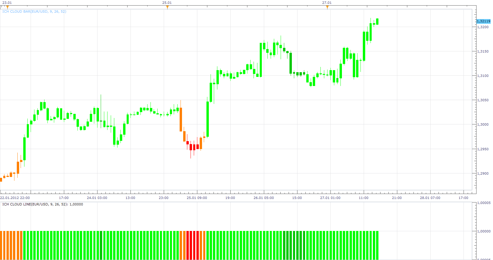

# ICH CLOUD LINE OSCILLATOR

> Source: https://fxcodebase.com/code/viewtopic.php?f=17&t=12428  
> Forum: 17 · Topic 12428 · 11 post(s)

---

## ICH CLOUD LINE OSCILLATOR

**Apprentice** · Sun Jan 29, 2012 2:54 pm

Indicator colored candles, depending on the position of a candle in comparison to the cloud.
That is a trend that is indicated by the cloud.

 [ICH CLOUD BAR.lua](files/24541/ICH%20CLOUD%20BAR.lua)

 [ICH CLOUD BAR OSCILLATOR.lua](files/24541/ICH%20CLOUD%20BAR%20OSCILLATOR.lua)

---

## Re: ICH CLOUD LINE OSCILLATOR

**blessing** · Tue Jan 31, 2012 8:21 am

hi,
i request a mtf strategy based on ichmouku cloud line bar,

time frames : H1, H4, H8, D1

**buy:**

ichimoku cloud line bar of h1 changes from yellow to green
 { ichmoku cloud line bar color[period][h1] ------ green
 ichimou cloud line bar color[ period-1][h1] ---- yellow}

[ and ]

ichimoku cloud line bar color h4,h8,d1 ----- green

**sell:**

ichimoku cloud line bar of h1 changes from yellow to red
 {ichimoku cloud line bar color[period][h1]------red and
 ichimoku cloud line bar color[period-1] [h1]-----yellow}

[ and]

ichimoku cloud line bar color[h4,h8,d1]-------red

---

## Re: ICH CLOUD LINE OSCILLATOR

**Apprentice** · Wed Feb 01, 2012 2:58 am

Your request is added to the developmental cue.

---

## Re: ICH CLOUD LINE OSCILLATOR

**Apprentice** · Fri Feb 10, 2012 2:58 pm

Requested can be found here.
[viewtopic.php?f=31&t=12319&p=25667#p25667](https://fxcodebase.com/code/viewtopic.php?f=31&t=12319&p=25667#p25667)

I am using slightly changed algorithm.
I hope it's not too big a problem.
If so, I can adjust it.

---

## Re: ICH CLOUD LINE OSCILLATOR

**blessing** · Fri Feb 10, 2012 6:36 pm

thank you very much apprentice

---

## Re: ICH CLOUD LINE OSCILLATOR

**miki052** · Fri Apr 06, 2012 1:21 am

Thanks alot share very informative detail!!!

---

## Re: ICH CLOUD LINE OSCILLATOR

**DrSenthilkumaar** · Fri Apr 13, 2012 2:31 pm

Hi Friends,
I am newely join this fourm.
I downloaded ICH Cloud Line Oscillator. As per instruction I Loaded (instaled) in Broco. But nothing was appeared in Custom Indicator list. Any one can explain me.

---

## Re: ICH CLOUD LINE OSCILLATOR

**Apprentice** · Mon Apr 16, 2012 3:43 am

All with a few exceptions, indicators on this forum
are written for TS2/Marketscope trading platform.
It will not work on Broce Trader. In theory, indicators can be translated,
If your target platform supports this functionality,
But the development of the extension for other platforms is not free.

---

## Re: ICH CLOUD LINE OSCILLATOR

**algotime** · Thu May 12, 2016 3:12 pm

if you don't want all the timeframes can you just set them all to the same setting like H1?

---

## Re: ICH CLOUD LINE OSCILLATOR

**Apprentice** · Fri May 13, 2016 1:26 pm

This is NOT MTF indicator.

---

## Re: ICH CLOUD LINE OSCILLATOR

**Apprentice** · Sun Jul 08, 2018 6:04 am

The indicator was revised and updated.
