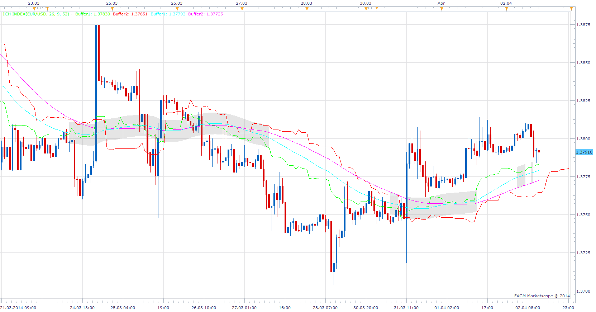

# ICH Squeeze

> Source: https://fxcodebase.com/code/viewtopic.php?f=17&t=60481  
> Forum: 17 · Topic 60481 · 8 post(s)

---

## ICH Squeeze

**Apprentice** · Wed Apr 02, 2014 5:28 am

Based on Cronex Taichi
[viewtopic.php?f=27&t=60425](https://fxcodebase.com/code/viewtopic.php?f=27&t=60425)

 [ICH Squeeze.lua](files/93328/ICH%20Squeeze.lua)

The indicator was revised and updated

---

## Re: ICH Squeeze

**cersoz** · Fri Apr 04, 2014 12:29 am

great indicator..

But line thickness isnt working!..please fix this!..

---

## Re: ICH Squeeze

**Apprentice** · Fri Apr 04, 2014 1:16 am

Please Re-Download.

---

## Re: ICH Squeeze

**cersoz** · Fri Apr 04, 2014 2:15 am

u r hero!...

thanks:)

---

## Re: ICH Squeeze

**cersoz** · Fri Apr 25, 2014 8:13 am

please check grey zone formula??? compare orginal indicatorin mtrader platforma .. totally different

---

## Re: ICH Squeeze

**Apprentice** · Sat Apr 26, 2014 7:59 am

Revision did not reveal any code differences.
Can you show me an example.
TS-based differences are possible.

---

## Re: ICH Squeeze

**cersoz** · Sun Apr 27, 2014 5:41 am

[http://prntscr.com/3dw77q](http://prntscr.com/3dw77q)
this chart from metatrader used orginal indicator.. as u can see only 1 single line plotted grey zone..

[http://prntscr.com/3dw7r4](http://prntscr.com/3dw7r4)
same chart in tradestation used with r translated indicator. all area painted grey zone:)

---

## Re: ICH Squeeze

**Apprentice** · Sun Jun 18, 2017 12:34 pm

The indicator was revised and updated.
