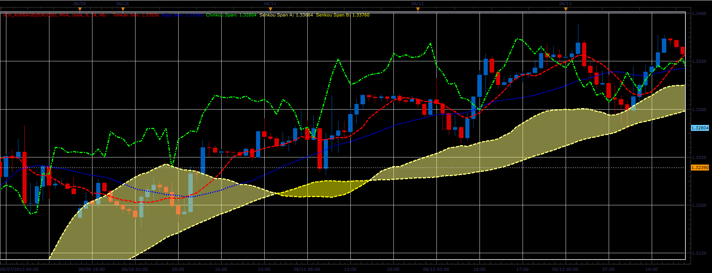

# Ichimoku Moving Average

> Source: https://fxcodebase.com/code/viewtopic.php?f=17&t=41467  
> Forum: 17 · Topic 41467 · 2 post(s)

---

## Ichimoku Moving Average

**Alexander.Gettinger** · Wed Jun 19, 2013 3:28 pm

Ichimoku with moving averages in place of mid-channel.

 

Download:

 [Ich_Average.lua](files/67719/Ich_Average.lua)

For this indicator must be installed Averages indicator ([viewtopic.php?f=17&t=2430](https://fxcodebase.com/code/viewtopic.php?f=17&t=2430)).

The indicator was revised and updated

---

## Re: Ichimoku Moving Average

**Apprentice** · Thu Jun 01, 2017 9:50 am

Indicator was revised and updated.
