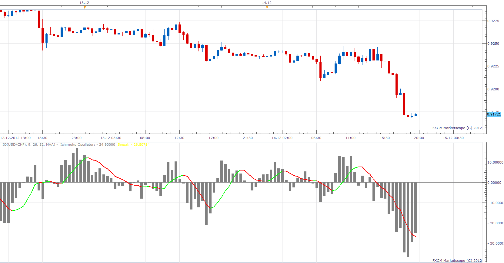

# Ichimoku Oscillator

> Source: https://fxcodebase.com/code/viewtopic.php?f=17&t=27706  
> Forum: 17 · Topic 27706 · 2 post(s)

---

## Ichimoku Oscillator

**Apprentice** · Fri Dec 14, 2012 1:33 pm

 markt=( CS - SA)
 trend=( TS - KS)

 IO =(markt-trend)/PipSize;

	Signal Line = MA of IO;

 [IO.lua](files/48495/IO.lua)

The indicator was revised and updated

---

## Re: Ichimoku Oscillator

**Apprentice** · Tue May 02, 2017 12:02 pm

Indicator was revised and updated.
