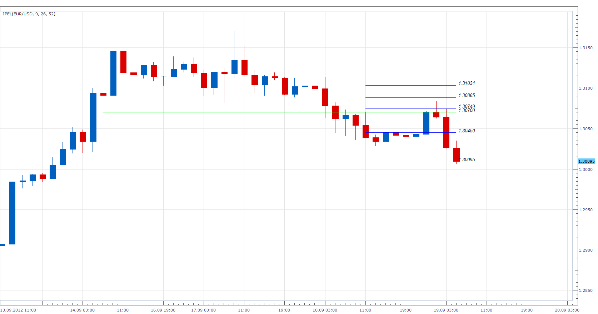
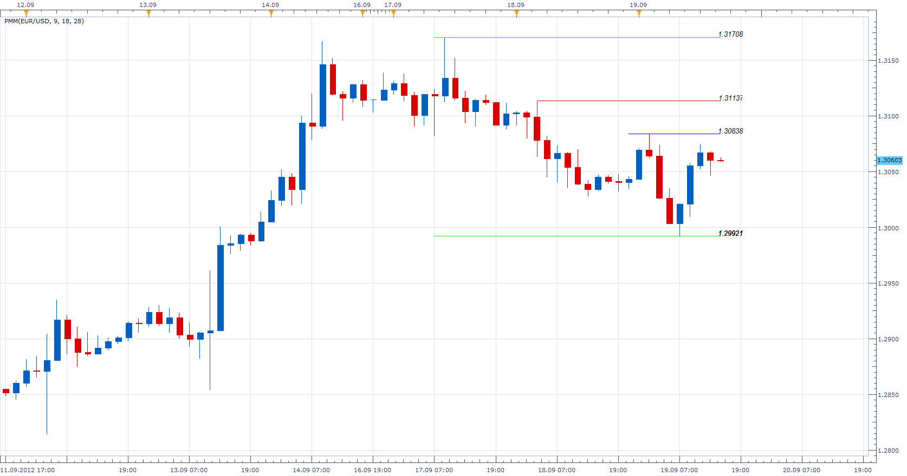

# Ichimoku Period Extreme Levels

> Source: https://fxcodebase.com/code/viewtopic.php?f=17&t=23584  
> Forum: 17 · Topic 23584 · 14 post(s)

---

## Ichimoku Period Extreme Levels

**Apprentice** · Wed Sep 19, 2012 5:32 am

The indicator will draw a line on min and max value of particular ICH component for selected period.

 [IPEL.lua](files/40584/IPEL.lua)

The indicator was revised and updated

---

## Re: Ichimoku Period Extreme Levels

**Apprentice** · Wed Sep 19, 2012 2:19 pm

As requested i made Simple spinoff, draws the line at the min / max values achieved by Price during selected period.

 [PMM.lua](files/40610/PMM.lua)

---

## Re: Ichimoku Period Extreme Levels

**nazaar** · Wed Sep 19, 2012 5:51 pm

This is another excellent tool!

Could you add an option to display the pip value between the min max values? Please see attached

Thanks.

---

## Re: Ichimoku Period Extreme Levels

**Apprentice** · Thu Sep 20, 2012 12:42 am

Pip difference added to PMM.

---

## Re: Ichimoku Period Extreme Levels

**nazaar** · Thu Sep 20, 2012 6:56 am

> **Apprentice wrote:**
> Pip difference added to PMM.

Dear Apprentice,

Thanks kindly for adding the pip difference, can you make it a user option to display the price and pip difference?

Thanks.

---

## Re: Ichimoku Period Extreme Levels

**nazaar** · Tue Oct 09, 2012 2:05 pm

> **Apprentice wrote:**
> Pip difference added to PMM.

Hello,

Would you be interested in adding to this brilliant tool?

Could you please **add the option** to identify the most recent tenkan kijun crosses to this tool? Either place a marker or arrow or a symbol at the most recent 3 tenkan / kijun crosses.

Please see attachement.

Thanks very kindly.

---

## Re: Ichimoku Period Extreme Levels

**nazaar** · Mon Oct 15, 2012 10:53 pm

> **Apprentice wrote:**
>
>
> The attachment **PMM.png** is no longer available
>
> As requested i made Simple spinoff, draws the line at the min / max values achieved by Price during selected period.
>
> The attachment **PMM.png** is no longer available

Hello,

could you please add a 4th line? I tried doing it but I am missing something as it is reading my 3rd and 4th option as the same thing. See attached.

Thanks.

---

## Re: Ichimoku Period Extreme Levels

**Apprentice** · Tue Oct 16, 2012 6:48 am

Your request has been added to the development list.

---

## Re: Ichimoku Period Extreme Levels

**Apprentice** · Tue Oct 16, 2012 12:37 pm

The fourth and fifth lines added.
Use Zero Period, if you want to delete a line.

---

## Re: Ichimoku Period Extreme Levels

**nazaar** · Wed Oct 17, 2012 3:39 pm

Hello Apprentice, how are you?

Would you be interested in adding to this tool? The attached indicator draws 3 sets of horizontal lines, used to identify the 9, 26 and 52 periods HH/LL points.

Would you please add an **option** to display Fib level values between the the HH and LL for a chosen period.
The tool would have an option automatically draw and display Fib level between a chosen period, for example fib level between the 26 period HH and LL.

Where to place the fib point A and B would depend on the direction price is moving and ideally it is chosen by the user, is this possible?

Output: Ideally, user would choose to display the fib level and whether to display fib % or fib level prices or both and placed 1 bar ahead of the live bar. Please see attached chart as an example.

I thank you kindly in advance for any consideration.

---

## Re: Ichimoku Period Extreme Levels

**Apprentice** · Fri Nov 23, 2012 6:58 am

Major PMM Update.

Fib Levels Added.
Code is Optimized.
Presentation improvement.

---

## Re: Ichimoku Period Extreme Levels

**Apprentice** · Tue May 02, 2017 12:17 pm

Indicator was revised and updated.

---

## Re: Ichimoku Period Extreme Levels

**rosaleen2300** · Tue Dec 14, 2021 1:17 pm

Please convert this "" HH and LL.LUA "" to MQ4 .

---

## Re: Ichimoku Period Extreme Levels

**Apprentice** · Thu Dec 16, 2021 2:52 pm

Your request is added to the development list.
Development reference 1022.
