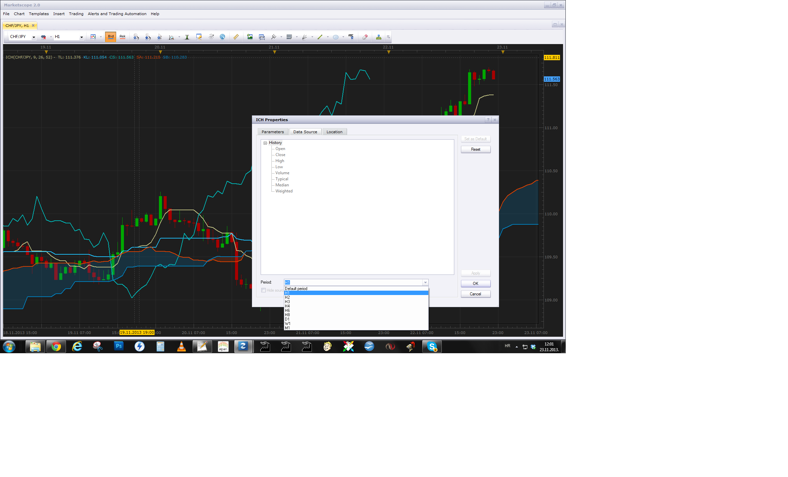

# Ichimoku with Shift

> Source: https://fxcodebase.com/code/viewtopic.php?f=17&t=23664  
> Forum: 17 · Topic 23664 · 21 post(s)

---

## Ichimoku with Shift

**Apprentice** · Fri Sep 21, 2012 11:03 am

In every respect this is a standard Ichimoku indicator,
on top of it, i add shift functionality for each component separately.
Use +Period for Forward and -Period for backward shift.

 [ICH with Shift.lua](files/40707/ICH%20with%20Shift.lua)

 [Ichimoku with Shift and Alert.lua](files/40707/Ichimoku%20with%20Shift%20and%20Alert.lua)

Based on request.
[http://fxcodebase.com/code/viewtopic.php?f=27&t=64498](https://fxcodebase.com/code/viewtopic.php?f=27&t=64498)

---

## Re: Ichimoku with Shift

**nazaar** · Sat Oct 27, 2012 8:47 am

Hello Apprentice, how are you?

Would it be possible to add a price line to this indicator? That is, a horizontal line is drawn at current price levels and moves as price fluctuates?

I would like to place this indicator below the chart but doing that at present I cannot see where price is relative to the lines. Thanks very much.

---

## Re: Ichimoku with Shift

**Apprentice** · Sun Oct 28, 2012 10:20 am

Price Line Option Added.

---

## Re: Ichimoku with Shift

**nazaar** · Sun Oct 28, 2012 8:40 pm

> **Apprentice wrote:**
> Price Line Option Added.

I am very grateful you did this, thank you very much Apprentice.

I was wondering, instead of using a line to show current price would it be possible to have an arrow showing where the live price is?

A line is better than before but it's another line in a smaller space making it look cluttered.

Thank you.

---

## Re: Ichimoku with Shift

**Apprentice** · Mon Oct 29, 2012 2:48 pm

If I find time, I'll try to add this.

---

## Re: Ichimoku with Shift

**nazaar** · Tue Oct 30, 2012 7:57 am

> **Apprentice wrote:**
> If I find time, I'll try to add this.

Apprentice, thanks for both the update and consideration.

---

## Re: Ichimoku with Shift

**nazaar** · Fri Nov 16, 2012 3:06 pm

Hello Apprentice, how are you? I hope all is better.

Thanks for the ichimoku with shift and a price line. I found the other indicator ([viewtopic.php?f=17&t=8619](https://fxcodebase.com/code/viewtopic.php?f=17&t=8619)) you did call Zscore. In this indicator you have it displayed below the chart with candlesticks.

Is it possible to apply this as well to the Ichimoku with shift tool instead of a horizontal price line?

See attached?

Thanks.

---

## Re: Ichimoku with Shift

**Apprentice** · Sat Nov 17, 2012 4:40 am

U can apply Zscore to Ichimoku with Shift.
Zscore need only tick as the source (single data stream)
Not vice versa.
Ichimoku need the whole bar, zscore have only single line as output.

In your post to have Z Price Score Normalization.
U can Apply Ichimoku to Z Price Score Normalization
Not vice versa

---

## Re: Ichimoku with Shift

**Apprentice** · Wed Mar 27, 2013 5:37 am

Output Stream selection option added.

---

## Ichimoku Current & Higher Time Frame

**nazaar** · Wed Oct 09, 2013 10:17 pm

Hello,

Attached is two custom version of the Ichimoku with shift tool. They both are customized to only show the ichimoku cloud. The difference between the two is only the colour of the clouds. The second attached file is intended to show the cloud for a higher time frame, that is the data source is set to a higher time frame.

Could someone please help me? I would like to combine the two attached tools into one tool. That is, the new combined tool will show two ichimoku clouds but one will be for the current chart and the second cloud would be for a higher time.

Please see attached image, it's the 1-hour chart with the 1-hour and 4-hour ichimoku clouds. Orange cloud is the 4-hour cloud and the grey is the 1-hour cloud.

Thanks in advance.

---

## Re: Ichimoku with Shift

**Apprentice** · Fri Oct 11, 2013 2:09 am

Your request is added to the development list.

---

## Ichimoku HTF Kijen-Sen

**ThemBonez** · Thu Nov 21, 2013 9:37 pm

Hi,
Is it Possible to create the Kijen-sen for higher time frame?
Thank You

---

## Re: Ichimoku with Shift

**Apprentice** · Sat Nov 23, 2013 5:59 am

Your preferred Presentations is similar to the MTF Stochastic RSI?
[viewtopic.php?f=17&t=3008&p=12183&hilit=MTF+RSI#p12183](https://fxcodebase.com/code/viewtopic.php?f=17&t=3008&p=12183&hilit=MTF+RSI#p12183)

 

If you prefer line mode, simply choose data source desired time frame.

---

## Re: Ichimoku with Shift

**Apprentice** · Thu Jun 22, 2017 6:43 am

Bump Up.

---

## Re: Ichimoku with Shift

**armin0012003** · Sun Mar 11, 2018 6:27 am

Hi thanks for your work
I have 2 favor to ask
1- can you add shift option for span A
2- I want to make cloud base on tenken with shift and kijen with shift
for example span a = tk 9 with shift of 5 and kj=26 with shift of 10 this give me span A
thanks in advanced

---

## Re: Ichimoku with Shift

**Apprentice** · Tue Mar 13, 2018 6:19 am

We have Cloud Shift period already.
You want to separate the A and B lines shift?

---

## Re: Ichimoku with Shift

**armin0012003** · Wed Mar 14, 2018 11:49 am

> **Apprentice wrote:**
> We have Cloud Shift period already.
> You want to separate the A and B lines shift?

Hi
regard the first question cause I found indicator that separate them
but on a second favor
I want kumo draw base on shift tk and kj , as I explain if I shift tk for 5 and shift kj for 10
so tk shift + kj shift /2 = span a and also can put any number for span b which is default 52
 if you can make something like this that would be great
cheers

---

## Re: Ichimoku with Shift

**Apprentice** · Wed Mar 14, 2018 5:23 pm

Your request is added to the development list under Id Number 4079

---

## Re: Ichimoku with Shift

**Apprentice** · Thu Mar 22, 2018 8:22 am

[ICH with Shift.armin0012003.lua](files/118337/ICH%20with%20Shift.armin0012003.lua)

Try this version.

---

## Re: Ichimoku with Shift

**armin0012003** · Sat Mar 24, 2018 8:34 am

thank you , appreciated man . great job.

---

## Re: Ichimoku with Shift

**Apprentice** · Sat May 12, 2018 8:35 am

The Indicator was revised and updated.
