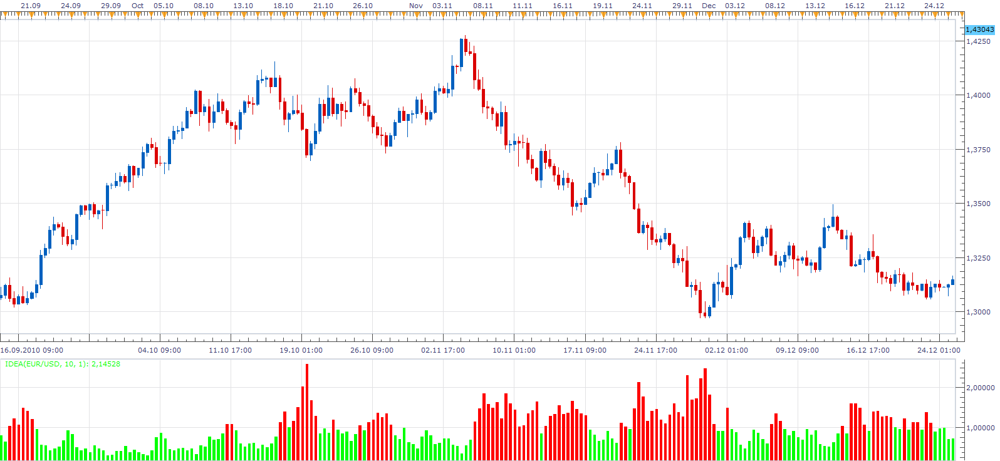

# Idea Trend Indicator

> Source: https://fxcodebase.com/code/viewtopic.php?f=17&t=4739  
> Forum: 17 · Topic 4739 · 8 post(s)

---

## Idea Trend Indicator

**Apprentice** · Wed Jun 15, 2011 4:40 am

Idea = (ema of high- ema of close) / (ema of close - ema of low)
UpTrend
Idea < 1
DownTrend
Idea > 1

 [Idea.lua](files/11745/Idea.lua)

The indicator was revised and updated

---

## Re: Idea Trend Indicator

**boursicoton** · Wed Jun 15, 2011 2:45 pm

very good work !!! i'm very happy....
thanks !

---

## Re: Idea Trend Indicator

**Terminus** · Thu Jun 16, 2011 3:13 am

hello,

how to use this indicator ?

---

## Re: Idea Trend Indicator

**Apprentice** · Thu Jun 16, 2011 3:56 am

I have no clue.
It has been written according to customer specification.
I guess enter Long position, when we have a UpTrend (Trend < 1 ), and vice versa ..

---

## Re: Idea Trend Indicator

**Terminus** · Thu Jun 16, 2011 1:43 pm

ok thanks. This is interesting because it seems to be built on the same principle as the Repulse, comparing forces buyers and sellers forces. But apparently not the same use. I'll observing it !

---

## Re: Idea Trend Indicator

**boursicoton** · Sat Jun 18, 2011 9:19 am

in french for real word

cet indicateur doit s'utiliser avec des unités de temps differents, exemple h4 et h1
le parametre doit correspondre avec le sous jacent travaillé, par exemple sur des paires de devises classiques comme eurusd, 34 comme les trois ema de raghee horner.

on peut appliquer une ema sur l'indicateur lui meme pour determiner la tendance

rouge : pour vendre
vert : pour acheter

l'indicateur montre la position du close par rapport au plus haut et plus bas, c'est basique !
on pourrait en faire plus compliquer avec un parametre en plus l'ouverture, je vais travailler dessus.

l'autre indicateur en demande, c'est le wi ! interessant aussi....il montre qu'une bougie peut etre baissiere alors que le chandelier est haussier....
désolé d'écrire en français...
merci pour ton travail apprentice ! je vais t'en demander encore : put this indicator on mtf...

j'ai supprimé les deux posts qui suivent, le code que j'avais changé genère des erreurs suivant les methodes, bref je suis un nul !

---

## Re: Idea Trend Indicator

**Alexander.Gettinger** · Fri Nov 21, 2014 5:06 pm

MQL4 version of Idea Trend oscillator: [viewtopic.php?f=38&t=61518](https://fxcodebase.com/code/viewtopic.php?f=38&t=61518).

---

## Re: Idea Trend Indicator

**Apprentice** · Sun Jul 30, 2017 7:02 am

The indicator was revised and updated.
