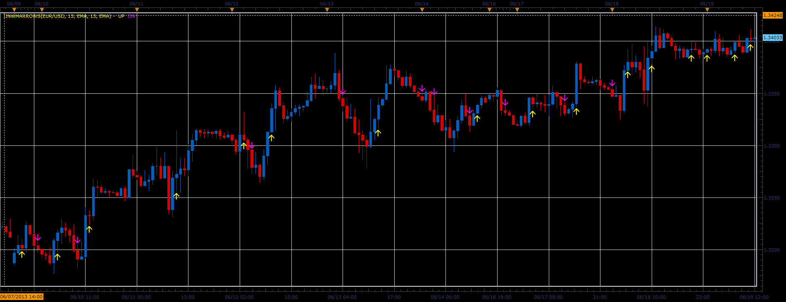

# IINWMARROWS indicator

> Source: https://fxcodebase.com/code/viewtopic.php?f=17&t=41448  
> Forum: 17 · Topic 41448 · 2 post(s)

---

## IINWMARROWS indicator

**Alexander.Gettinger** · Wed Jun 19, 2013 2:31 pm

This indicator is a ported MQL5 indicator from [http://www.mql5.com/ru/code/1739](http://www.mql5.com/ru/code/1739) (in Russian).

The indicator uses the fast and slow MA.
If FastMA[i-1]>SlowMA[i-1] and FastMA[i-2]<SlowMA[i-2] and FastMA[i]>SlowMA[i] - UP arrow
If FastMA[i-1]<SlowMA[i-1] and FastMA[i-2]>SlowMA[i-2] and FastMA[i]<SlowMA[i] - DN arrow
Fast MA is calculated for close price and slow MA is calculated for open price.

 

Download:

 [IINWMARROWS.lua](files/67696/IINWMARROWS.lua)

For this indicator must be installed Averages indicator ([viewtopic.php?f=17&t=2430](https://fxcodebase.com/code/viewtopic.php?f=17&t=2430)).

The indicator was revised and updated

---

## Re: IINWMARROWS indicator

**Apprentice** · Sat May 27, 2017 12:09 pm

Indicator was revised and updated.
