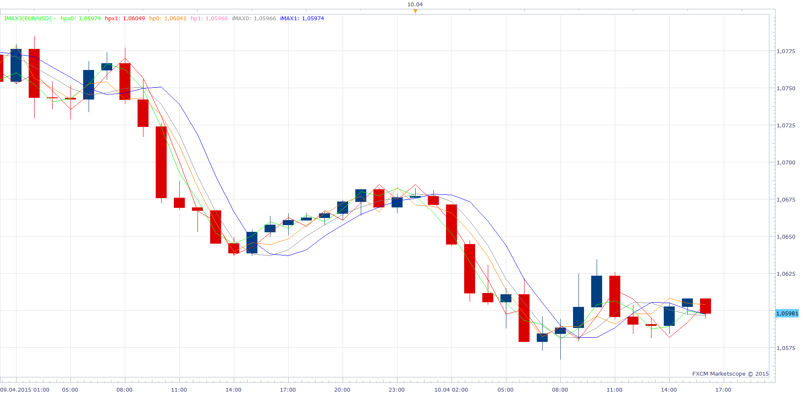

# iMAX - Fast Trend Detector

> Source: https://fxcodebase.com/code/viewtopic.php?f=17&t=62103  
> Forum: 17 · Topic 62103 · 3 post(s)

---

## iMAX - Fast Trend Detector

**Apprentice** · Sun Apr 12, 2015 1:01 pm

Based on request.
[viewtopic.php?f=27&t=62095](https://fxcodebase.com/code/viewtopic.php?f=27&t=62095)

 [iMax3.lua](files/99765/iMax3.lua)

The indicator was revised and updated

---

## Re: iMAX - Fast Trend Detector

**Alexander.Gettinger** · Fri May 08, 2015 10:30 am

MQL4 version of iMAX indicator: [viewtopic.php?f=38&t=62202](https://fxcodebase.com/code/viewtopic.php?f=38&t=62202).

---

## Re: iMAX - Fast Trend Detector

**Apprentice** · Mon Jul 03, 2017 7:33 am

The indicator was revised and updated.
