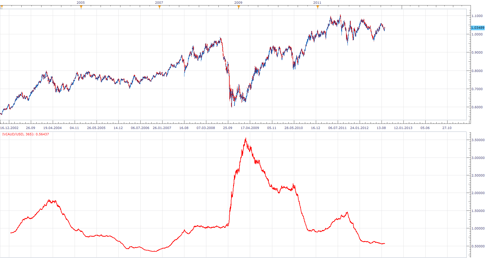

# Implied volatility

> Source: https://fxcodebase.com/code/viewtopic.php?f=17&t=23269  
> Forum: 17 · Topic 23269 · 7 post(s)

---

## Implied volatility

**Apprentice** · Tue Sep 11, 2012 2:25 am

This is my version of the implied volatility.
I have extrapolated deviation based on a set number or period.
Shows the expected shift in price thill end of the year, next 365 days.
Best results are Obtained on D1 time frame.

In this example, evaluation greater than 1 are simply crazy.

More on the topic can be found here.
[http://www.optionsplaybook.com/options- ... olatility/](http://www.optionsplaybook.com/options-introduction/what-is-volatility/)

 [IV.lua](files/40059/IV.lua)

The indicator was revised and updated

---

## Re: Implied volatility

**tradinc** · Sat Sep 15, 2012 2:15 am

can you make the oscillator made out of bars instead of a line
The green bars shows the strength of the up trend above the horizontal line.
The red bars shows the strength of the down trend below the horizontal line.
Add horizontal lines like the Standard RSI with
value, color, style, and width options. Show in the background. Default can be 80,75,70,50,30,25 and 20.

---

## Re: Implied volatility

**Apprentice** · Sat Sep 15, 2012 2:39 am

Can you explain "made ​​out of bars instead of a line
The green bars. "
You want RSI with additional lines on these levels.
And Bar Painted in dependence on the crossing direction of RSI, Up or Down,
for indicated lines.

Can you attach a chart template.
The one thing I am sure, this is posted in the wrong topic.

---

## Re: Implied volatility

**tradinc** · Sat Sep 15, 2012 10:20 am

no its not
actually i was just hoping for you to change the oscillator in to bars instead of the current line. something the looks like the "Better volume oscillator" [http://fxcodebase.com/code/download/fil ... &mode=view](https://fxcodebase.com/code/download/file.php?id=7354&mode=view) ...were it can be one or two color code only
but with a horizontal line where it can be edited as one pleases to use as a entry and exit signal

---

## Re: Implied volatility

**thespecial_one** · Fri Mar 15, 2013 3:25 pm

So please can you explain how you calculate IMPLIED VOLATILITY without having options prices, and any info about futures and options as TS operates with cfds.?

 Thk you.

---

## Re: Implied volatility

**Apprentice** · Sat Mar 16, 2013 8:42 am

IV = (SD* (365)^(1/2)) / (close * (Ratio)^(1/2));
SD - standard deviation of Period

Size1 = (Chart Period Duration)*Period;
Size2 = (Duration of One Day)*365;

Ratio= (Size2 / (Size1));

For for exact formula on how to use this indicator value.
Consult above website reference.

---

## Re: Implied volatility

**Apprentice** · Wed May 10, 2017 5:55 am

Indicator was revised and updated.
