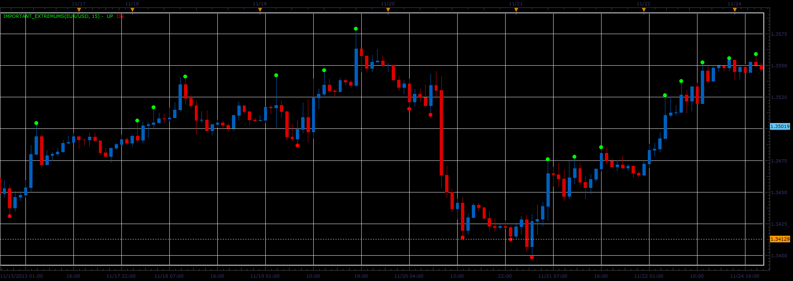

# Important extremum indicator

> Source: https://fxcodebase.com/code/viewtopic.php?f=17&t=59987  
> Forum: 17 · Topic 59987 · 3 post(s)

---

## Important extremum indicator

**Alexander.Gettinger** · Tue Nov 26, 2013 4:10 pm

Formulas:
"Up", if High[i-1]>=MaxHigh and High[i-1]>High[i],
"Dn", if Low[i-1]<=MinLow and Low[i-1]<Low[i], where
MaxHigh, MinLow - maximum and minimum prices at range from (i-Period-1) to (i-2).

 

Download:

 [Important_Extremums.lua](files/91142/Important_Extremums.lua)

The indicator was revised and updated

---

## Re: Important extremum indicator

**Alexander.Gettinger** · Tue Nov 26, 2013 4:11 pm

MQL4 version of Important extremum indicator: [viewtopic.php?f=38&t=59988](https://fxcodebase.com/code/viewtopic.php?f=38&t=59988).

---

## Re: Important extremum indicator

**Apprentice** · Sat Jun 17, 2017 4:33 am

The indicator was revised and updated.
