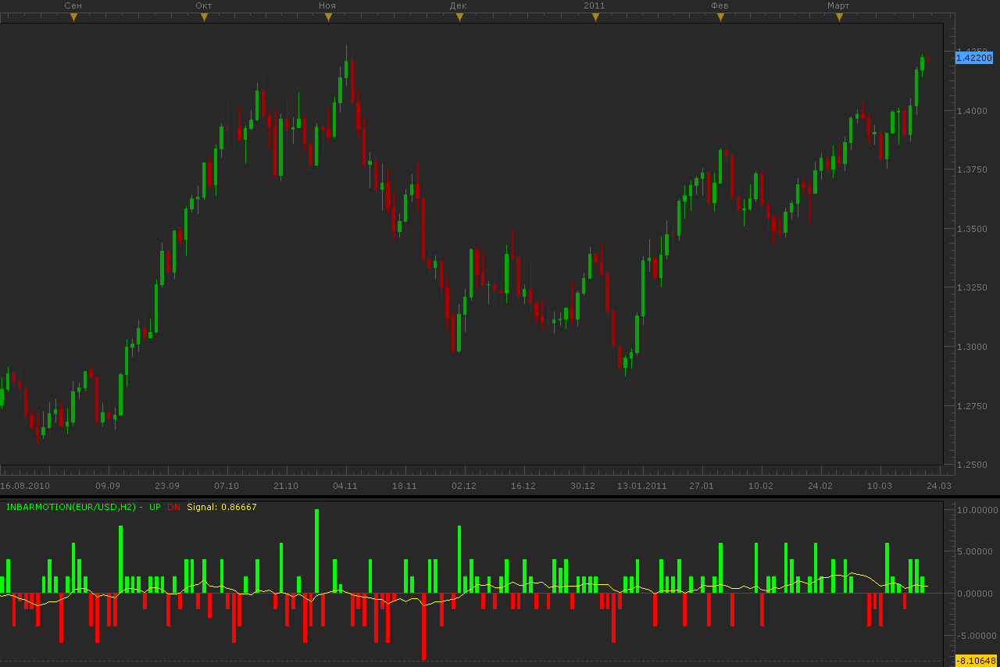

# In bar motion indicator

> Source: https://fxcodebase.com/code/viewtopic.php?f=17&t=3696  
> Forum: 17 · Topic 3696 · 8 post(s)

---

## In bar motion indicator

**Alexander.Gettinger** · Mon Mar 21, 2011 11:12 pm

Indicator shows what moves price in bar on the data of smaller timeframe.
Indicator is counted how much bars of smaller timeframe were closed upwards and downwards and display difference on histogram. Also drawn signal (averaged) line.

 

Download:

 [InBarMotion.lua](files/8948/InBarMotion.lua)

 [InBarMotion Old.lua](files/8948/InBarMotion%20Old.lua)

The indicator was revised and updated

---

## Re: In bar motion indicator

**Yodian** · Sat Aug 16, 2014 9:25 am

In a number of cases there is no value (no bar displayed)...
Can you fix it pls?

---

## Re: In bar motion indicator

**Apprentice** · Wed Aug 20, 2014 4:21 pm

Try my version.
I use a bit different approach.

---

## Re: In bar motion indicator

**Yodian** · Sat Aug 23, 2014 4:34 am

Link pls?

---

## Re: In bar motion indicator

**Apprentice** · Sun Aug 24, 2014 4:26 am

Re-Download InBarMotion.lua from first (top most) post.

---

## Re: In bar motion indicator

**Yodian** · Wed Aug 27, 2014 1:18 pm

This is the one that I use (not the old one). Still have the problem.

---

## Re: In bar motion indicator

**Apprentice** · Thu Aug 28, 2014 5:25 am

Unfortunately, I can not find any problem with the current implementation.

---

## Re: In bar motion indicator

**Apprentice** · Sat Jul 01, 2017 5:21 am

The indicator was revised and updated.
