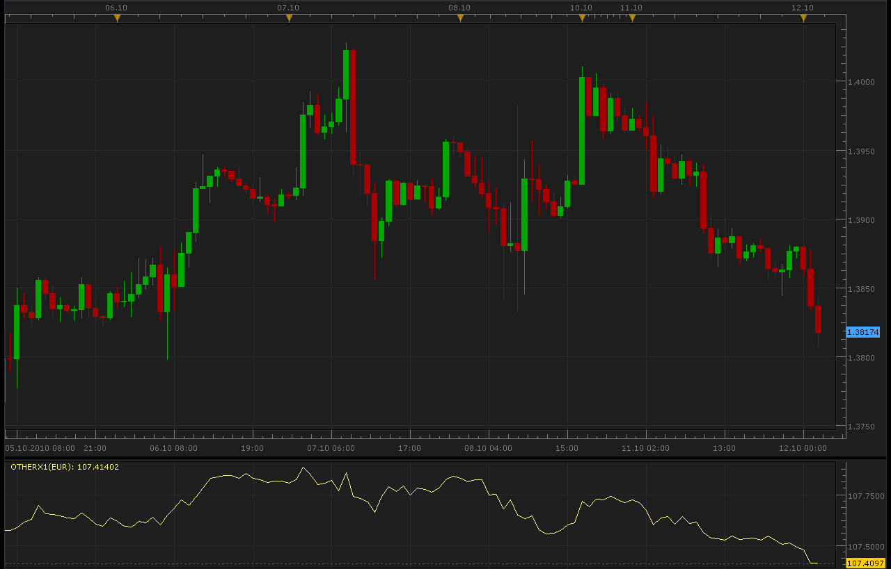
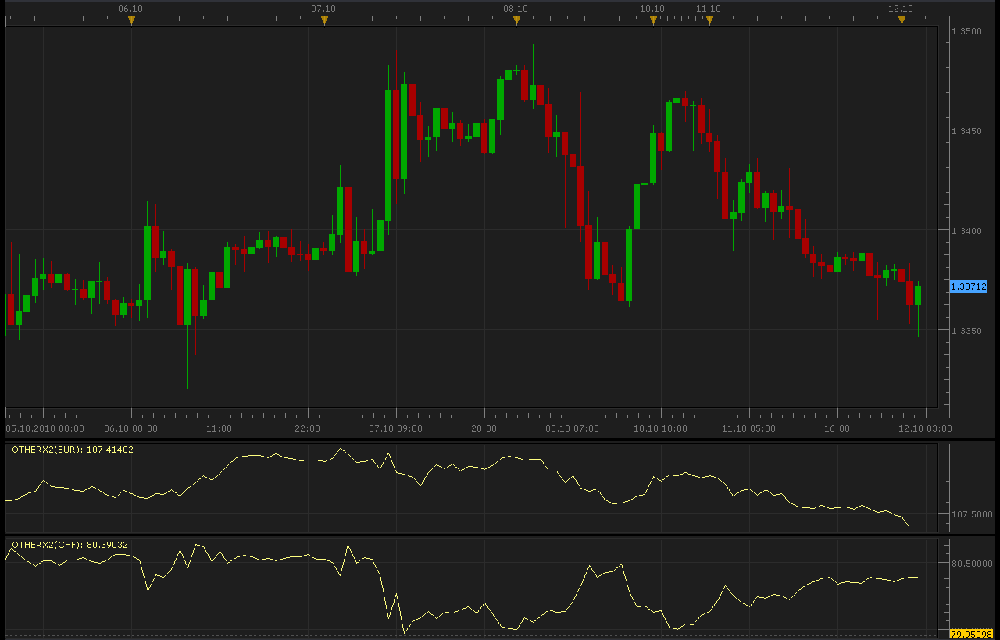

# Indexes of currency

> Source: https://fxcodebase.com/code/viewtopic.php?f=17&t=2379  
> Forum: 17 · Topic 2379 · 17 post(s)

---

## Indexes of currency

**Alexander.Gettinger** · Tue Oct 12, 2010 1:50 am

Example:
Index of EUR calculate as [EUR/USD] * USDX
Index of CHF calculate as USDX / [USD/CHF].

 

 [OtherX1.lua](files/5133/OtherX1.lua)

 [OtherX1 Bars.lua](files/5133/OtherX1%20Bars.lua)

The indicator was revised and updated

---

## Re: Indexes of currency

**Alexander.Gettinger** · Tue Oct 12, 2010 1:52 am

Other version of indicator.
Indicator calculate index UP or DOWN currency of current instrument.

 

Code: [Select all](https://fxcodebase.com/code/)
`function Init()
    indicator:name("Instrument Index");
    indicator:description("Calculates the instrument index in on the base of (XXX/USD or USD/XXX) and USDX");
    indicator:requiredSource(core.Bar);
    indicator:type(core.Oscillator);

    indicator.parameters:addGroup("Calculation");
    indicator.parameters:addString("SymbolPos", "Symbol position", "", "UP");
    indicator.parameters:addStringAlternative("SymbolPos", "UP", "", "UP");
    indicator.parameters:addStringAlternative("SymbolPos", "DOWN", "", "DOWN");

    indicator.parameters:addGroup("Display");
    indicator.parameters:addColor("clrIndex", "Index Color", "", core.rgb(255, 255, 128));
end

local source;
local barSize;
local usdx;
local loading = false;
local offset;
local weekoffset;
local SymbolPos;
local Symbol;

-- indexes for the instruments in the data table
local eurusd = 1;
local usdjpy = 2;
local gbpusd = 3;
local usdcad = 4;
local usdchf = 5;
local usdsek = 6;
local xxxusd = 7;
local first = nil;
local last = nil;
-- data table
local data = {};
local SymbolWeight;
local Symbol2;

function CheckSymbol(Symb)
 local Table=core.host:findTable("offers");
 if Table:find("Instrument",Symb)~=nil then
  return true;
 else
  return false;
 end
end

-- add a new item into the data table
-- index        - is the index of the item in the table
-- instrument   - the instrument name
-- weight       - the weigth of the instrument
function AddCollectionItem(index, instrument, weight)
    local t, coll, from, to, tmp;
    t = {};
    t.instrument = instrument;
    t.data = nil;
    t.loading = false;
    t.weight = weight;
    t.rqfrom = nil;
    t.rqto = nil;
    data[index] = t;

    if first == nil or first > index then
        first = index;
    end
    if last == nil or last < index then
        last = index;
    end
end

-- initialize the collection of the instruments
function InitCollection()
    -- sum of absolute values of the weights must be 1. negative sign is for the
    -- instrument which has USD as counter currency.
    AddCollectionItem(eurusd, "EUR/USD", -0.576);
    AddCollectionItem(usdjpy, "USD/JPY", 0.136);
    AddCollectionItem(gbpusd, "GBP/USD", -0.119);
    AddCollectionItem(usdcad, "USD/CAD", 0.091);
    AddCollectionItem(usdsek, "USD/SEK", 0.042);
    AddCollectionItem(usdchf, "USD/CHF", 0.036);
    if Symbol~="USD" then
     AddCollectionItem(xxxusd, Symbol2, SymbolWeight);
    end
end

-- prepare the indicator
function Prepare()
    source = instance.source;
    host = core.host;
    barSize = source:barSize();
    offset = host:execute("getTradingDayOffset");
    weekoffset = host:execute("getTradingWeekOffset");
    SymbolPos=instance.parameters.SymbolPos;
    if SymbolPos=="UP" then
     Symbol=string.sub(source:name(),1,3);
    else
     Symbol=string.sub(source:name(),5,7);
    end
   
    if CheckSymbol(Symbol .. "/USD")==true then
     Symbol2=Symbol .. "/USD";
     SymbolWeight=1.;
    end
    if CheckSymbol("USD/" .. Symbol)==true then
     Symbol2="USD/" .. Symbol;
     SymbolWeight=-1.;
    end
   

    InitCollection();

    local name = profile:id() .. "(" .. Symbol .. ")";
    instance:name(name);
    usdx = instance:addStream("X", core.Line, name .. ".X", "X", instance.parameters.clrIndex, 0);
end

local p = {};
local w = {};

-- get the price of the specified instrument
function GetPrice(index, date)
    local t;

    local from, to, tmp;

    t = data[index];

    assert(t ~= nil, "internal error!");

    if t.data == nil then
        -- data is not loaded yet at all
        if source:isAlive() then
            to = 0;
        else
            to = source:date(source:size() - 1);
        end
        from = source:date(source:first());
        t.data = host:execute("getHistory", index, t.instrument, barSize, from, to, source:isBid());
        t.rqfrom = from;
        t.rqto = to;
        t.loading = true;
        loading = true;
        return 0, 0;
    elseif date < t.rqfrom then
        -- requested date is before the first item of the collection
        -- we have ever requested
        from = date;
        to = t.data:date(0);
        host:execute("extendHistory", index, t.data, from, to);
        t.rqfrom = from;
        t.loading = true;
        loading = true;
        return 0, 0;
    elseif not(source:isAlive()) and date > t.rqto then
        -- requested date is after the last item of the collection
        -- we have ever requested
        to = date;
        from = t.data:date(t.data:size() - 1);
        host:execute("extendHistory", index, t.data, from, to);
        t.rqto = to;
        t.loading = true;
        loading = true;
        return 0, 0;
    end

    local p;
    p = findDateFast(t.data, date, false);
    if p < 0 then
        return 0, 0;
    end
    return t.data.close[p], t.weight;
end

local lastdate = nil;

-- the function which is called to calculate the period
function Update(period, mode)

    if loading or period <= source:first() then
        return ;
    end

    -- do not calculate for the floating candle
    period = period - 1;

    if lastdate ~= nil and source:date(period) == lastdate then
        return ;
    end

    lastdate = source:date(period);

    local i, x, absent, a, b;
    absent = false;
    for i = first, last, 1 do
        a, b = GetPrice(i, lastdate);
        if a == 0 then
            absent = true;
        end
        p[i] = a;
        w[i] = b;
    end

    if loading then
        usdx:setBookmark(1, period);
        return ;
    end

    if absent then
        if usdx:hasData(period - 1) then
            usdx[period] = usdx[period - 1];
        end
    else
        x = 50.14348112;
        for i = first, last, 1 do
            x = x * math.pow(p[i], w[i]);
        end
        usdx[period] = x;
    end

    period = period + 1;

    if period > 0 and period == source:size() - 1 then
        usdx[period] = usdx[period - 1];
    end
end

function AsyncOperationFinished(cookie)

    local t;
    t = data[cookie];
    t.loading = false;
    for i = first, last, 1 do
        if data[i].loading then
            return ;
        end
    end
    loading = false;

    local period;
    period = usdx:getBookmark(1);

    if (period < 0) then
        period = 0;
    end
    instance:updateFrom(period);
end

function findDateFast(stream, date, precise)
    local datesec = nil;
    local periodsec = nil;
    local min, max, mid;

    datesec = math.floor(date * 86400 + 0.5)

    min = 0;
    max = stream:size() - 1;

    while true do
        mid = math.floor((min + max) / 2);
        periodsec = math.floor(stream:date(mid) * 86400 + 0.5);
        if datesec == periodsec then
            return mid;
        elseif datesec > periodsec then
            min = mid + 1;
        else
            max = mid - 1;
        end
        if min > max then
            if precise then
                return -1;
            else
                return min - 1;
            end
        end
    end
end`

 [OtherX2.lua](files/5134/OtherX2.lua)

 [OtherX2 Bars.lua](files/5134/OtherX2%20Bars.lua)

---

## Re: Indexes of currency

**upliftingmania** · Wed Jun 27, 2012 6:43 am

Hi,

I have been desperately looking for a eur index for the TS2. However, this doesn't seem to be working.

I am getting the following error when I add the indicator to a 1 min chart.

An error occurred during the calculation of the indicator 'OTHERX1'. The error details: [string "OtherX1.lua"]:128: Incorrect instrument name..

Any help is highly apprecaited

---

## Re: Indexes of currency

**Apprentice** · Thu Jun 28, 2012 1:22 am

You probably do not have a subscription to one of the following currency pairs.
eurusd, usdjpy, gbpusd , usdcad , usdchf, usdsek

Also try one of these indices.
[viewtopic.php?f=17&t=609&p=1197&hilit=index#p1197](https://fxcodebase.com/code/viewtopic.php?f=17&t=609&p=1197&hilit=index#p1197)
[viewtopic.php?f=17&t=970&p=1796&hilit=index#p1796](https://fxcodebase.com/code/viewtopic.php?f=17&t=970&p=1796&hilit=index#p1796)

---

## Re: Indexes of currency

**upliftingmania** · Thu Jun 28, 2012 7:57 pm

Thanks a lot Apprentice, Its working fine now...

---

## Re: Indexes of currency

**upliftingmania** · Thu Jun 28, 2012 8:13 pm

I have another query too.Since the above mentioned formula is

[EUR/USD] * USDX

Does it make sense to compute/plot a chart just from the FXCM dow jones dollar index and the eur/usd chart?

---

## Re: Indexes of currency

**Apprentice** · Fri Jun 29, 2012 3:54 am

This would make sense if we only had USD index.
However, the indicator allows you calculation of the indexes for other currency pairs.

---

## Re: Indexes of currency

**upliftingmania** · Mon Jul 02, 2012 6:26 pm

Thanks for clarifying

---

## Re: Indexes of currency

**Alexander.Gettinger** · Thu Jul 05, 2012 4:51 pm

MQL4 version of this indicator: [viewtopic.php?f=38&t=20874](https://fxcodebase.com/code/viewtopic.php?f=38&t=20874)

---

## Re: Indexes of currency

**upliftingmania** · Tue Aug 07, 2012 2:56 am

Hi,

I have been using the index indicator on the TS2 platform and its been very helpful so far. However, I found one small problem -

The line chart that represents the indicator updates only after the formation of the candle in the respective time frame (1min, 5min, 1 hour etc). For example the line chart for the indicator on the 5min chart would only update after the completion of the respective 5 min candle...

Is it possible to make the right edge of the indicator dynamic or in other words can it adjust/ respond to price changes in real time i.e. while the respective candle is being formed.

---

## Re: Indexes of currency

**all_in** · Sun Jul 20, 2014 1:44 pm

Hi,

OtherX2 is a great indi.

Please can it be modified to display bars?

Thanks

---

## Re: Indexes of currency

**Apprentice** · Mon Jul 21, 2014 7:41 am

OtherX1 Bars.lua Added.

---

## Re: Indexes of currency

**all_in** · Mon Jul 21, 2014 8:26 am

> **Apprentice wrote:**
> OtherX1 Bars.lua Added.

Super fast mate, thanks, but it was X2

---

## Re: Indexes of currency

**Apprentice** · Tue Jul 22, 2014 2:54 am

OtherX2 Bars.lua Added.

---

## Re: Indexes of currency

**all_in** · Tue Jul 22, 2014 4:13 am

> **Apprentice wrote:**
> OtherX2 Bars.lua Added.

Thanks

---

## Re: Indexes of currency

**all_in** · Tue Jul 22, 2014 4:19 am

Hi,

I get an error.

P.S. The line X2 indi works fine

Thanks

---

## Re: Indexes of currency

**Apprentice** · Sat Jul 01, 2017 5:02 am

The indicator was revised and updated.
