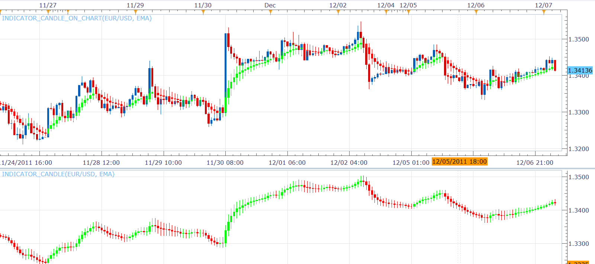

# Indicator as candle

> Source: https://fxcodebase.com/code/viewtopic.php?f=17&t=9077  
> Forum: 17 · Topic 9077 · 3 post(s)

---

## Indicator as candle

**Alexander.Gettinger** · Wed Dec 07, 2011 4:59 am

The indicator draws any indicator or oscillator as a candlestick chart.
High corresponds to the Indicator calculated based on the Bar High price.
Will work, can be used only for indicators that use the Tick as a source.

Unfortunately it will not work for the indicator which are using whole bar and source.
Indicator example: Heiken Ashi (HA)

You can use it for the indicator which are using tick and source.
Indicator example: Simple moving average (MVA)
most moving averages.
See updated description.

Download indicator for main chart:

 [Indicator_Candle_On_Chart.lua](files/19856/Indicator_Candle_On_Chart.lua)

Download oscillator:

 [Indicator_Candle.lua](files/19856/Indicator_Candle.lua)

The indicator was revised and updated

---

## Re: Indicator as candle

**Apprentice** · Mon Jul 07, 2014 5:04 am

Description update.

---

## Re: Indicator as candle

**Apprentice** · Sat Jul 01, 2017 4:53 am

The indicator was revised and updated.
