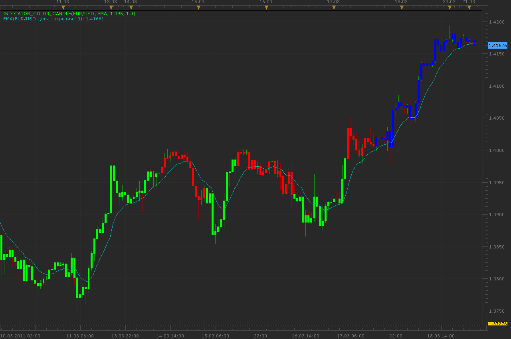

# Indicator color candle

> Source: https://fxcodebase.com/code/viewtopic.php?f=17&t=3695  
> Forum: 17 · Topic 3695 · 3 post(s)

---

## Indicator color candle

**Alexander.Gettinger** · Mon Mar 21, 2011 11:02 pm

This indicator is a further development of Stochastic color candle ([viewtopic.php?f=17&t=3682](https://fxcodebase.com/code/viewtopic.php?f=17&t=3682)).

Indicator paints candle in correspondence to values of chosen indicator data (ID).
If ID<[Level1] candle have a [Color1],
if ID>[Level1] and <[Level2] candle have a [Color2] and
if ID>[Level2] candle have a [Color3].

 

Download:

 [Indicator_Color_Candle.lua](files/8947/Indicator_Color_Candle.lua)

The indicator was revised and updated

---

## Re: Indicator color candle

**RJH501** · Wed Jul 27, 2011 7:55 pm

Hi Alexander!

Great idea but it doesn't work with BF_FlatTrend or GMACD. When you get time could you check it out please.

Thanks!

RJH

---

## Re: Indicator color candle

**Apprentice** · Thu Mar 16, 2017 5:45 am

Indicator was revised and updated.
