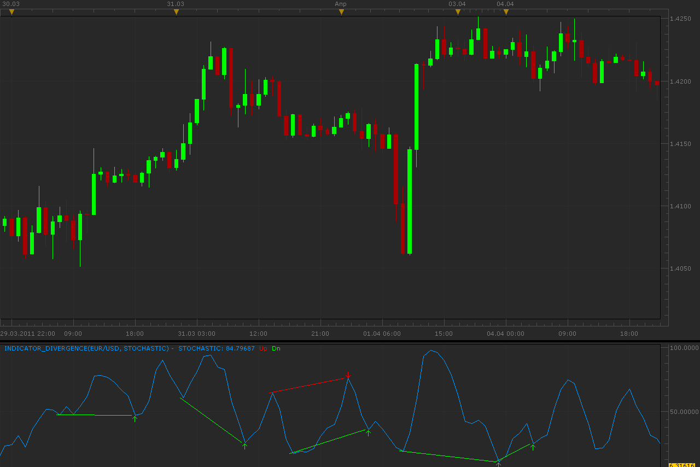
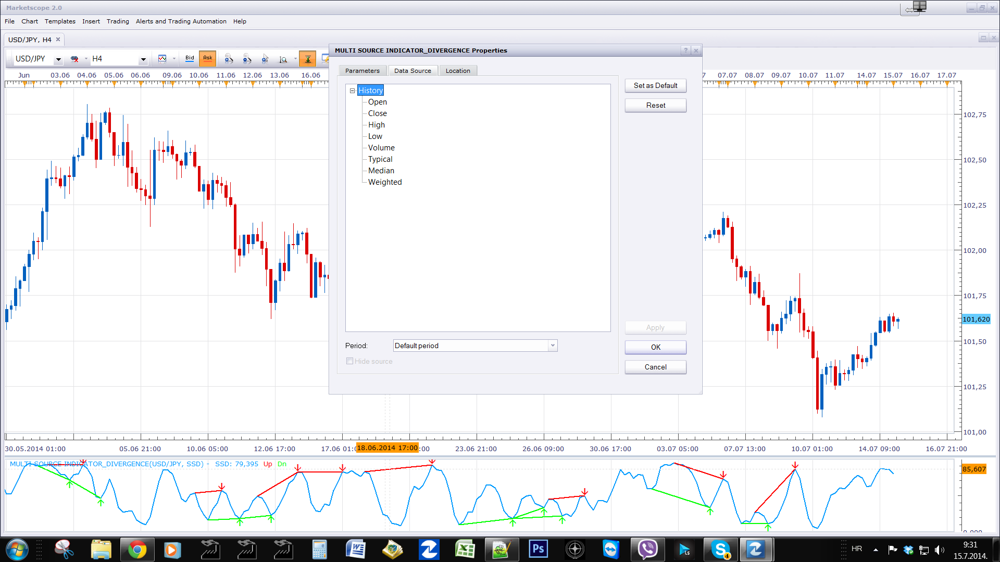

# Indicator Divergence

> Source: https://fxcodebase.com/code/viewtopic.php?f=17&t=3846  
> Forum: 17 · Topic 3846 · 38 post(s)

---

## Indicator Divergence

**Alexander.Gettinger** · Wed Apr 06, 2011 1:30 am

Indicator show divergence between price and chosen indicator. User may choose any standard or custom indicator for finding divergence.

Parameter [Frames] define count of bars for identification of indicator extremums.

 

Download:

 [Indicator_Divergence.lua](files/9401/Indicator_Divergence.lua)

 [Indicator_Divergence with Alert.lua](files/9401/Indicator_Divergence%20with%20Alert.lua)

Multi Source Indicator_Divergence will allow you the selection or source type.

For example the MACD has three outputs.
1) MACD
2) Signal
3) Histogram.
This is possible via the Stream Number parameter.
U can now select tick or bar source.
Unfortunately if tick source is selected, Bar-based indicator (HA, AO, AC ...) will not work.
Make sure to set source to Bar source for Bar-based indicator

 [Multi Source Indicator_Divergence.lua](files/9401/Multi%20Source%20Indicator_Divergence.lua)

The indicator was revised and updated

---

## Re: Indicator Divergence

**alpha_bravo** · Wed Apr 06, 2011 5:07 am

useful, thanks.

---

## Re: Indicator Divergence

**luigipg** · Thu Apr 07, 2011 10:49 am

a signal for this one? thanks!!!

---

## Re: Indicator Divergence

**Alexander.Gettinger** · Sat Apr 09, 2011 9:09 pm

> **luigipg wrote:**
> a signal for this one? thanks!!!

OK. I work on it.

---

## Re: Indicator Divergence

**Nikolay.Gekht** · Sun Apr 10, 2011 10:19 am

I have an idea:
1) Make the indicator core.Tick instead of core.Bar
in this case users will be able to apply the indicator at any output, including output of other indicators:
[http://www.fxcodebase.com/wiki/index.ph ... tor_Source](http://www.fxcodebase.com/wiki/index.php/Indicator_Parameters_in_Marketscope#Indicator_Source)
2) Remove the selection of the indicator to find divergences and let the user to choose the proper source.

So, the indicator will be simpler, faster and more flexible. For example the user will be able to find divergences of indicators such as MACD of MVA or, for example, just a median prices.

---

## Re: Indicator Divergence

**hardik_bilota** · Tue Jun 14, 2011 2:38 am

Hi,

I am a beginner and I do work with Hiken-Ashi chart. I downloaded this indicator and found it really good, Thanks for it.

However I am confused about the labels. Please confirm my understanding for the same
Reversal Bearish - Means uptrend is over and downtrend is next.
Reversal Bullish - Means downtrend is over and uptrend is next.

Also suggest what should be the parameters set to like time period for 1Min, 3Min, 5Min and 15Min chart. Currently I am using 12-26-9

Regards,
Hardik

---

## Re: Indicator Divergence

**2excel** · Sun Oct 20, 2013 7:26 am

Hi

I love this indicator. Any chance it can detect hidden divergence?

---

## Re: Indicator Divergence

**speakinmymind** · Mon Oct 21, 2013 11:00 am

Great indicator, can someone please develop a trading strategy / alert,!

---

## Re: Indicator Divergence

**speakinmymind** · Mon Oct 21, 2013 12:49 pm

Could you please add the feature to show the corresponding divergence lines on the price? Thanks!!

---

## Re: Indicator Divergence

**Apprentice** · Tue Oct 22, 2013 4:13 am

Your request is added to the development list.

---

## Re: Indicator Divergence

**speakinmymind** · Thu Oct 24, 2013 12:16 pm

Could you please update this to allow for selection of data output. Currently, if the indicator chosen has more than one output this indicator will select the first output instead of user selection.

Secondly, once you chose the indicator you should be able the select the data source of that indicator. Currently if you chose MACD for example, the default data source is "close price". The user should be able to change this to anything including other indicators if capable, as the MACD indicator would allow is.

---

## Re: Indicator Divergence

**Apprentice** · Fri Oct 25, 2013 6:15 am

Your request is added to the development list.

---

## Re: Indicator Divergence

**Coondawg71** · Wed Jun 25, 2014 6:53 pm

> **Nikolay.Gekht wrote:**
> I have an idea:
> 1) Make the indicator core.Tick instead of core.Bar
> in this case users will be able to apply the indicator at any output, including output of other indicators:
> [http://www.fxcodebase.com/wiki/index.ph ... tor_Source](http://www.fxcodebase.com/wiki/index.php/Indicator_Parameters_in_Marketscope#Indicator_Source)
> 2) Remove the selection of the indicator to find divergences and let the user to choose the proper source.
>
> So, the indicator will be simpler, faster and more flexible. For example the user will be able to find divergences of indicators such as MACD of MVA or, for example, just a median prices.

Bump up please.

thanks!

sjc

---

## Re: Indicator Divergence

**Apprentice** · Mon Jul 07, 2014 9:41 am

Multi Source Indicator_Divergence.lua Added

---

## Re: Indicator Divergence

**Coondawg71** · Mon Jul 07, 2014 11:36 pm

Thank you very much!

sjc

---

## Re: Indicator Divergence

**BTrade** · Mon Jul 14, 2014 9:48 pm

Hello Apprentice,

I have installed this indicator. it works with MACD and MVA, but it does NOT work with slow stochastic. Could you, please, fix it?

Thanks

---

## Re: Indicator Divergence

**Apprentice** · Tue Jul 15, 2014 2:30 am

Be sure to choose a History as Source, as SSD uses whole bar.

---

## Re: Indicator Divergence

**BTrade** · Tue Jul 15, 2014 2:51 am

Thanks!!! It works!

---

## Re: Indicator Divergence

**lancelune** · Wed Sep 16, 2015 5:39 pm

Hello. I have not the same result with the indicator RSI divergence. What for?
With an identical RSI divergences are different. I tried to change the parameter frame, but I never got the same result.

Thank you to get me some explanation.

---

## Re: Indicator Divergence

**nookie** · Thu Sep 17, 2015 9:37 am

Hello, is it possible this divergence to be done on tick volume? Showing divergence of tick volume and price

---

## Re: Indicator Divergence

**Apprentice** · Mon Sep 21, 2015 2:39 am

Requested can be found here.
[viewtopic.php?f=17&t=62684](https://fxcodebase.com/code/viewtopic.php?f=17&t=62684)

---

## Re: Indicator Divergence

**Laventus** · Tue Nov 03, 2015 11:34 am

Is it possible to get an alert put in for when the candle closes with the divergence formed? I wanted a divergence indicator with alert for both SSD and RSI and since this indi allows you to choose from all of them it would probably be easiest to do on here. Thanks in advance!

---

## Re: Indicator Divergence

**Laventus** · Tue Nov 03, 2015 11:44 am

1 more thing i forgot to add in my last post, Is it possible to also only have option for the indicator to draw only in extreme overbought and oversold condition. For example, i only want it to show bearish divergence at the 80 level, and bullish divergence at the 20 level. Is there also some way to get the indicator to identify double tops and doubles bottoms at extreme levels on say RSI also? Thanks

---

## Re: Indicator Divergence

**Apprentice** · Wed Nov 04, 2015 8:14 am

Your request is added to the development list.

---

## Re: Indicator Divergence

**LOVEFX** · Tue Jun 07, 2016 7:11 pm

Hi Apprentice,

is it possible to add to the parameters 2 more options, to allow to send a email alert when a divergence has been created ?

It would be great to get that for green one and red one, for both.

That will be very helpful

---

## Re: Indicator Divergence

**Apprentice** · Fri Jun 10, 2016 2:44 am

Your request is added to the development list.
Bugzilla Bug Bug 3538

---

## Re: Indicator Divergence

**LOVEFX** · Wed Nov 02, 2016 5:36 pm

Hi Apprentice,

Can we have the alert email option when a divergence has been done ?

Thank you

---

## Re: Indicator Divergence

**Apprentice** · Fri Nov 04, 2016 3:59 am

Indicator_Divergence with Alert.lua added.

---

## Re: Indicator Divergence

**LOVEFX** · Wed Nov 09, 2016 11:04 pm

Thank you Apprentice,

Very good job, better than i've asked

Do you know how to get the date and time about my region or country ?

Is it possible to edit/change the text for classic/reversal divergence ?

---

## Re: Indicator Divergence

**Apprentice** · Fri Nov 11, 2016 12:15 pm

Do you know how to get the date and time about my region or country ?
[http://fxcodebase.com/wiki/index.php/Changing_Time_Zone](https://fxcodebase.com/wiki/index.php/Changing_Time_Zone)

Is it possible to edit/change the text for classic/reversal divergence ?
Sure, What did you have in mind.

---

## Re: Indicator Divergence

**7510109079** · Tue Nov 29, 2016 3:01 pm

the alert fires 2 candles after the arrow. Can it be done so it fires one candle after. Maybe give the user the choice of 1st or second fractal alert?

---

## Re: Indicator Divergence

**Apprentice** · Thu Dec 01, 2016 4:24 am

Simple Fractal option added.

---

## Re: Indicator Divergence

**7510109079** · Thu Dec 01, 2016 6:11 am

cool thx.

btw following code lines 269+270 still require swapping:

pperiod1 = source:serial(period)
period = period - 1;

---

## Re: Indicator Divergence

**7510109079** · Mon Dec 05, 2016 7:46 am

code lines reversed to prevent line lag

---

## Re: Indicator Divergence

**doanthedung** · Tue Dec 06, 2016 9:00 am

Great indicator!
Can you create Strategy with MA filter?

Thanks!

---

## Re: Indicator Divergence

**Apprentice** · Wed Dec 07, 2016 4:18 am

Try this version.
[viewtopic.php?f=31&t=64180](https://fxcodebase.com/code/viewtopic.php?f=31&t=64180)

---

## Re: Indicator Divergence

**7510109079** · Fri Jun 23, 2017 4:30 am

Can a small correction be made to the "**Indicator_Divergence with Alert**" lua 3 posts above:
[download/file.php?id=17153](https://fxcodebase.com/code/download/file.php?id=17153) please

If DRAWINGMODE parameter is set to Open or Close, the oscillator line moves accordingly BUT the div lines and arrows stay fixed.

Can this be corrected so that the lines & arrows connect exactly to the oscillator line

many thx in advance

---

## Re: Indicator Divergence

**7510109079** · Thu Jun 29, 2017 12:15 pm

bump for the above request
