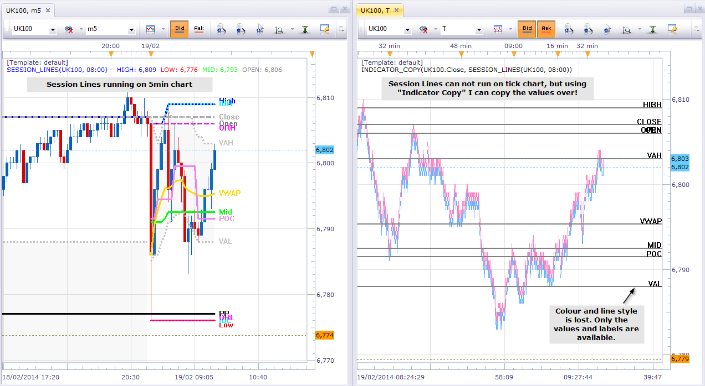

# Indicator Output Copier

> Source: https://fxcodebase.com/code/viewtopic.php?f=17&t=60324  
> Forum: 17 · Topic 60324 · 2 post(s)

---

## Indicator Output Copier

**robocod** · Wed Feb 19, 2014 11:09 am

I wanted to use one of my indicators on a tick chart, but it wouldn't work because a) it needed bars, and b) 5000 tick limit on tick charts meant that it could not load enough data.

MarketScope has a feature called "interop". It allows a custom indicator to access the output streams of an active instance of another indicator (potentially on a totally different chart). So, I used this to solve my little problem: basically, I wrote an indicator to access and copy the output streams of the other indicator that I have on my chart.

See the screenshot below. Here on the left, I have an indicator called Session Lines which tracks the high,low,mid,vwap, etc. of a day trading session. And on the right, I have a tick chart with the "Indicator Copy" which is accessing the live data of the indicator on the other chart, and displaying the values as horizontal lines (with labels).

It isn't possible to access the original colours, styles and other graphical features - just the raw values. In this implementation I only display the final output values.

This is still in development, but I found the technique quite useful. The indicator which is being "copied" does not need any modification to support this feature. The only requirement is that the full name of the active instance must be unique, since this is used by MarketScope to identify the indicator that you want. (You need to copy the full name of the indicator, you can copy/paste it from the properties window).

More information can be found on my [blog](http://robocod.blogspot.co.uk/2014/02/indicator-copy.html).

 

The indicator was revised and updated

---

## Re: Indicator Output Copier

**Apprentice** · Fri Jun 02, 2017 6:03 am

Bump up.
