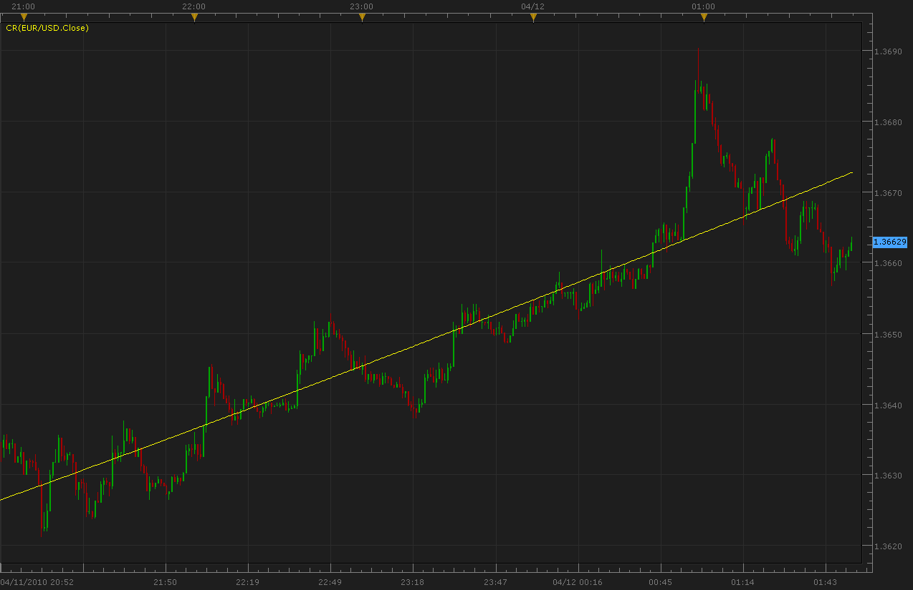
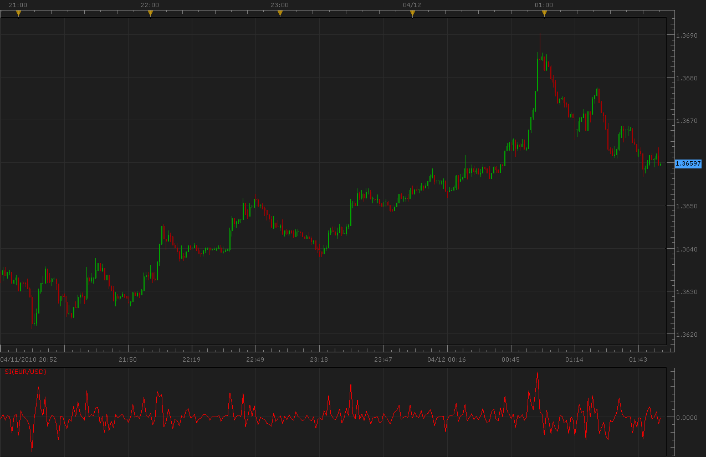
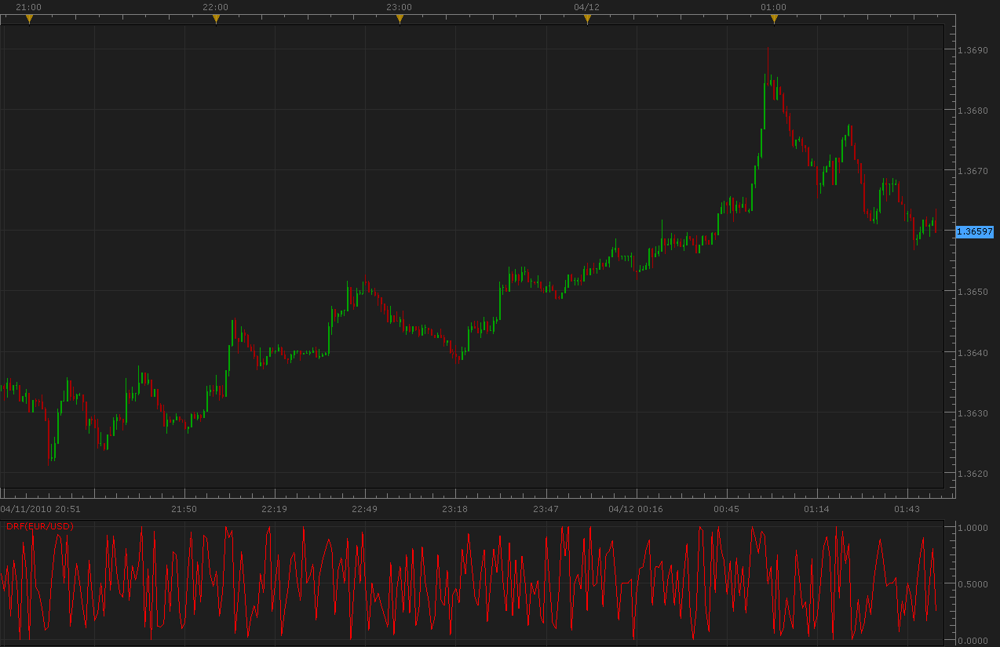
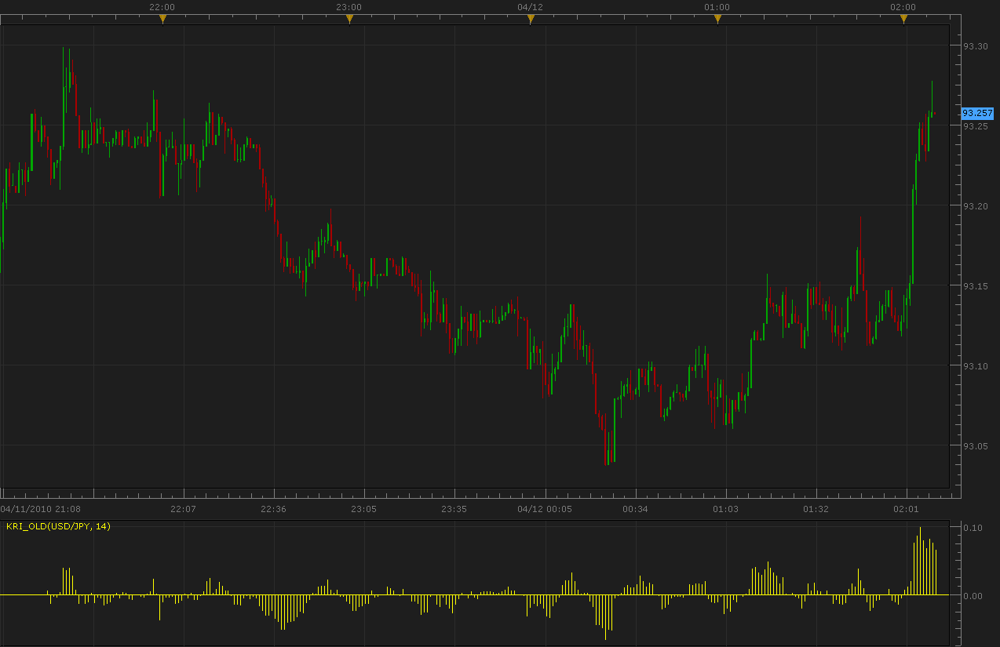

# Indicators Changed/Removed in Apr 10 2010 version

> Source: https://fxcodebase.com/code/viewtopic.php?f=17&t=620  
> Forum: 17 · Topic 620 · 5 post(s)

---

## Indicators Changed/Removed in Apr 10 2010 version

**miocker** · Mon Apr 12, 2010 3:47 am

Please find below the old versions of the indicators changed/removed in the Apr 10, 2010 version of the Marketscope:

**Curvilinear Second-Order Regression**

The Curvilinear Second Order Regression (CR) indicator plots a curve of the trend taking into consideration all prices. It is like a regular regression line, but curves slightly with the price trend.
The CR uses the second-order equation:
y = ax+ bx + cx^2
For calculation of coefficients a, b, c, see the code below.

 

The indicator was revised and updated

Please, download both: CR.lua and CR.lua.rc files because otherwise there will be no correct indicator name and indicator description in the Marketscope II.

---

## Wilder Swing Index

**miocker** · Mon Apr 12, 2010 4:00 am

Wilder Swing Index (SI) is a part of Wilder’s Swing Index System. In itself the SI is useless, it doesn’t generate any signals, but its formula combines factors that have great deal of interest.
The values of SI are used to form Accumulated Swing Index (ASI).

Wilder has determined that the five most important positive patterns in an uptrend are:
1. Today’s close is higher than the prior close.
2. Today’ close is higher than today’s open.
3. Today’s high is greater than the prior close.
4. Today’s low is greater that the prior close.
5. The prior close was above the prior open.
On a downtrend, these patterns are reversed.
SI combines these five factors, then scales the resulting value to fall between 100 and +100 as follows:
SI = 50x((Ct-Ct-1 + 0.5x(Ct - Ot)+0.25*(Ct-1-Ot-1))/R) x K/M
Where K is the largest of Ht – Ct-1 and Lt – Ct-1
M is the value of a limit move (in the Marketscope this value is 300, the same value is used in MT).
R is calculated from the following two steps:
1. Determine which of the largest of:
a. Ht – Ct-1
b. Lt – Ct-1
c. Ht – Lt
2. Calculate R to the corresponding formula:
a. R = (Ht – Ct-1) – 0.5(Lt – Ct-1) + 0.25(Ct-1 – Ot-1)
b. R = (Lt – Ct-1) – 0.5(Ht – Ct-1) + 0.25(Ct-1 – Ot-1)
c. R = (Ht – L1) + 0.25(Ct-1 – Ot-1)

 

The indicator was revised and updated

Please, download both: SI.lua and SI.lua.rc files because otherwise there will be no correct indicator name and indicator description in the Marketscope II.

---

## Daily Raw Figure

**miocker** · Mon Apr 12, 2010 4:04 am

Daily Raw Figure (DRF) measures the implied direction of the day’s trading.
DRF is calculated as:
DRF = (BP + SP)/(2x(high-low));
Where BP = high - open, SP = close – low.
The maximum value of 1 is reached when a market opens trading at the low and closes at the high. When the opposite occurs and the market opens at the high and closes on the lows, the DRF will be 0.

 

The indicator was revised and updated

Please, download both: DRF.lua and DRF.lua.rc files because otherwise there will be no correct indicator name and indicator description in the Marketscope II.

---

## Kairi Relative Index (old histogram version)

**miocker** · Mon Apr 12, 2010 5:40 am

We have an updated KRI indicator in the new version of Marketscope II. Now it is drawn with lines, not as a histogram. Please find the old version below.

 

The indicator was revised and updated

Please, download both: KRI_old.lua and KRI_old.lua.rc files because otherwise there will be no correct indicator name and indicator description in the Marketscope II.

---

## Re: Indicators Changed/Removed in Apr 10 2010 version

**Apprentice** · Sun Dec 25, 2016 7:21 am

Indicator was revised and updated.
