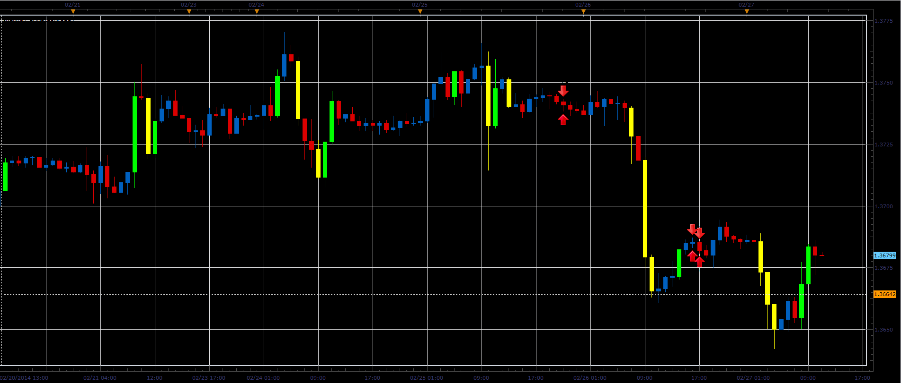

# Inertia bars

> Source: https://fxcodebase.com/code/viewtopic.php?f=17&t=60367  
> Forum: 17 · Topic 60367 · 21 post(s)

---

## Inertia bars

**Alexander.Gettinger** · Thu Feb 27, 2014 11:29 am

The indicator paint bars in which the body is larger than the predetermined value.

 

Download:

 [Inertia_bars.lua](files/92928/Inertia_bars.lua)

MQ4/MT4 version.
[viewtopic.php?f=38&t=68457](https://fxcodebase.com/code/viewtopic.php?f=38&t=68457)

---

## Re: Inertia bars

**Daydreaminblue** · Mon May 05, 2014 8:59 am

Hi,

Is there a way you can make it so that, either with new settings on this one, or on a new indicator, candles that have less than N% of the range of the candle are highlighted? For example, a doji would be a candle with it's body less than 5% of the range. But I would like to customize that number, and have them highlighted similar to inertia bars.

---

## Re: Inertia bars

**Apprentice** · Wed May 07, 2014 2:48 am

Range will be High-Low?

---

## Re: Inertia bars

**Daydreaminblue** · Thu May 08, 2014 3:20 pm

Yes. High - Low = Range. And the highlighted bars should be the candles where the body is > N% of the range. This would be very helpful.

---

## Re: Inertia bars

**Daydreaminblue** · Mon May 12, 2014 11:44 am

Bump.

---

## Re: Inertia bars

**Apprentice** · Tue May 13, 2014 2:04 am

You can now choose between the Pips or Percentages.

---

## Re: Inertia bars

**Daydreaminblue** · Tue May 13, 2014 9:27 am

Beautiful, thank you!

---

## Re: Inertia bars

**Daydreaminblue** · Wed Jul 09, 2014 2:46 pm

Hi,

Can you please fix the glitch where the chart double when switching time frames on the Ask? Constantly having to switch to the Bid to fix it gets in the way.

Thanks!

---

## Re: Inertia bars

**Apprentice** · Thu Jul 10, 2014 5:14 am

Can you first, make a screen shot of this problem.
I can not reproduce this.
After that, try to de-install your TS.
And make a complete new installation.

---

## Re: Inertia bars

**Daydreaminblue** · Sat Jul 12, 2014 3:24 pm

Here is a screenshot of what pops up when I am on the Ask and switch timeframes. It is on 5m to emphasize the layering. It shows both the bid and the ask.

---

## Re: Inertia bars

**Daydreaminblue** · Sat Jul 12, 2014 3:25 pm

(screenshot)

---

## Re: Inertia bars

**Apprentice** · Sun Jul 13, 2014 1:28 pm

Once again I was unable to reproduce this.
I believe this is known bug TS / should be fixed in the next update.
Will inform the development team, just to be sure.

---

## Re: Inertia bars

**Daydreaminblue** · Tue Jul 15, 2014 7:57 am

Thank you, still completely satisfied with your work.

---

## Re: Inertia bars

**angelalzate** · Mon Mar 09, 2015 4:07 pm

Good afternoon , hope is well . Thanks for this indicator is great. I wonder if I can have for mt4 . Also if you could do an indicator to me identify highlights, shadows or tails of candles that meet certain parameters such as pips or percentage of the sail, eg " paint it that color streaks , lines, or shadows that are both 20 pips " . This MarketScope and for mt4 . Thanks and happy evening .

---

## Re: Inertia bars

**congok** · Mon Apr 20, 2015 1:25 am

Is it possible that the indicator draw a diamond (or arrow) above or below the candle instead of painting the candle?

---

## Re: Inertia bars

**Apprentice** · Mon Apr 20, 2015 4:03 am

Diamond / Sign option Added.

---

## Re: Inertia bars

**congok** · Mon Apr 20, 2015 12:35 pm

works perfect thanks...

---

## Re: Inertia bars

**Apprentice** · Fri Oct 19, 2018 4:10 am

The indicator was revised and updated.

---

## Re: Inertia bars

**HazLaRock** · Fri May 10, 2019 8:54 am

i need this in mt4 format? is it possible?

---

## Re: Inertia bars

**Apprentice** · Sat May 11, 2019 5:38 am

Your request is added to the development list under Id Number 4648

---

## Re: Inertia bars

**Apprentice** · Mon May 13, 2019 5:17 am

MQ4/MT4 version.
[viewtopic.php?f=38&t=68457](https://fxcodebase.com/code/viewtopic.php?f=38&t=68457)
