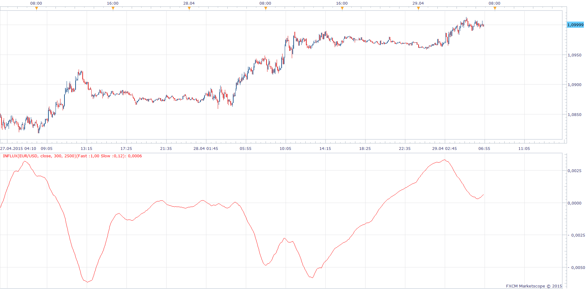
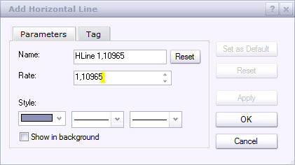
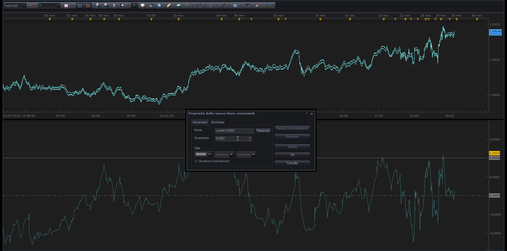

# Influx

> Source: https://fxcodebase.com/code/viewtopic.php?f=17&t=62160  
> Forum: 17 · Topic 62160 · 59 post(s)

---

## Influx

**Apprentice** · Wed Apr 29, 2015 6:32 am

Based on request.
[viewtopic.php?f=27&t=62159](https://fxcodebase.com/code/viewtopic.php?f=27&t=62159)
RawFast is Avg of source of last P1 seconds;
RawSlow is Avg of source of last P2 seconds;
FastMA is Avg of RawFast of last P1 seconds;
SlowMA is Avg of RawSlow of last P2 seconds;
Fast is 2*RawFast - FastMA;
Slowis 2*RawSlow - SlowMA;
MACD is Fas-Slow;
Basically Influx is the MACD indicator.
Unlike regular MACD, whose period is determined by Number of period,
MACD moving average period is specified in seconds.
In addition, additional filter is applied to reduce the lag time.

 [Influx.lua](files/100138/Influx.lua)

 [Timed MACD.lua](files/100138/Timed%20MACD.lua)

 [Tick Influx.lua](files/100138/Tick%20Influx.lua)

 [Tick Timed MACD.lua](files/100138/Tick%20Timed%20MACD.lua)

Tick versions can be applied to individual data streams.
(high, low, close, indicator outputs ..)

This is a temp fix.
Next TS update will allow us to have single version,
regardless of source type.
Tick tick does not represent a time frame, rather, tick data source.

 [Tick Time Frame Timed MACD.lua](files/100138/Tick%20Time%20Frame%20Timed%20MACD.lua)

 [Tick Time Frame Influx.lua](files/100138/Tick%20Time%20Frame%20Influx.lua)

Tick Time Frame Versions will also work on "t1" time frame.

 [Period Tick Time Frame Influx.lua](files/100138/Period%20Tick%20Time%20Frame%20Influx.lua)

 Influx with Duration in periods, NOT seconds

---

## Re: Influx

**blueseahorse** · Fri May 29, 2015 4:32 am

hi sir

i found influx indicator can not be used in tick chart
can this be solved?
thanks

---

## Re: Influx

**Apprentice** · Sun Jun 07, 2015 3:43 am

For the time being, influx will only be available for Bar sources.
Tick version will be possible with one of the following TS updates.

---

## Re: Influx

**blueseahorse** · Sun Jun 07, 2015 8:43 pm

thanks a lot.
because influx is based on seconds level deviation，if not used on tick chart, the indicator will have no differences than other MACD.
looking forward to the update.

---

## Re: Influx

**strbac** · Tue Jun 09, 2015 11:37 am

Dear sir,

Can this indicator somehow be converted or modified to work in JForex (.jfx)?

Thank you

---

## Re: Influx

**Apprentice** · Wed Jun 10, 2015 3:20 am

Unfortunately Fxcodedebase do not provide JForex support.

---

## Re: Influx

**sosinsky** · Thu Jun 25, 2015 7:59 am

I read someone said that this indicator doesn't work on tick chart, it's right because it's made to work with bars.
Can you rewrite it, a new version, that work with tick stream?

---

## Re: Influx

**Apprentice** · Fri Jun 26, 2015 4:17 am

Tick Influx.lua, Tick Timed MACD.lua Added.

---

## Re: Influx

**sosinsky** · Fri Jun 26, 2015 5:29 am

Thanks, but I see something doesn't work, at least for me.
An illustration is on the picture.

 

---

## Re: Influx

**Apprentice** · Fri Jun 26, 2015 6:03 am

Tick tick does not represent a time frame, rather, tick data source.
Similarly as the original, This version will work on the time frames "m1" and higher.

---

## Re: Influx

**Apprentice** · Fri Jun 26, 2015 6:34 am

Try Tick Time Frame Versions.

---

## Re: Influx

**sosinsky** · Fri Jun 26, 2015 8:27 am

I will try it, thanks.

---

## Re: Influx

**sosinsky** · Tue Jul 07, 2015 4:35 pm

It works, but I see that there is a little problem with tick time frame influx, this issue doesn't appear on tick time frame timed macd that works great.
Issue is on the picture, it should great if it stops the calculation when there are not enough values at the end of the stream.

 

---

## Re: Influx

**sosinsky** · Wed Jul 08, 2015 10:05 am

> **sosinsky wrote:**
> It works, but I see that there is a little problem with tick time frame influx, this issue doesn't appear on tick time frame timed macd that works great.
> Issue is on the picture, it should great if it stops the calculation when there are not enough values at the end of the stream.
>
>
> Immagine 15.png

Problem solved, I've disabled vertical auto adjust from chart.
Thanks.

---

## Re: Influx

**sosinsky** · Fri Jul 10, 2015 1:07 pm

How do I see 5 decimals or 3 decimals of the pair in the subwindow of oscillator?
I added an horizontal line in the oscillator but it's only 4 digit.

---

## Re: Influx

**Apprentice** · Mon Jul 13, 2015 4:05 am

If you are using the "Horizontal line tool"?
You can define sub fractional pips.
Decimal number will vary depending on the currency pair.

---

## Re: Influx

**sosinsky** · Thu Jul 16, 2015 12:01 pm

> **Apprentice wrote:**
> If you are using the "Horizontal line tool"?
> You can define sub fractional pips.
> Decimal number will vary depending on the currency pair.

Yes sub fractional pips, this is what I mean. But how do I define them?

---

## Re: Influx

**Apprentice** · Tue Jul 21, 2015 5:02 am

---

## Re: Influx

**sosinsky** · Wed Jul 22, 2015 3:15 pm

> **Apprentice wrote:**
>
>
> The attachment **Capture.PNG** is no longer available

This is exactly what I tried but as you can see on the picture, I see sub pips on main windows where there are ticks but i can't see sub pips on sub window of indicator, it seems like if the indicator doesn't work with sub pips.

 

---

## Re: Influx

**blueseahorse** · Sun Aug 16, 2015 10:07 pm

> **Apprentice wrote:**
>
> Tick Time Frame Versions will also work on "t1" time frame.

dear sir

i am also wondering if "Tick Time Frame Timed MACD.lua" can be converted into mq4, please?

thanks a lot

---

## Re: Influx

**Apprentice** · Wed Aug 19, 2015 3:04 am

Your request is added to the development list.

---

## Re: Influx

**sosinsky** · Thu Aug 27, 2015 9:25 am

I still need to use indicator with sub fractiona pips, any help?
Thanks.

---

## Re: Influx

**Alexander.Gettinger** · Fri Sep 11, 2015 12:53 pm

> i am also wondering if "Tick Time Frame Timed MACD.lua" can be converted into mq4, please?

MQL4 version of oscillators: [viewtopic.php?f=38&t=62647](https://fxcodebase.com/code/viewtopic.php?f=38&t=62647).

---

## Re: Influx

**sosinsky** · Thu Oct 29, 2015 4:18 am

I've solved the problem of sub fractional pips by myself adding these lines of code:
local precision = math.max(2, source:getPrecision());
MACD:setPrecision(precision);

Now indicator diplays also sub fractional pips.
Thanks,

sosinsky

---

## Re: Influx

**MarkoFX** · Mon Sep 26, 2016 2:21 pm

I have a question, hope anybody can help me
i want to overlay the indicators with a fixed scales, is that possible ?

---

## Re: Influx

**Apprentice** · Tue Sep 27, 2016 12:06 pm

[viewtopic.php?f=17&t=63494&p=106346&hilit=overlay#p106346](https://fxcodebase.com/code/viewtopic.php?f=17&t=63494&p=106346&hilit=overlay#p106346)
As RLW Overlay.lua or as RLW Normalization.lua indicator?

---

## Re: Influx

**MarkoFX** · Mon Oct 10, 2016 12:39 pm

thx but I mean more like this. for exaple i have attached a picture of MT4 influx.
in MT4 you can put "2" influx in one indicator window. then you can set fix scales for both indicators.

left example: both have the same fixed scale.
right example: the blue influx have a lower fixed scale so the blue influx line get stretched without stretching the other influx.

hope i can also do this in fxcm i have searched and searched but found nothing how can i do this overlay with fixed scales ?

---

## Re: Influx

**Apprentice** · Tue Oct 11, 2016 3:27 am

Unfortunately something like that is not supported by TS
Will propose it to the development team.

---

## Re: Influx

**Apprentice** · Mon Nov 07, 2016 7:11 am

Major update, Signal & Histogram lines added all three MACD indicator.

---

## Re: Influx

**tradeforlife1** · Sun Dec 18, 2016 3:42 pm

Hi,

Could you please modify the Tick Time Frame Influx.lua indicator to add 3 more lines other than the current one? currently the indicator shows one line which is calculated based on Fast MA and Slow MA inputs. I need the indicator to have totally 4 lines so that the indicator shows 4 lines within the same indicator window using below 4 input sets.

Calculation:
1_Fast MA Duration in seconds
1_Slow MA Duration in seconds
2_Fast MA Duration in seconds
2_Slow MA Duration in seconds
3_Fast MA Duration in seconds
3_Slow MA Duration in seconds
4_Fast MA Duration in seconds
4_Slow MA Duration in seconds

In same way, there should be 4 set of inputs for Style/Appearance/Data Source.

Now after setting the inputs the indicator shows 4 lines in the same indicator window. This functionality is to overcome the limitation currently TS have (adding more than one indicator in the same indicator window).

Thanks in advance.

---

## Re: Influx

**tradeforlife1** · Mon Dec 19, 2016 6:18 am

Hi,

Please ignore my previous request. I can add more indicators in same window now by choosing the same source. thank you.

---

## Re: Influx

**MarkoFX** · Thu Feb 16, 2017 4:43 pm

hello I have an idea and hope you can help me.
i want to visualice an influx out of 3 influx calculations.
the process is called frequency addition. you can find an explanation of what I mean here [http://clas.mq.edu.au/speech/acoustics/ ... forms.html](http://clas.mq.edu.au/speech/acoustics/waveforms/adding_waveforms.html)

---

## Re: Influx

**Apprentice** · Tue Feb 28, 2017 6:42 am

[Influx.lua](files/111254/Influx.lua)

 [Tick Time Frame Influx.lua](files/111254/Tick%20Time%20Frame%20Influx.lua)

 [Tick Influx.lua](files/111254/Tick%20Influx.lua)

 [Tick Timed MACD.lua](files/111254/Tick%20Timed%20MACD.lua)

 [Timed MACD.lua](files/111254/Timed%20MACD.lua)

Versions with additional moving averages options.

---

## Re: Influx

**MarkoFX** · Thu Mar 02, 2017 7:05 am

many thx

---

## Re: Influx

**leppozdrav** · Thu Mar 02, 2017 1:02 pm

...

---

## Re: Influx

**dudex12** · Fri Mar 03, 2017 1:57 am

Can anyone point me in the right direction as to what the Y-axis is measuring or representing?

Also, how is anyone arriving at different reference points? How do you know what to put as your fast-ma or slow-ma?

---

## Re: Influx

**Apprentice** · Fri Mar 03, 2017 4:42 am

RawFast is Avg of source of last P1 seconds;
RawSlow is Avg of source of last P2 seconds;
FastMA is Avg of RawFast of last P1 seconds;
SlowMA is Avg of RawSlow of last P2 seconds;
Fast is 2*RawFast - FastMA;
Slowis 2*RawSlow - SlowMA;
MACD is Fas-Slow;

---

## Re: Influx

**MarkoFX** · Wed Mar 15, 2017 9:52 am

it is posible to add the wave addition feature also to the existing MT4 Influx Indicator (2 waves in one) ?

best regards Marko

---

## Re: Influx

**Apprentice** · Thu Mar 16, 2017 5:06 am

> wave addition feature

Can you explain your self via private e-mail?

---

## Re: Influx

**ForexGuy** · Thu Apr 20, 2017 12:26 pm

Is it possible a version of all the above mq4 indicators, in *.mq5 format for metatrader 5 please? Thanks.

---

## Re: Influx

**Apprentice** · Fri Apr 21, 2017 2:50 am

Unfortunately, we do not provide support for MT5,
We do not have MQ5 capabilities / development team.

---

## Re: Influx

**ForexGuy** · Fri Apr 21, 2017 4:55 am

Thank you for the quick answer about the mq5 issue.
Is it possible to have the Versions with additional moving averages options posted above in MQ4 version please? Thanks.

---

## Re: Influx

**Bojanv74** · Sat Apr 22, 2017 2:15 am

Hi

Please can you arrange that the last version of "Tick Timed MACD.lua" is also working o tick chart.

Tnx in andvance and br

Bojan

---

## Re: Influx

**Apprentice** · Sat Apr 22, 2017 5:25 am

Please use Tick Time Frame Timed MACD.lua

---

## Re: Influx

**Bojanv74** · Sat Apr 22, 2017 7:11 am

Hi

I alredy used it but it is ony in 4 digit, I would like to have it in 5, please.

Tnx Bojan

---

## Re: Influx

**Apprentice** · Mon Apr 24, 2017 4:18 am

Try it now.

---

## Re: Influx

**Bojanv74** · Mon Apr 24, 2017 4:29 pm

Thank you!

---

## Re: Influx

**isamegrelo** · Fri Oct 27, 2017 4:46 am

Still not working Tick Influx indicator

---

## Re: Influx

**Apprentice** · Fri Oct 27, 2017 1:00 pm

Try Tick Time Frame Influx.

---

## Re: Influx

**Apprentice** · Sun May 09, 2021 10:37 am

The Indicator was revised and updated.

---

## Re: Influx

**swnlobo** · Thu May 13, 2021 10:01 am

Thanks a Million

All the best

Swnlobo

---

## Re: Influx

**zerounu** · Fri Jan 12, 2024 3:38 pm

Hello,

This might be a stupid question, but I have tried the indicator but I can't add more than one MA.
I was wondering if there is any way how I can have 4 different MA , ex 20MA, 50MA, 100MA , 200MA.

Because at the moment I have to add 4 different instances of the same indicator (4 different windows)

Thank you

---

## Re: Influx

**Apprentice** · Sat Jan 13, 2024 3:45 pm

For what indicator do you need 4 instances?

---

## Re: Influx

**zerounu** · Mon Jan 15, 2024 9:28 am

Hello,

Thank you very much for your quick reply.

For this two :

Tick Time Frame Timed MACD.lua
Tick Time Frame Influx.lua

Could you please point me to an indicator for adding an 30Min SMA and 90Min SMA on the tick chart.

Thank you in advance.
Regards

---

## Re: Influx

**zerounu** · Wed Jan 17, 2024 4:14 am

Hello,

Thank you for your response.

This are the indicators that would benefit from having 4 instances of MA calculations.
Tick Influx.lua
Tick Timed MACD.lua
Tick Time Frame Influx.lua

Regards,

---

## Re: Influx

**Apprentice** · Mon Jan 22, 2024 12:56 pm

Something like this?
[https://fxcodebase.com/code/viewtopic.php?f=17&t=74560](https://fxcodebase.com/code/viewtopic.php?f=17&t=74560)

If everything is ok, will add others.

---

## Re: Influx

**zerounu** · Tue Jan 23, 2024 4:13 pm

Hello,

This looks amazing . Thank you very much for all the effort.

Do you think you can do something about the 30min and 90min SMA on the tick chart?

Regards

---

## Re: Influx

**Apprentice** · Thu Jan 25, 2024 3:38 pm

 

What of you select a higher time frame as the source?

---

## Re: Influx

**zerounu** · Wed Feb 21, 2024 10:04 am

> **zerounu wrote:**
> Hello,
>
> This looks amazing . Thank you very much for all the effort.
>
> Do you think you can do something about the 30min and 90min SMA on the tick chart?
>
> Regards

Hello,

What I mean by this:

On the chart where is the BID and ASK - to add a 30min and 90min Moving Average envelope.

Regards,
