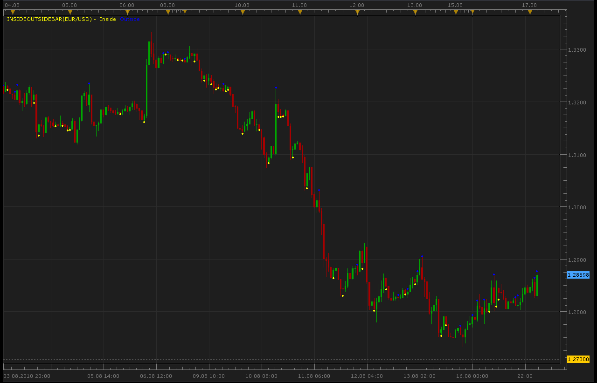
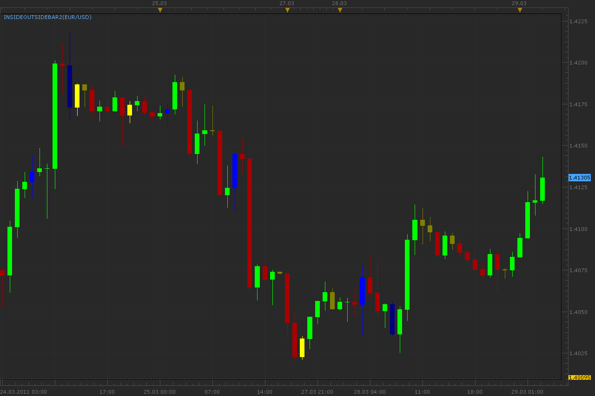
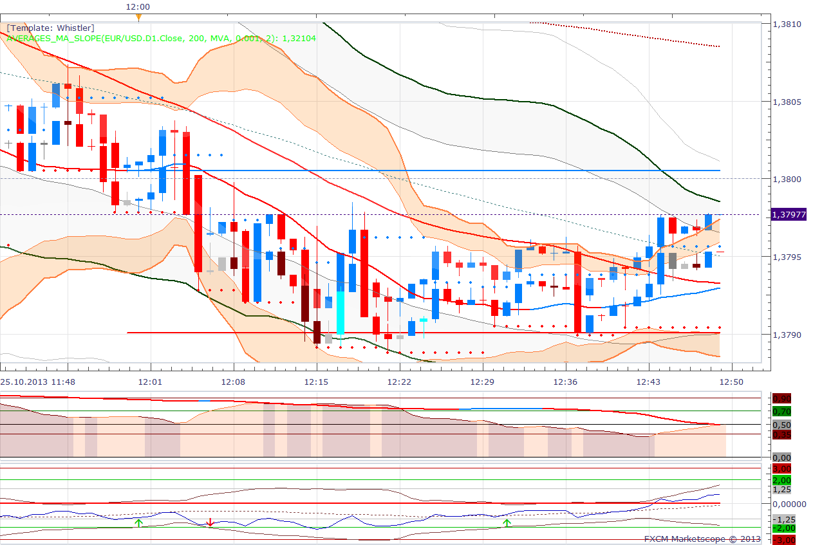

# Inside/Outside bar indicator

> Source: https://fxcodebase.com/code/viewtopic.php?f=17&t=1838  
> Forum: 17 · Topic 1838 · 24 post(s)

---

## Inside/Outside bar indicator

**Alexander.Gettinger** · Tue Aug 17, 2010 2:44 am

Indicator mark inside and outside bars.

 



```lua
function Init()
    indicator:name("Inside/outside bar Indicator");
    indicator:description("Inside/outside bar Indicator");
    indicator:requiredSource(core.Bar);
    indicator:type(core.Indicator);
   
    indicator.parameters:addColor("clrIn", "Inside bar color", "Inside bar color", core.rgb(255, 255, 0));
    indicator.parameters:addColor("clrOut", "Outside bar color", "Outside bar color", core.rgb(0, 0, 255));
end

local first;
local source = nil;
local buffIn;
local buffOut;

function Prepare()
    source = instance.source;
    Percent=instance.parameters.Percent;
    MaxPeriod=instance.parameters.MaxPeriod;
    first = source:first()+2;
    local name = profile:id() .. "(" .. source:name() .. ")";
    instance:name(name);
    buffIn = instance:createTextOutput ("Inside", "Inside", "Wingdings", 10, core.H_Center, core.V_Center, instance.parameters.clrIn, first);
    buffOut = instance:createTextOutput ("Outside", "Outside", "Wingdings", 10, core.H_Center, core.V_Center, instance.parameters.clrOut, first);
end

function Update(period, mode)
    if (period>first) then
     if source.high[period]>source.high[period-1] and source.low[period]<source.low[period-1] then
      buffOut:set(period, source.high[period], "\159", "");
     end
     if source.high[period]<source.high[period-1] and source.low[period]>source.low[period-1] then
      buffIn:set(period, source.low[period], "\159", "");
     end
    end
end
```

---

## Re: Inside/Outside bar indicator

**Alexander.Gettinger** · Tue Mar 29, 2011 3:00 am

Modification of Inside/Outside bar indicator.
Indicator paints bars in different colors.

 



Download:

 [InsideOutsideBar2.lua](files/9153/InsideOutsideBar2.lua)

 [InsideOutsideBar2 with Alert.lua](files/9153/InsideOutsideBar2%20with%20Alert.lua)

---

## Re: Inside/Outside bar indicator

**conejobum** · Tue Mar 29, 2011 2:23 pm

you did a great job apprentice ...I am really pleased.

Thank a lot.

conejobum

---

## Re: Inside/Outside bar indicator

**ginlin84** · Mon Aug 29, 2011 10:32 am

thx..
about this indicator, can make it more variable? as sometime I would just require inside bar only in my chart.

---

## Re: Inside/Outside bar indicator

**Apprentice** · Mon Aug 29, 2011 3:44 pm

Your request I added to our database.

---

## Re: Inside/Outside bar indicator

**Alexander.Gettinger** · Mon Sep 05, 2011 10:45 am

> **ginlin84 wrote:**
> thx..
> about this indicator, can make it more variable? as sometime I would just require inside bar only in my chart.

Please, see this indicator:

 [InsideOutsideBar.lua](files/14536/InsideOutsideBar.lua)

---

## Re: Inside/Outside bar indicator

**vstrelnikov** · Mon Sep 19, 2011 7:00 pm

I've fixed small defect with real time candles.
Updated 'InsideOutsideBar.lua' above and in first post.

---

## Re: Inside/Outside bar indicator

**nazaar** · Mon Nov 28, 2011 5:57 pm

Hi,

this sounds like an excellent indicator tool. What are the criterias for an inside or outside bars?

thanks,
nazaar

---

## Re: Inside/Outside bar indicator

**Apprentice** · Mon Nov 28, 2011 6:22 pm

OutSide

if source.high[period]>source.high[period-1] and source.low[period]<source.low[period-1]

InSide
 if source.high[period]<source.high[period-1] and source.low[period]>source.low[period-1]

---

## Re: Inside/Outside bar indicator

**crusader1** · Mon Sep 10, 2012 7:57 am

Hi guys nice one but it is little confusing.
It is not possible to do it more easy with only letter above or below the candle.
for outside it will be O for inside it will be I and for same open it will be T?
Because I was trading several years on MT4 and now I have change it ti TS2 and Green and red candle is very important for me

thx

---

## Re: Inside/Outside bar indicator

**Apprentice** · Tue Sep 11, 2012 3:55 am

Your request is added to the development list.

---

## Re: Inside/Outside bar indicator

**Alexander.Gettinger** · Tue Sep 11, 2012 4:37 pm

> **crusader1 wrote:**
> Hi guys nice one but it is little confusing.
> It is not possible to do it more easy with only letter above or below the candle.
> for outside it will be O for inside it will be I and for same open it will be T?
> Because I was trading several years on MT4 and now I have change it ti TS2 and Green and red candle is very important for me
>
> thx

Please, see this version of indicator:

 [InsideOutsideBar3.lua](files/40104/InsideOutsideBar3.lua)

---

## Re: Inside/Outside bar indicator

**fxdirekt** · Fri Oct 25, 2013 5:51 am

This is a great indicator, however with the new version of 01.13.092613 of the FXCM Trading Station there is a small but annoying problem. When a chart is opened with the indicator it looks messed up

 



By pressing 'Bid' or 'Ask' the effect disappears.
It worked fine with the previous version of TS. Can this be fixed?

Thanks in advance.

---

## Re: Inside/Outside bar indicator

**Apprentice** · Sat Oct 26, 2013 1:19 am

Which version you use.
1, 2 or 3rd
Try to show this with only Inside / Outside added to chart.

---

## Re: Inside/Outside bar indicator

**fxdirekt** · Sun Oct 27, 2013 1:35 pm

Apprentice, thanks for your answer,

I use Insideoutsidebar2. After some research I found the following:
- the problem does not happen with new layouts, created after the new Trading Station release.
- if I eliminate all indicators except Insideoutsidebar2 in a layout created with the previous release of Trading Station the effect happens.

Is there any way to get rid of the problem besides creating all layouts from scratch?

---

## Re: Inside/Outside bar indicator

**Apprentice** · Mon Oct 28, 2013 2:15 am

Unfortunately not. As far as I know.

---

## Re: Inside/Outside bar indicator

**maikel.top** · Tue Dec 08, 2015 5:30 pm

Can You please make a few changes to this indicator?

if source.high[period]>source.high[period-1] and source.low[period]<source.low[period-1]
(close of candle doesnt metter)
color candle green

if source.high[period]<source.high[period-1] and source.low[period]>source.low[period-1]
(close of candle doesnt metter)
color candle red

if source.high[period]<source.high[period-1] and source.low[period]<source.low[period-1]
(close of candle doesnt metter)
color candle previous candle color

if source.high[period]>source.high[period-1] and source.low[period]>source.low[period-1]
then: if source.close[period]>source.open[period] color candle green
else color candle red

Please, asap, thank you.

---

## Re: Inside/Outside bar indicator

**Apprentice** · Thu Dec 10, 2015 6:37 am

Try this version.

 [InsideOutsideBar Mod 4.lua](files/103725/InsideOutsideBar%20Mod%204.lua)

---

## Re: Inside/Outside bar indicator

**pakoromeu** · Mon Jun 27, 2016 2:31 am

Is it possible to add a sound and a dialog box alert to InsideOutsideBar2.lua. It would be a great help. Blessing

---

## Re: Inside/Outside bar indicator

**Apprentice** · Mon Sep 04, 2017 9:46 am

The indicator was revised and updated.

---

## Re: Inside/Outside bar indicator

**Apprentice** · Mon Sep 04, 2017 12:49 pm

InsideOutsideBar2 with Alert.lua added.

---

## Re: Inside/Outside bar indicator

**Apprentice** · Fri May 18, 2018 3:37 am

The Indicator was revised and updated.

---

## Re: Inside/Outside bar indicator

**Stevie Love** · Fri May 25, 2018 7:46 am

I love this indicator and I’m hoping there is either one I’ve not yet found or this one could be updated to also include the option to change the colour (in exactly the same way this one does) of candles that have opened and closed in the top third and candles that have opened and closed in the bottom third (i.e. hanging mans and shooting stars that are defined by an open and close price in the top or bottom third of a candle and therefore have a shadow that is at least two thirds of the candle). This would be useful to me because I’m very strict about measuring these candles and reject any that have not specifically opened and closed within the top or bottom third and I’m sick of measuring

I recognise this would be outside the definition of this indicator, therefore maybe a divergent version might be more appropriate, but either way it would be extremely useful to me.

Many thanks for a great indicator.

---

## Re: Inside/Outside bar indicator

**Apprentice** · Mon May 28, 2018 7:41 am

So your request is to have a hanging man and shooting stars indicator.
The presentation is to be candle coloring

Is so can do provide rules, or provide web reference to the definition for two.
