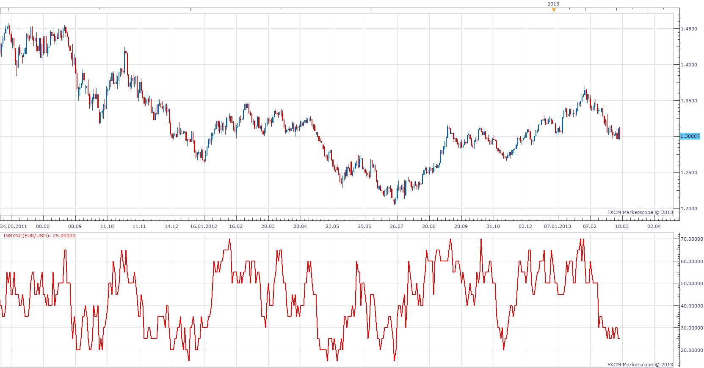

# InSync

> Source: https://fxcodebase.com/code/viewtopic.php?f=17&t=32957  
> Forum: 17 · Topic 32957 · 8 post(s)

---

## InSync

**Apprentice** · Fri Mar 08, 2013 5:51 pm

InSync is composite of several indicators Each of the indicators, have a certain weight.
Interpretation for the following formulas came from the article "The Insync Index", by Norm North, in Technical Analysis of Stocks & Commodities Jan 1995.

 [InSync.lua](files/56043/InSync.lua)

 

Up - InSync > MA
Down - InSync < MA

 [MTF MCP Insync Heat Map.lua](files/56043/MTF%20MCP%20Insync%20Heat%20Map.lua)

---

## Re: InSync

**juju1024** · Sun Mar 17, 2013 10:17 pm

Thank you, very interesting,

Can you edit this indicator, so that we can change the period please ?

Thanks

---

## Re: InSync

**Apprentice** · Mon Mar 18, 2013 5:26 am

Component parameters are added.

---

## Re: InSync

**Apprentice** · Fri Jun 17, 2022 3:03 am

MTF MCP Insync Heat Map.lua added.

---

## Re: InSync

**Apprentice** · Mon Dec 26, 2022 6:16 am

Updated.

---

## Re: InSync

**scandisk** · Sat Aug 12, 2023 1:58 am

Hi Apprentice
I wanted to add to the indicator levels mid and overbought and over sold also add candle colors when price is below the mid line red and above the mid line green, I also would like levels painted on chart of the lower level and upper level just like in link pictures. I attached the the system that I would like copied.
Thanks

 [https://www.tradingview.com/script/klcz ... -LazyBear/](https://www.tradingview.com/script/klczcNre-Insync-Index-LazyBear/)

---

## Re: InSync

**Apprentice** · Wed Aug 16, 2023 2:59 pm

We have added your request to the development list.
Development reference 730.

---

## Re: InSync

**Apprentice** · Mon Aug 21, 2023 5:09 am

 [MTF_MCP_Insync_Heat_Map.lua](files/152166/MTF_MCP_Insync_Heat_Map.lua)
