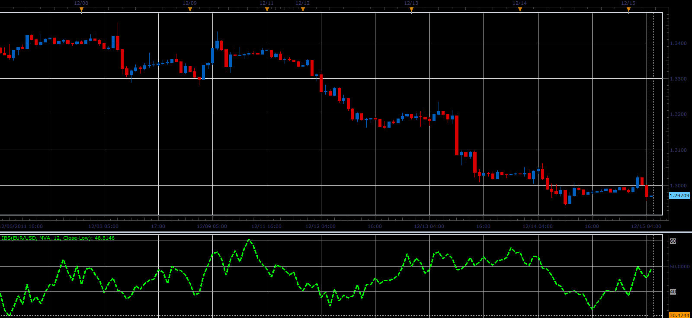

# Internal Bar Strength indicator

> Source: https://fxcodebase.com/code/viewtopic.php?f=17&t=9703  
> Forum: 17 · Topic 9703 · 2 post(s)

---

## Internal Bar Strength indicator

**Alexander.Gettinger** · Thu Dec 15, 2011 5:05 am

This indicator is a ported MQL5 indicator from [http://www.mql5.com/ru/code/749](http://www.mql5.com/ru/code/749) (in Russian).

Formulas:
IBS=MA(CurIBS),
CurIBS=100*(Close-Low)/Range, if [Price]="Close-Low",
CurIBS=100*(High-Close)/Range, if [Price]="High-Close", where
Range=High-Low.

 

Download:

 [IBS.lua](files/20697/IBS.lua)

For this indicator must be installed Averages indicator from [viewtopic.php?f=17&t=2430](https://fxcodebase.com/code/viewtopic.php?f=17&t=2430)

The indicator was revised and updated

---

## Re: Internal Bar Strength indicator

**Apprentice** · Mon Mar 20, 2017 7:54 am

Indicator was revised and updated.
