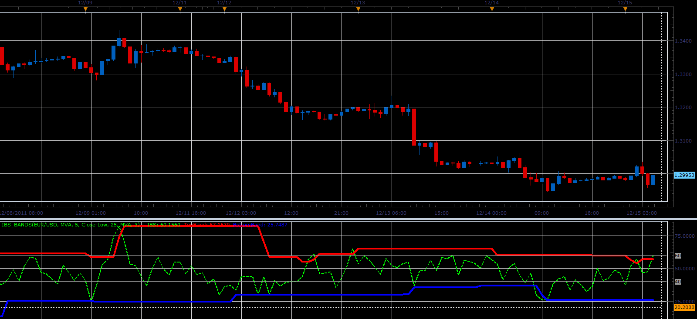

# Internal Bar Strength with bands

> Source: https://fxcodebase.com/code/viewtopic.php?f=17&t=9711  
> Forum: 17 · Topic 9711 · 3 post(s)

---

## Internal Bar Strength with bands

**Alexander.Gettinger** · Thu Dec 15, 2011 5:39 am

This indicator is a ported MQL5 indicator from [http://www.mql5.com/ru/code/750](http://www.mql5.com/ru/code/750) (in Russian).

Bands is a minimum and maximum of IBS at [Extremum Period] previous candles.

 

Download:

 [IBS_Bands.lua](files/20705/IBS_Bands.lua)

For this indicator must be installed Averages indicator from [viewtopic.php?f=17&t=2430](https://fxcodebase.com/code/viewtopic.php?f=17&t=2430)

The indicator was revised and updated

---

## Re: Internal Bar Strength with bands

**Alexander.Gettinger** · Thu Dec 15, 2011 5:59 am

Strategy based on this indicator: [viewtopic.php?f=31&t=9714&p=20708#p20708](https://fxcodebase.com/code/viewtopic.php?f=31&t=9714&p=20708#p20708)

---

## Re: Internal Bar Strength with bands

**Apprentice** · Mon Mar 20, 2017 7:58 am

Indicator was revised and updated.
