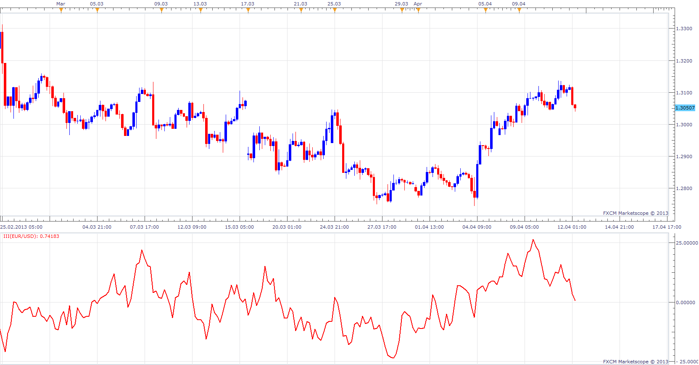

# Intraday Intensity Index

> Source: https://fxcodebase.com/code/viewtopic.php?f=17&t=34513  
> Forum: 17 · Topic 34513 · 3 post(s)

---

## Intraday Intensity Index

**Apprentice** · Fri Apr 12, 2013 6:16 am

As described in article Intraday Intensity by Dennis Peterson
III = Sum ((2C-H-L)/(H-L))xV
Normalized III = (III /Sum(V))*100

 [III.lua](files/58804/III.lua)

---

## Re: Intraday Intensity Index

**Alexander.Gettinger** · Fri Jun 06, 2014 3:15 pm

MQL4 version of Intraday Intensity Index: [viewtopic.php?f=38&t=60795](https://fxcodebase.com/code/viewtopic.php?f=38&t=60795).

---

## Re: Intraday Intensity Index

**Apprentice** · Fri Nov 04, 2022 6:26 am

Based on the source
[https://www.prorealcode.com/prorealtime ... ity-index/](https://www.prorealcode.com/prorealtime-indicators/intraday-intensity-index/)

A volume based indicator that depicts the flow of funds for a security according to where it closes in its high and low range.

This indicator was developed by Dave Bostian. Its goal is to track the activity of institutional block traders.

John Bollinger advised to use this indicator as a confirmation tool with the Bollinger Bands.

 [Intraday Intensity Index.lua](files/148156/Intraday%20Intensity%20Index.lua)
