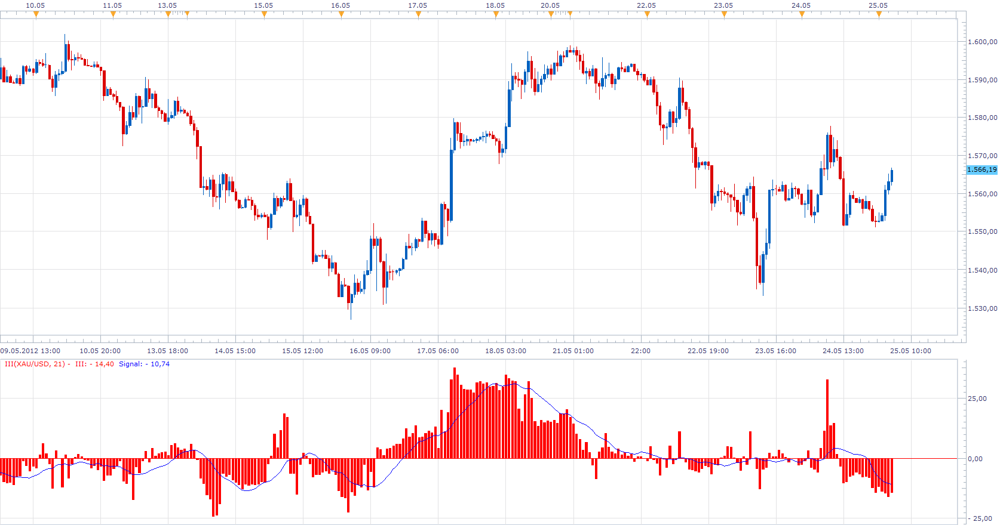

# Intraday Intensity

> Source: https://fxcodebase.com/code/viewtopic.php?f=17&t=19120  
> Forum: 17 · Topic 19120 · 17 post(s)

---

## Intraday Intensity

**Apprentice** · Fri May 25, 2012 3:12 am

II = Sum ((2C-H-L)/(H-L))xV
III = (II / Sum(V)) x 100
Signal = MA of III

 [III.lua](files/34033/III.lua)

---

## Re: Intraday Intensity

**Apprentice** · Sun Nov 09, 2014 3:02 pm

Minor Update.

---

## Re: Intraday Intensity

**iverlord** · Mon Nov 10, 2014 3:44 am

Please how does this indicator work ?

---

## Re: Intraday Intensity

**Apprentice** · Mon Nov 10, 2014 4:27 am

A volume based indicator that depicts the flow of funds for a security according to where it closes in its high and low range.

The formula is
IIstd = Sum21 ((2C-H-L)/(H-L))xV
IInorm = (IIstd / Sum21 V) x 100
C=close
H=high
L=low
V=volume

These are all the information that I have at my disposal.

---

## Re: Intraday Intensity

**Alexander.Gettinger** · Tue Nov 18, 2014 12:00 pm

MQL4 version of Intraday Intensity oscillator: [viewtopic.php?f=38&t=61469](https://fxcodebase.com/code/viewtopic.php?f=38&t=61469).

---

## Re: Intraday Intensity

**Apprentice** · Wed Jun 28, 2017 5:31 am

The indicator was revised and updated.

---

## Re: Intraday Intensity

**rrsspp** · Sun May 20, 2018 11:36 am

Is it possible that there is some mistake in this indicator.I made some calculation with this formula:IIstd = Sum21 ((2C-H-L)/(H-L))xV
open0.96120
high 0.96881
low 0.96116
close 0.96725
volume 85709
with this data it IIstd is 50753.17 possitive volue.In metatrader 4 it is negative volue. Please help

---

## Re: Intraday Intensity

**Apprentice** · Mon May 21, 2018 5:29 am

I can not make a comparison without mq4 code.
Can you provide it?

---

## Re: Intraday Intensity

**rrsspp** · Wed May 23, 2018 3:47 pm

//+------------------------------------------------------------------+
//| III2.mq4 |
//| Copyright © 2014, Gehtsoft USA LLC |
//| [http://fxcodebase.com](https://fxcodebase.com) |
//+------------------------------------------------------------------+
#property copyright "Copyright © 2014, Gehtsoft USA LLC"
#property link "http://fxcodebase.com"

#property indicator_separate_window
#property indicator_buffers 4
#property indicator_color1 Red
#property indicator_color2 Blue

extern int Length=21;
extern int Smoothing_Length=14;

double III[], Signal[];
double Raw[], Vol[];

int init()
{
 IndicatorShortName("Intraday Intensity oscillator");
 IndicatorDigits(Digits);
 SetIndexStyle(0,DRAW_HISTOGRAM);
 SetIndexBuffer(0,III);
 SetIndexStyle(1,DRAW_LINE);
 SetIndexBuffer(1,Signal);
 SetIndexStyle(2,DRAW_NONE);
 SetIndexBuffer(2,Raw);
 SetIndexStyle(3,DRAW_NONE);
 SetIndexBuffer(3,Vol);

 return(0);
}

int deinit()
{

 return(0);
}

int start()
{
 if(Bars<=3) return(0);
 int ExtCountedBars=IndicatorCounted();
 if (ExtCountedBars<0) return(-1);
 int limit=Bars-2;
 if(ExtCountedBars>2) limit=Bars-ExtCountedBars-1;
 int pos;
 pos=limit;
 while(pos>=0)
 {
 if (High[pos]!=Low[pos])
 {
 Raw[pos]=Volume[pos]*(2.*Close[pos]-High[pos]-Low[pos])/(High[pos]-Low[pos]);
 }
 Vol[pos]=Volume[pos];

 pos--;
 }

 double Avg, AvgVol;
 pos=limit;
 while(pos>=0)
 {
 Avg=iMAOnArray(Raw, 0, Length, 0, MODE_SMA, pos);
 AvgVol=iMAOnArray(Vol, 0, Length, 0, MODE_SMA, pos);
 if (AvgVol!=0.)
 {
 III[pos]=100.*Avg/(AvgVol*Point);
 }

 pos--;
 }

 pos=limit;
 while(pos>=0)
 {
 Signal[pos]=iMAOnArray(III, 0, Smoothing_Length, 0, MODE_SMA, pos);

 pos--;
 }

 return(0);
}

---

## Re: Intraday Intensity

**rrsspp** · Sun May 27, 2018 4:03 pm

I want to ask someone to help me.I need indicator only with this formula
IIstd = Sum21 ((2C-H-L)/(H-L))xV
no normalization please help

---

## Re: Intraday Intensity

**Apprentice** · Mon May 28, 2018 7:25 am

[III without normalization.lua](files/119379/III%20without%20normalization.lua)

---

## Re: Intraday Intensity

**Apprentice** · Mon May 28, 2018 7:37 am

MT4 based version.

 [III MT4.lua](files/119380/III%20MT4.lua)

---

## Re: Intraday Intensity

**rrsspp** · Wed May 30, 2018 3:03 pm

Apprentice thank you for the help, I really appreciate your work but i tried everything and can`t load MT4 version in MT4

---

## Re: Intraday Intensity

**Apprentice** · Thu May 31, 2018 2:47 am

It is NOT written for the MT4 platform.
It is written based on the MT4 template.

---

## Re: Intraday Intensity

**rrsspp** · Thu May 31, 2018 2:41 pm

how can I load it in MT 4

---

## Re: Intraday Intensity

**Apprentice** · Fri Jun 01, 2018 6:47 am

Try this version.

 [Intraday Intensity oscillator.mq4](files/119428/Intraday%20Intensity%20oscillator.mq4)

---

## Re: Intraday Intensity

**rrsspp** · Sun Jun 03, 2018 4:59 pm

Apprentice this works great. I want to say thank you again and want to wish you big profit in the markets, you helped me a lot!!!!!!!!!!!!!!!!
