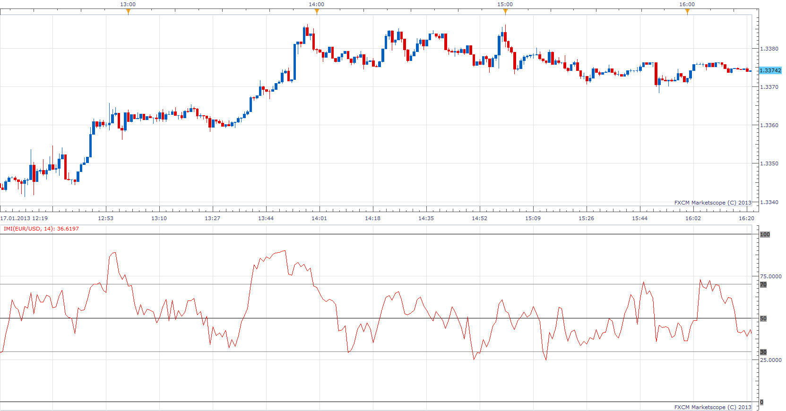

# Intraday Momentum Index

> Source: https://fxcodebase.com/code/viewtopic.php?f=17&t=30911  
> Forum: 17 · Topic 30911 · 3 post(s)

---

## Intraday Momentum Index

**Apprentice** · Thu Jan 17, 2013 5:43 pm

Meaures the percentage of the underlying symbol upwards price change to its total price change during a specified number of periods.

 [IMI.lua](files/52833/IMI.lua)

The indicator was revised and updated

---

## Re: Intraday Momentum Index

**Alexander.Gettinger** · Thu Sep 18, 2014 9:38 am

MQL4 version of Intraday Momentum Index: [viewtopic.php?f=38&t=61173](https://fxcodebase.com/code/viewtopic.php?f=38&t=61173).

---

## Re: Intraday Momentum Index

**Apprentice** · Sat Jun 24, 2017 5:06 am

The indicator was revised and updated.
